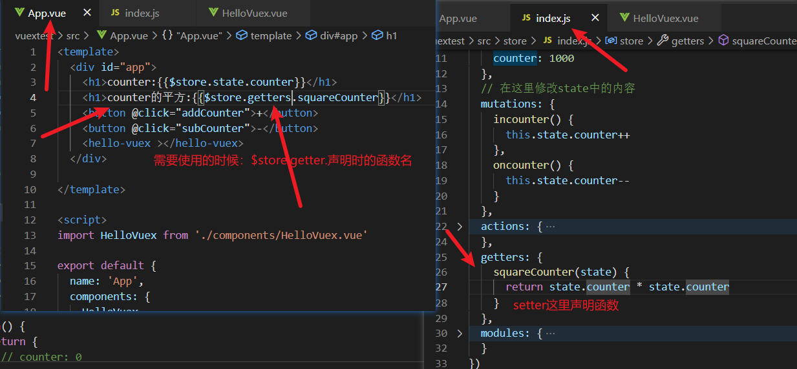
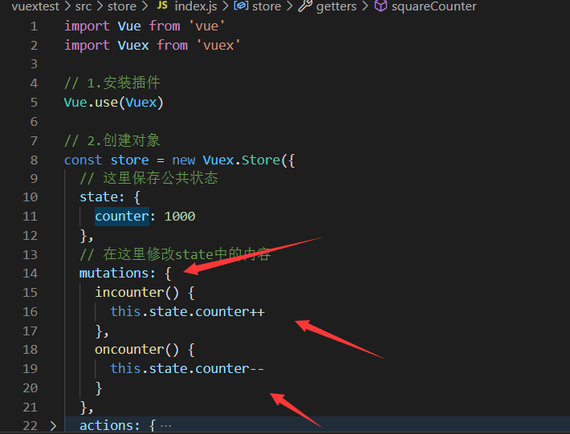
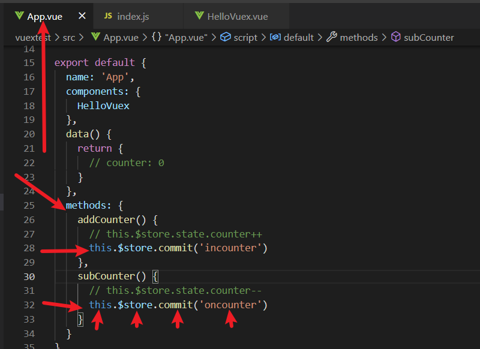
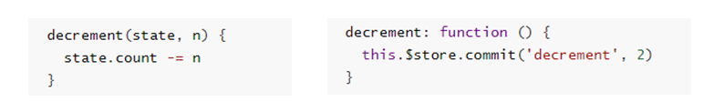
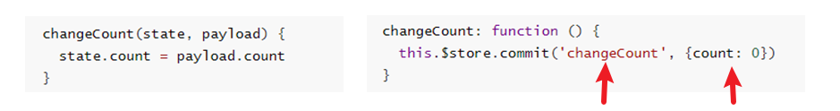
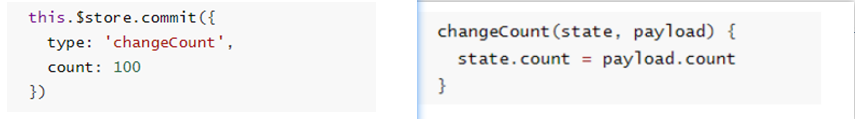
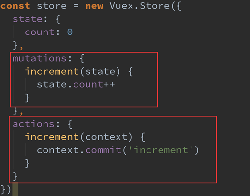
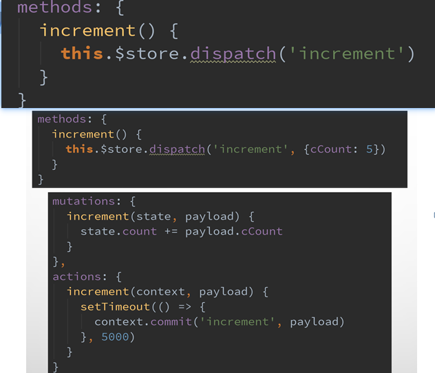
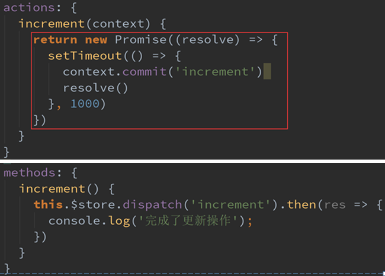
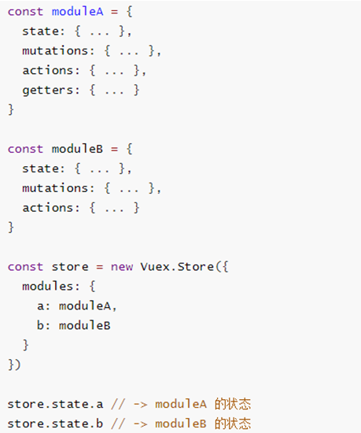

## 一、基本使用

### 1.npm安装插件

> 命令：npm install vuex

### 2.创建独立vuex文件夹

> 在src目录下创建文件夹store(或vuex)，在store文件夹中创建index.js文件。

### 3.完善index.js文件

> 导入Vuex => 安装(引入)插件 => 创建对象 => 导出store

```javascript
import Vue from 'vue'
//导入Vuex
import Vuex from 'vuex'

// 1.安装插件
Vue.use(Vuex)

// 2.创建对象
const store = new Vuex.Store({
  state: {
      
  },
  mutations: {

  },
  actions: {

  },
  getters: {

  },
  modules: {

  }
})

// 3.导出store
export default store
```

### 4.main.js中挂载

```javascript
import Vue from 'vue'
import App from './App.vue'
import store from './store'

Vue.config.productionTip = false

new Vue({
  store,
  render: h => h(App),
}).$mount('#app')
```


## 二、state

> state中用来存放公共状态，且state是唯一的(单一状态树)


## 三、setters

> 类似于计算属性，获取改变后的state属性值。




## 四、mutations

> Mutations是Vuex的store**状态的更新**的**唯一方式**。

### 1.mutations的定义

> 在mutations中定义



### 2.mutations状态更新

> 在需要进行更新的地方(如App.vue中或某个组件中)，使用$store.commit('mutations中的函数名')的方式进行更新。



### 3.mutations传递参数

> 在通过mutation更新数据的时候, 有可能我们希望携带一些**额外的参数**:
>
> * 参数被称为是mutation的**载荷(Payload)**

* 只需要传递一个参数时



* 传递多个参数时：以对象形式



### 4.mutations提交风格

> 上面的通过**commit**进行提交是一种普通的方式
>
> Vue还提供了另外一种风格, 它是一个**包含type属性的对象**



### 5.mutations响应规则

> Vuex的store中的state是响应式的, 当state中的数据发生改变时, Vue组件会自动更新.这就要求我们必须遵守一些Vuex对应的规则:

* 提前在store中初始化好所需的属性.

* 当给state中的对象添加新属性时, 使用下面的方式:
* * 方式一: 使用Vue.set(obj, 'newProp', 123)
  * 方式二: 用新对象给旧对象重新赋值


## 五、actions

> 我们强调, 不要再Mutation中进行异步操作.
>
> 但是某些情况, 我们确实希望在Vuex中进行一些异步操作, 比如网络请求, 必然是异步的. 这个时候怎么处理呢?
>
> actions类似于mutations, 但是是用来代替mutations进行异步操作的.

### 1.actions的基本定义

> context是和store对象具有相同方法和属性的对象.
>
> 也就是说, 我们可以通过context去进行commit相关的操作, 也可以获取context.state等.



### 2.actions的分发

> 在Vue组件中, 如果我们调用action中的方法, 那么就需要使用dispatch



### 3.actions返回的Promise

> 在actions中, 我们可以将异步操作放在一个Promise中, 并且在成功或者失败后, 调用对应的resolve或reject.




## 六、modules

> Module是模块的意思, 为什么在Vuex中我们要使用模块呢?
>
> Vue使用单一状态树,那么也意味着很多状态都会交给Vuex来管理.
>
> 当应用变得非常复杂时,store对象就有可能变得相当臃肿.
>
> 为了解决这个问题, Vuex允许我们将store分割成模块(Module), 而每个模块拥有自己的state、mutation、action、getters等

