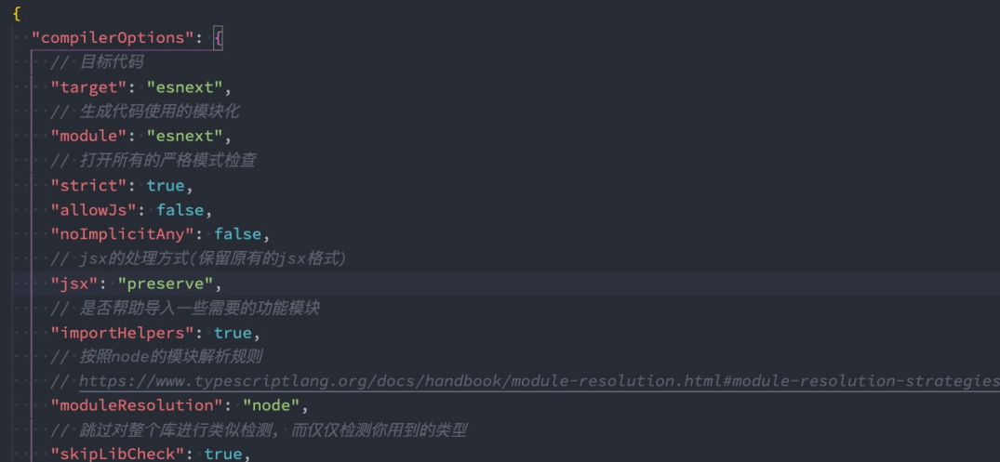

# TypeScript

## 一、认识TypeScript

### 1.什么是TypeScript?

> TypeScript is a typed superset of JavaScript that compiles to plain JavaScript.

### 2.TypeScript特点

* 始于JavaScript，归于JavaScript 
* * TypeScript从今天数以百万计的JavaScript开发者所熟悉的语法和语义开始。使用现有的JavaScript代码，包括流行的JavaScript库， 并从JavaScript代码中调用TypeScript代码；
  *  TypeScript可以编译出纯净、 简洁的JavaScript代码，并且可以运行在任何浏览器上、Node.js环境中和任何支持ECMAScript 3（或 更高版本）的JavaScript引擎中；

* TypeScript是一个强大的工具，用于构建大型项目 
* * 类型允许JavaScript开发者在开发JavaScript应用程序时使用高效的开发工具和常用操作比如静态检查和代码重构； 
  * 类型是可选的，类型推断让一些类型的注释使你的代码的静态验证有很大的不同。类型让你定义软件组件之间的接口和洞察现有 JavaScript库的行为；

* 拥有先进的 JavaScript 
* * TypeScript提供最新的和不断发展的JavaScript特性，包括那些来自2015年的ECMAScript和未来的提案中的特性，比如异步功能和 Decorators，以帮助建立健壮的组件；
  * 这些特性为高可信应用程序开发时是可用的，但是会被编译成简洁的ECMAScript3（或更新版本）的JavaScript；

### 3.TypeScript的编译环境

> 们需要在电脑上安装**TypeScript**，这样就可以通过TypeScript的Compiler将其编译成JavaScript；

* 安装命令 **npm install typescript -g** 
* 查看版本 **tsc --version**
* 编译 **tsc js文件**    '会生成由js转换为的一个ts文件'

### 4.TypeScript的运行环境

* 方式一：通过webpack，配置本地的TypeScript编译环境和开启一个本地服务，可以直接运行在浏览器上；

**可以看coderwhy的一篇文章：https://mp.weixin.qq.com/s/wnL1l-ERjTDykWM76l4Ajw**

* 方式二：通过ts-node库，为TypeScript的运行提供执行环境；

安装ts-node  **npm install ts-node -g**

另外ts-node需要依赖 tslib 和 @types/node 两个包：**npm install tslib @types/node -g**

直接通过 ts-node 来运行TypeScript的代码： **ts-node js文件**


## 二、TypeScript基础

### 1.定义变量

> 在TypeScript中定义变量需要指定 **标识符** 的类型。完整的声明格式如下：
>
> 声明了类型后TypeScript就会进行类型检测，声明的类型可以称之为类型注解：**var/let/const 标识符: 数据类型 = 赋值;**

* 在TypeScript定义变量（标识符）和ES6之后一致，可以使用var、let、const来定义。
* 在tslint中并不推荐使用var来声明变量；
* 类型推导：TypeScript本身的 特性帮助我们推断出对应的变量类型：

```typescript
var name: string = 'tjx'
let age: number = 18
const height: number = 1.88

// string 和 String 是有区别的：
// string: 表示typescript中的字符串类型
// String: 表示JavaScript的字符串包装类的类型
const message: string = "所以应该使用string"

// 类型推导/推断：默认情况下进行赋值时：会将赋值的值的类型，作为当前标识符的类型
let foo = "foo"
// foo = 123  不能将类型“number”分配给类型“string”。
```

### 2.JavaScript数据类型

> typescript数据类型**包含**JavaScript数据类型；

* **number类型**：TypeScript和JavaScript一样，不区分整数类型（int）和浮点型 （double），统一为number类型。而TypeScript也是支持二进制、八进制、十 六进制的表示；

```typescript
// ts 不区分整型浮点型
let num: number = 123
num =222
// num = "dfjs" // 报错
// 十进制
let num1: number = 100
// 二进制
let num2: number = 0b111
// 八进制
let num3: number = 0o456
// 十六进制
let num4: number = 0xabc
console.log(num, num2, num3, num4);
```

* **boolean类型**：true和false

```typescript
let flag: boolean = true
flag = 20 > 30
```

* **string类型**：string类型是字符串类型，可以使用单引号或者双引号表示；同时也支持ES6的模板字符串来拼接变量和字符串；

```typescript
let message1 = 'hello world'
let message2 = 'hello world'
const name = 'tjx'
const age = 19
let message3 = `name:${name} age:${age}`
console.log(message3);
```

* **array类型**

```typescript
// 可以确定是一个数组，但是不能确定数组中存放什么数据类型：一个数组中在typescript开发中，最好存放的数据类型是固定的
// const names = [] 
// 不好的习惯
// names.push('abc')
// names.push(123)
const names: Array<string> = [] // 不推荐（会在react的jsx中有冲突）
// names.push(123) 报错
const names2: string[] = [] // 推荐
```

* **object类型**

```typescript
// const info: object = { // 不推荐这么写，如果这么写，info.name将不能取到值
const info = {
  name: 'tjx',
  age: 19
}
```

* Sysmbol类型

```typescript
const title1 = Symbol("title")
const title2 = Symbol("title")
const info = {
  [title1]: '程序员',
  [title2]: '老师'
}
```

* **null和undefined类型**

```typescript
// null 类型只有 null这一个值，并且最好指定一下，不要使用自推断
const n1: null = null
// undefined也只有一个值
const n2: undefined = undefined
```

### 3.Typescript数据类型

#### (1)any类型

>  在某些情况下，我们确实无法确定一个变量的类型，并且可能它会发生一些变化，这个时候我们可以使用**any类型**（类似 于Dart语言中的dynamic类型）。

* 可以对any类型的变量进行任何的操作，包括获取不存在的属性、方法； 
* 可以给一个any类型的变量赋值任何的值，比如数字、字符串的值；
* 如果对于某些情况的处理过于繁琐不希望添加规定的类型注解，或者在引入一些第三方库时，缺失了类型注解，这个时候 我们可以使用any： 包括在Vue源码中，也会使用到any来进行某些类型的适配；

```typescript
let message: any = "asf"
message = 123
message = true
message = {
}
console.log(message);
```

#### (2)unknown类型

> unknown是TypeScript中比较特殊的一种类型，它用于描述类型不确定的变量。**unknow**类型只能赋值给**any**和**unknow**类型，**any**类型可以赋值给**任意**类型

```typescript
function foo() {
  return 'abc'
}
function bar() {
  return 123
}
let flag = true
// let result: any
let result: unknown  // 最好不要使用any
if (flag) {
  result = foo()
} else {
  result = bar()
}
// any 和 unknow 的区别：
// unknow类型只能赋值给any和unknow类型，any类型可以赋值给任意类型
// 以下报错：
// let message: string = result
// let num: number = result

console.log(result);
```

#### (3)void类型

> **void**通常用来指定一个函数是没有返回值的，那么它的返回值就是void类型；

* 可以将null和undefined赋值给void类型，也就是函数可以返回null或者undefined
* 函数我们没有写任何类型，那么它默认返回值的类型就是void的，也可以显示的来指定返回值是void：

```typescript
function sum(num1: number, num2: number): void {
  console.log(num1 + num2);
  return undefined
}
sum(20, 30)
```

#### (4)never类型

> never 表示永远不会发生值的类型，比如一个函数：如果一个函数中是一个死循环或者抛出一个异常，那么这个函数会返回东西吗？不会，那么写void类型或者其他类型作为返回值类型都不合适，我们就可以使用**never类型**；

```typescript
// function foo(): never {
//   // 死循环
//   while(true) {

//   }
// }

// function bar(): never {
//   throw new Error()
// }

// never应用场景
function handlMessage(message: string | number | boolean) {
  switch (typeof message) {
    case 'string':
      console.log("string处理message");
      break
    case 'number':
      console.log(("number处理message"));
      break
    default:
      // 应用场景，用于提示开发者使代码更完整
      // const check: never = message // 报错
  }
}

handlMessage("abc")
handlMessage(123)
```

#### (5)tuple类型

> **tuple**和**数组**有什么区别？
>
> 首先，数组中通常建议存放相同类型的元素，不同类型的元素是不推荐放在数组中。（可以放在对象或者元组 中） 
>
> 其次，**元组**中**每个元素都有自己特性的类型**，根据索引值获取到的值可以确定对应的类型；

* 基本使用：

```typescript
// tuple元组：多种元素的组合
const info: [string, number, number] = ['abc', 18, 1.88]
const name = info[0] // 元组类型可以确定数组里面每一个值的类型
console.log(name.length);
```

* 应用场景：

```typescript
function useState<T>(state: T) {
  let currentState = state

  const changeState = (newState: T) => {
    currentState = newState
  }

  const tuple: [T, (newState: T) => void] = [currentState, changeState]

  return tuple
}

const [counter, setCounter] = useState(10) // counter: number;setNuber: (newState: number) => void
const [title, setTitle] = useState("abc")  // title: string ; setTitle: (newState: string) => void
```

### 4.TypeScript其他类型

#### (1)函数的参数类型和返回值类型

> 声明函数时，可以在每个参数后添加类型注解，以声明函数接受的参数类型；也可以添加返回值的类型注解，这个注解出现在函数列表的后面；
>
> 通常情况下不需要返回类型注解，因为TypeScript会根据 return 返回值推断函数的 返回类型；

```typescript
// 开发中可以不用写返回值类型:不写会自动推到
function sum(num1: number, num2: number): number {
  return num1 + num2
}
```

#### (2)匿名函数的参数

> 匿名函数与函数声明会有一些不同： 当一个函数出现在TypeScript可以确定该函数会被如何调用的地方时，该函数的参数会自动指定类型；

```typescript
// 通常情况下，在定义一个函数时，都会给参数加上类型注解
function foo(message: string) {
}
const names = ['abc', 'cba', 'bdj']
// item根据上下文环境推导出来的，这个时候可以不加类型注解
names.forEach(function (item) {
  // 我们并没有指定item的类型，但是item是一个string类型
  // 这是因为TypeScript会根据forEach函数的类型以及数组的类型推断出item的类型；
  // 这个过程称之为上下文类型（contextual typing），因为函数执行的上下文可以帮助确定参数和返回值的类型
  console.log(item.split(" "));
})
```

#### (3)对象类型

```typescript
function printPoint(point: {x: number, y: number}) {
  console.log(point.x);
  console.log(point.y);
}
printPoint({x: 123, y: 123})
```

#### (4)可选类型

> 对象类型也可以指定哪些属性是可选的，可以在属性的后面添加一个  **?**

```typescript
function printPoint(point: {x: number, y: number, z?: number}) {
  console.log(point.x);
  console.log(point.y);
  console.log(point.z);
}
// 传两个参数也可以
printPoint({x: 123, y: 123})
// 传三个参数也可以
printPoint({x: 123, y: 123, z: 123})
```

#### (5)联合类型

> TypeScript的类型系统允许我们使用多种运算符，从现有类型中构建新类型。

**联合类型（Union Type）：** 

* 联合类型是由两个或者多个其他类型组成的类型；
* 表示可以是这些类型中的任何一个值；
* 联合类型中的每一个类型被称之为联合成员（union's members）；

```typescript
// number|string 联合类型
// 传入给一个联合类型的值是非常简单的：只要保证是联合类型中的某一个类型的值即可
// 但是我们拿到这个值之后，我们应该如何使用它呢？因为它可能是任何一种类型。
// 比如我们拿到的值可能是string或者number，我们就不能对其调用string上的一些方法；
function printID(id: number | string | boolean) {
  // console.log(id.toUpperCase()); // 会报错，id可能不是字符串类型，所以使用时要小心
  // 那么我们怎么处理这样的问题呢？
  // 我们需要使用缩小（narrow）联合（后续我们还会专门讲解缩小相关的功能）；
  // TypeScript可以根据我们缩小的代码结构，推断出更加具体的类型；
  if (typeof id === 'string') {
    // typescript 可以帮助确定id一定时string类型
    console.log(id.toUpperCase);
  } else {
    console.log(id);
  }
}
printID(123)
printID("asd")
printID(true)
```

**可选类型可以看做是 类型 和 undefined 的联合类型：**

```typescript
// 一个参数是可选类型的时候，它其实类似于是这个参数是 类型|undefined d的联合类型
function foo1(message?: string) {
  console.log(message);
}
foo1(undefined) // 不报错
foo1()  // 不报错
function foo2(message: string | undefined) {
  console.log(message);
}
// foo2() // 报错，不能为空
foo2(undefined) // 不报错
```

### 5.TypeScript其他类型补充

#### (1)类型别名

> 通过在类型注解中编写 对象类型 和 联合类型，但是当我们想要多次在其他地方使用时，就要编写多 次。比如我们可以给对象类型起一个别名；

```typescript
// 使用type关键字定义类型别名
type IDType = string | number | boolean
type PointType = {
  x: number,
  y: number,
  z: number
}
function printID(id: IDType) {
}
function printPoint(point: PointType) {
}
```

#### (2)类型断言

> 有时候TypeScript无法获取具体的类型信息，这个我们需要使用**类型断言**（Type Assertions）。 比如我们通过 document.getElementById，TypeScript只知道该函数会返回 HTMLElement ，但并不知道它 具体的类型，所以需要通过断言将之转换为**更具体** 或者 **不太具体** 的类型版本，此规则可**防止不可能的强制转换**

```typescript
// 类型断言就是将一个类型较大范围缩小为一个具体的类型，从而可以去调用该类型的相应的属性及方法
const el = document.getElementById('tjx') as HTMLImageElement
el.src = 'url地址'

class Person {
}
class Student extends Person {
  studying() {
  }
}
function sayHello(p: Person) {
  // p.studying() // 报错：类型“Person”上不存在属性“studying”。
  // 这时就可以使用类型断言
  (p as Student).studying()
}
const stu = new Student()
sayHello(stu)
```

#### (3)非空类型断言！

```typescript
function printMessageLength(message?: string) {
  // console.log(message.length); 报错，因为传入的message有可能是为undefined的，这个时候是不能执行方法的；
  // if (message) {
  //   console.log(message.length);
  // }
  // 但是，我们确定传入的参数是有值的，这个时候我们可以使用非空类型断言,跳过ts在编译阶段对它的检测
  // 非空断言：！，表示一定不为空
  console.log(message!.length);
  
}

printMessageLength("abc")
// printMessageLength() // 如果还是传入一个空的，则编译时会报错
```

#### (4)可选链

> 可选链并不是TypeScript独有的特性，它是**ES11（ES2020）**中增加的特性：可选链使用可选链操作符  **?.**  ； 它的作用是当对象的属性不存在时，会短路，直接返回undefined，如果存在，那么才会继续执行；

```typescript
// 可选链是ES11中的语法，用于判断是否有值
type Person = {
  name: string,
  friend?: {
    name: string,
    age?: number
  }
}
const info:Person = {
  name: 'tjx',
  friend: {
    name: 'yn'
  }
}

// 在一个看不到该代码的地方调用时
console.log(info.friend?.name); // 不确定是否有friend属性，有的话取name的值，没有返回undefined
```

#### (5)??和!!的作用

* **!!操作符**：将一个其他类型转换成boolean类型； 类似于Boolean(变量)的方式；
* **??操作符**： 它是ES11增加的新特性； 空值合并操作符（??）是一个逻辑操作符，当操作符的左侧是 null 或者 undefined 时，返回其右侧操作数， 否则返回左侧操作数；

```typescript
// !!时js语法：用于将其他类型转为boolean类型
const message = 'hello world'

// const flag = Boolean(message)
// console.log(flag);

const flag = !!message
```

#### (6)字面量类型

```typescript
// "hello world" 也可以作为类型，叫做字面量类型
const message: 'hello world' = 'hello world'
// let num: 123 = 456 // 报错，前后的值必须一样
// 字面量类型的意义，就是必须结合联合类型
type Alignment = 'left' | 'center' | 'right'
let align: Alignment = 'left'
align = 'center'
align = 'right'
// align = 'hhh'   // 报错
```

#### (7)字面量推理

```typescript
type Method = 'GET' | 'POST'
function request(url: string, method: Method) {}

type Request = {
  url: string,
  method: 'GET'
}

// 此时options中的method类型为string类型
const options = {
  url: "https:/www.tjx.cn/abc",
  method: "POST"
} as const  // as const 这里就称为字面量推理，此时的options的method类型为Method

// 开发中一般这么写：
// const options: Request = {
//   url: "https:/www.tjx.cn/abc",
//   method: "POST"
// }

// 但是request中的method类型要求是Method类型：
// request(options.url, options.method)  // 所以这里报错：类型“string”的参数不能赋给类型“Method”的参数。
// 解决办法：类型断言
request(options.url, options.method as Method)
```

#### (8)类型缩小

> 可以通过类似于 typeof padding === "number" 的判断语句，来改变TypeScript的执行路径；在给定的执行路径中，我们可以缩小比声明时更小的类型，这个过程称之为 **缩小**; 
>
> 而我们编写的 typeof padding === "number 可以称之为 **类型保护**（type guards）；

```typescript
// 1.typeop类型缩小
function PrintID(id: number | string) {
  if (typeof id === 'string') {
    console.log(id.toUpperCase());
  } else {
    console.log(id);
  }
}

// 2.平等的类型缩小（=== !== == !=/switch）
type Direction = "left" | "right" | "bottom"
function printDirection(direction: Direction) {
  // 1.if判断
  // if (direction === 'left') {
  //   console.log(direction);
  // } else if ...

  // 2.switch判断
  // switch (direction) {
  //   case 'left':
  //     console.log(direction);
  //     break;
  //   case ...
  // }
}

// 3.instanceof
function printTime(time: string | Date) {
  if (time instanceof Date) {
    console.log(time.toUTCString());
  } else {
    console.log(time);
  }
}
class Student {
  studying() { }
}
class Teacher {
  teaching() { }
}
function work(p: Student | Teacher) {
  if (p instanceof Student) {
    p.studying()
  } else {
    p.teaching()
  }
}

// 4.in
// Javascript 有一个运算符，用于确定对象是否具有带名称的属性：in运算符
// 如果指定的属性在指定的对象或其原型链中，则in 运算符返回true；
type Fish = {
  swimming: () => void
}
type Dog = {
  running: () => void
}
function walk(animal: Fish | Dog) {
  // 判断animal里面是否有swimming属性
  if ('swimming' in animal) {
    animal.swimming()
  } else {
    animal.running()
  }
}
const fish: Fish = {
  swimming() {
    console.log("swimming");
  }
}
walk(fish)
```

### 6.TypeScript函数类型

#### (1)函数的类型

```typescript
// 1.函数作为参数时，在参数中如何编写类型
function foo() {
}
function bar(fn: () => void) {
  fn()
}
bar(foo)

// 2.定义常量时编写函数类型
type AddFnType = (num1: number, num2: number) => number
const add: AddFnType = (num1: number, num2: number) => {
  return num1 + num2
}
```

#### (2)函数类型解析

> **(num1: number, num2: number) => void**，代表的就是一个函数类型： 接收两个参数的函数：num1和num2，并且都是number类型； 并且这个函数是没有返回值的，所以是void；在某些语言中，可能参数名称num1和num2是可以省略，**但是TypeScript是不可以的**

#### (3)参数的可选类型

```typescript
// 可选类型必须放在必选类型的后面
function foo(x: number, y?: number) {
}
```

#### (4)默认参数

> 从ES6开始，JavaScript是支持默认参数的，TypeScript也是支持默认参数的；

```typescript
function foo(x: number, y: number = 100) {
  console.log(x, y);
}
foo(20)

function foo2(x: number = 100, y: number) {
  console.log(x, y);
}
// 只有传入为undefined时才会使用第一个参数的默认值；所以一般有默认值的放在后面
foo2(undefined, 20)
```

#### (5)剩余参数

```typescript
// 从ES6开始，JavaScript也支持剩余参数，剩余参数语法允许我们将一个不定数量的参数放到一个数组中。
function sum(...nums: number[]) {
  let total = 0
  for (const num of nums) {
    total += num
  }
  return total
}
const result = sum(10, 30, 20)
console.log(result);
const result1 = sum(10, 30, 20, 40)
console.log(result1);
```

#### (6)指定this类型

```typescript
type NameType = {
  name: string
}
function sayHello(this: NameType) {
  console.log(this.name);
}
```

#### (7)函数的重载

```typescript
// 函数的重载：函数的名称相同，但是参数不同的几个函数，就是函数的重载
// 定义重载函数
function add(num1: number, num2: number): number; // 没有函数体
function add(num1: string, num2: string): string; // 没有函数体
// 定义函数体，即实现函数，参数值类型一般比较宽泛
function add(num1: any, num2: any): any {
  if (typeof num1 === 'string' && typeof num2 === 'string') {
    return num1.length + num2.length
  }
  return num1 + num2
}
// 执行时根据参数的不同进行相应的重载函数，执行相同的函数体
const result = add(20, 30)
const result2 = add('abc', 'cga')
console.log(result);
console.log(result2);

// 在函数重载中，实现函数是不能被调用的
// add({name: 'tjx'}, {age: 18})
```

**联合类型和重载：**

```typescript
// 实现方式一：联合类型
// function getLength(args: string | any[]) {
//   return args.length
// }
// console.log(getLength('dsf'));
// console.log(getLength([123, 213, 3213]));

// 实现方式二：函数的重载
function getLength(args: string): number;
function getLength(args: any[]): number;
function getLength(args: any): number {
  return args.length
}
console.log(getLength('dsf'));
console.log(getLength([123, 213, 3213]));
```


## 三、TypeScript高级

### 1.类

> 和JavaScript中的类差不多，这里不再详细介绍。

#### (1)类的定义

```typescript
class Person {
  name: string
  age: number

  constructor(name: string, age: number) {
    this.name = name
    this.age = age
  }

  eating() {
    console.log(this.name + 'eating');
  }
}

const p = new Person('tjx', 18)
console.log(p.name);
p.eating()
```

#### (2)类的继承

```typescript
class Person {
  name: string = ''
  age: number = 0
  eating() {
    console.log("eating");
  }
}
class Student extends Person{
  sno: number = 0
  studying() {
    console.log("studying");
  }
}
class Teacher extends Person{
  title: string = ''
  teaching() {
    console.log("teaching");
  }
}

const stu = new Student()
stu.name = 'tjx'
stu.age = 18
console.log(stu.name);
console.log(stu.age);
console.log(stu.eating());
```

```typescript
class Person {
  name: string
  age: number
  constructor(name: string, age: number) {
    this.name = name
    this.age = age
  }
  eating() {
    console.log("eating");
  }
}
class Student extends Person {
  sno: number

  constructor(name: string, age: number, sno: number) {
    // 通过super调用父类的构造方法
    super(name, age)
    this.sno = sno
  }
  studying() {
    console.log("studying");
  }
  // 方法的重写
  eating() {
    // 执行父类中的方法
    super.eating()
    console.log("student eating");
  }
}

const stu = new Student('tjx', 18, 100)
stu.name = 'tjx'
stu.age = 18
console.log(stu.name);
console.log(stu.age);
console.log(stu.sno);
console.log(stu.eating());
```

#### (3)类的多态

```typescript
class Animal {
  action() {
    console.log("animal running");
  }
}
class Dog extends Animal {
  action() {
    console.log("dog running");
  }
}
class Fish extends Animal {
  action() {
    console.log("fish swimming");
  }
}
// 多态的目的是为了写出更加具备通用性的代码
function makeAction(animal: Animal[]) {
  animal.forEach(animal => {
    animal.action()
  })
}
makeAction([new Dog(), new Fish()])
// dog running
// fish swimming
```

#### (4)类的成员修饰符

> 在TypeScript中，类的属性和方法支持三种修饰符： public、private、protected；public是默认的修饰符，也是可以直接访问的

* public 修饰的是在任何地方可见、公有的属性或方法，默认编写的属性就是public的；
* private 修饰的是仅在同一类中可见、私有的属性或方法； 
* protected 修饰的是仅在类自身及子类中可见、受保护的属性或方法；

```typescript
class Person {
  // public name: string = ''
  private name: string = ''
  getName() {
    return this.name
  }
  setName(newName) {
    this.name = newName
  }
}
const p = new Person()
// p.name = '123'
p.setName('123')
```

#### (5)只读属性readonly

> 如果有一个属性我们不希望外界可以任意的修改，只希望确定值后直接使用，那么可以使用readonly

```typescript
class Person {
  // 2.属性本身不能进行修改，但是如果他是对象类型，对象中的属性可以修改
  readonly name: string
  readonly friend?: Person
  constructor(name: string, friend?: Person) {
    // 1.只读属性是可以在构造器中赋值，赋值之后就不可以修改了
    this.name = name
    this.friend = friend
  }
}

const p = new Person('tjx', new Person('yn'))
console.log(p.name);
// 不可以直接修改friend
// p.friend = new Person('james')
```

#### (6)getters/setters

```typescript
class Person {
  private _name: string
  constructor(name: string) {
    this._name = name
  }
  // 访问器setter/getter
  // setter
  set name(newName) {
    this._name = newName
  }
  // getter
  get name() {
    return this._name
  }
}
const p = new Person("tjx")
p.name = 'yn'
console.log(p.name);
```

#### (7)静态成员

> 前面我们在类中定义的成员和方法都属于对象级别的, 在开发中, 我们有时候也需要定义类级别的成员和方法。在TypeScript中通过关键字**static**来定义

```typescript
class Student {
  static time: string = '20.00'

  static attendCalss() {
    console.log("go studing");
  }
}
// 静态成员可以直接通过类调用
console.log(Student.time);
Student.attendCalss()
```

#### (8)abstract 抽象类

```typescript
function makeArea(shape: Shape) {
  return shape.getArea()
}
// 抽象类
abstract class Shape {
  // 抽象方法
  abstract getArea()
}
class Rectangle extends Shape {
  private width: number
  private height: number
  constructor(width: number, height: number) {
    super()
    this.width =width
    this.height =height
  }
  // 子类继承了抽象类，必须实现抽象类中的抽象方法
  getArea() {
    return this.width * this.height
  }
}
class Circle extends Shape{
  private r: number
  constructor(r: number) {
    super()
    this.r = r
  }
  getArea() {
    return this.r * this.r * 3.14
  }
}
const rectangle = new Rectangle(20 ,40)
const circle = new Circle(10)
console.log(makeArea(rectangle));
console.log(makeArea(circle));
```

#### (9)类的类型

```typescript
class Person {
  name: string = ""
  eating() {
  }
}
const p = new Person()
// 类也可以作为变量的类型，当然也要有其中的属性及方法
const p1: Person = {
  name: 'tjx',
  eating() {
  }
}
```

### 2.接口

#### (1)接口的声明

> 接口声明和类型声明相似，接口中我们也可以定义可选属性以及只读属性。

```typescript
// 通过类型type别名声明对象类型
// type InfoType = {name: 'tjx', age: 18}

// 另一种声明对象的类型：接口interface
interface InfoType {
  // 定义只读属性
  name: string
  age: number
  // 定义可选类型
  friend?: {
    name: string
  }
}

const info: InfoType = {
  name: 'tjx',
  age: 18
}
```

#### (2)索引类型

```typescript
// 通过interface定义索引类型
interface IndexLanguage {
  // 表示索引必须为number类型，值必须为string类型
  [index: number]: string
}

const frontLanguage = {
  0: "HTML",
  1: "CSS",
  2: "JavaSctipt",
  3: "Vue"
}

interface ILangugeYear {
  [name: string]: number
}
const languageYear = {
  "C": 1972,
  "java": 1995,
  "javascript": 1996,
  "typescript": 2014
}
```

#### (3)函数类型

> 前面我们都是通过interface来定义对象中普通的属性和方法的，实际上它也可以用来定义函数类型;当然，除非特别的情况，还是**推荐**使用**类型别名**来定义函数;

```typescript
// 通过type定义函数类型
// type CalcFn = (n1: number, n2: number) => number
// 通过接口定义函数类型
interface CalcFn {
  (num1: number, num2: number): number
}

function calc(num1: number, num2: number, calcFn: CalcFn) {
  return calcFn(num1, num2)
}
const add: CalcFn = (num1, num2) => {
  return num1 + num2
}
calc(20, 30, add)
```

#### (4)接口的继承

> 接口和类一样是可以进行继承的，也是使用extends关键字： 并且我们会发现，接口是支持多继承的（类不支持多继承）

```typescript
interface Person {
  name: string
  eating: () => void
}
interface Animal {
  running: () => void
}
interface Student extends Person, Animal {
  sno: number
}

const stu: Student = {
  sno: 110,
  name: 'tjx',
  eating: function() {
  },
  running: function() {
  }
}
```

#### (5)交叉类型

> 是交叉类型（Intersection Types）： 交叉类似表示**需要满足多个类型的条件**； 交叉类型使用 **&** 符号

```typescript
interface Colorful {
  color: string
}
interface IRun {
  running: () => void
}
type NewType = Colorful & IRun
const obj: NewType = {
  color: 'red',
  running: function() {
  }
}
```

#### (6)接口的实现

```typescript
interface ISwim {
  swimming: () => void
}
interface IEat {
  eating: () => void
}
// 类实现接口
class Animal {

}
// 继承：只能实现单继承
// 实现：实现接口，类可以实现多个接口
class Fish extends Animal implements ISwim, IEat {
  swimming() {
    console.log("fish Swimming");
  }
  eating() {
    console.log("fish Eating");
  }
}
class Person implements ISwim {
  swimming() {
    console.log("person swimming");
  }
}

// 接口的作用：编写一些公共的API
function swimAction(swimable: ISwim) {
  swimable.swimming()
}
// 1.所有实现了接口的类对应的对象，都是可以传入的
swimAction(new Fish())
swimAction(new Person())

swimAction({swimming: function() {}})
```

#### (7)interface和type区别

* interface 可以重复的对某个接口来定义属性和方法； 
* type定义的是别名，别名是不能重复的；

```typescript
interface IFoo {
  name: string
}
interface IFoo {
  age: number
}
// 分开写实际会做一个合并
const foo: IFoo = {
  name: 'tjx',
  age: 10
}
```

#### (8)字面量赋值

```typescript
interface IPerson {
  name: string
  age: number
  height: number
}
const info = {
  name: 'tjx',
  age: 10,
  height: 1.88,
  address: '四川'
}
// const p: IPerson = {
//   name: 'tjx',
//   age: 10,
//   height: 1.88,
//   address: '四川' // 报错
// }
const p: IPerson = info  // 不报错  
// 这是因为TypeScript在字面量直接赋值的过程中，为了进行类型推导会进行严格的类型限制。
// 但是之后如果我们是将一个 变量标识符 赋值给其他的变量时，会进行freshness擦除操作。
console.log(info);
console.log(p);
```

#### (9)枚举类型

> **枚举**其实就是将一组可能出现的值，一个个列举出来，定义在一个类型中，这个类型就是枚举类型； p枚举允许开发者定义一组命名常量，常量可以是数字、字符串类型；

```typescript
enum Direction {
  LEFT,
  RIGHT,
  TOP,
  BOTTOM
}
function turnDirection(direction: Direction) {
}
turnDirection(Direction.BOTTOM)
turnDirection(Direction.TOP)
```

* 枚举类型的值

```typescript
enum Direction {
  // 枚举类型的值也可以手动改变,也可以是字符串
  LEFT = 100,
  RIGHT,
  TOP,
  BOTTOM = 111
}
function turnDirection(direction: Direction) {
  console.log(direction);
  
} 
// 枚举类型其实是有个默认的值的：改变之前如下
// turnDirection(Direction.BOTTOM) // 3
// turnDirection(Direction.TOP) // 2
// 改变之后
turnDirection(Direction.BOTTOM) // 111
turnDirection(Direction.RIGHT) // 101
turnDirection(Direction.TOP) // 102
turnDirection(Direction.LEFT) // 100
```

### 3.泛型

> 泛型就是对类型进行参数化。

#### (1)泛型的基本使用

```typescript
// 在定义函数时，不指明参数的类型，而是让调用者以参数的形式告知是什么类型
function sum<Type>(num: Type): Type {
  return num
}
// 调用方式一：明确的传入类型
sum<number>(1)
sum<{name: string}>({name: 'tjx'})
sum<any[]>(['abc'])
// 调用方式二：类型推导
// 他会自己推导参数是什么类型
sum(50) 
sum('abc')
```

#### (2)泛型接收类型

> 泛型可以有多个参数。

```typescript
// 泛型可以由多个参数
function foo<T, E>(args: T, args2: E) {

}
foo<number, string>(10, "as")
```

#### (3)泛型接口

```typescript
interface IPerson<T1, T2> {
  name: T1
  age: T2
}
const p: IPerson<string, number> = {
  name: 'tjx',
  age: 19
}
// 没有类型推导，但是可以给一个默认类型
// interface IPerson<T1, T2 = number> {
//   name: T1
//   age: T2
// }
```

#### (4)泛型类

```typescript
class Point<T> {
  x: T
  y: T
  z: T
  constructor(x: T, y: T, z: T) {
    this.x = x
    this.y = y
    this.z = z
  }
}
const p = new Point<string>('1.2', '1.4', '2')
// 类型推导
const p2 = new Point('1.2', '1.4', '2')
const p3: Point<string> = new Point('1.2', '1.4', '2')

const name: Array<string> = ['abc']
```

#### (5)泛型约束

```typescript
interface ILength {
  length: number
}
// 通过extends对类型进行限制
function getLength<T extends ILength>(arg: T) {
  return arg.length
}
getLength('abc')
getLength(['abc', 'dsf'])
getLength({length: 100})
```


## 四、其他内容补充

### 1.命名空间

> 命名空间在TypeScript早期时，称之为内部模块，主要目的是将一个模块内部再进行作用域的划分，防止一些命名 冲突的问题。一般较少使用。

* 定义：

```typescript
namespace time {
  export function format(time: string) {
    return "2022-02-22"
  }

  export function foo() {

  }
  // 命名空间的东西只能在内部使用，要想在外部使用需要export导出
  let name: string = 'abc'
}

// 要想在另一个模块中使用命名空间，命名空间也需要导出
export namespace price {
  export function format(price: number) {
    return "99.99"
  }
}

// 使用
time.format
price.format
// time.name
```

### 2.类型定义文件

> **typescript文件：.d.ts文件** 
>
> 我们之前编写的typescript文件都是 .ts 文件，这些文件最终会输出 .js 文件，也是我们通常编写代码的地方； 
>
> 还有另外一种文件 **.d.ts** 文件，它是用来做**类型的声明(declare)**。 它仅仅用来做类型检测，告知typescript我们有哪 些类型；
>
> 那么typescript会在哪里查找我们的类型声明呢？**内置类型声明**； **外部定义类型声明**；**自己定义类型声明**；

#### (1)内置类型声明

> 内置类型声明是typescript自带的、帮助我们内置了JavaScript运行时的一些标准化API的声明文件；包括比如Math、Date等内置类型，也包括DOM API，比如Window、Document等；
>
> 内置类型声明通常在我们安装typescript的环境中会带有的； https://github.com/microsoft/TypeScript/tree/main/lib

#### (2)外部定义类型声明

> 外部类型声明通常是我们使用一些库（比如第三方库）时，需要的一些类型声明。

**这些库通常有两种类型声明方式：**

* 方式一：在自己库中进行类型声明（编写.d.ts文件），比如axios 
* 方式二：通过社区的一个公有库DefinitelyTyped存放类型声明文件
* * 该库的GitHub地址：https://github.com/DefinitelyTyped/DefinitelyTyped/ 
  * 该库查找声明安装方式的地址：https://www.typescriptlang.org/dt/search?search= 
  * 比如我们安装react的类型声明： npm i @types/react --save-dev

#### (3)自定义声明文件

> 创建一个 XXX.d.ts 的文件，在任何地方都可以，在其中自定义类型声明。

```typescript
// 声明模块
declare module 'lodash' {
  export function join(arr: any[]): void
}

// 声明变量、函数、类
declare let tjxName: string
declare let tjxAge: number
declare let tjxHeight: number

declare function tjxFoo(): void

declare class Person {
  name: string
  age: number
  constructor(name: string, age: number)
}

// 声明文件
// 在某些情况下，我们也可以声明文件：
// 比如在开发vue的过程中，默认是不识别我们的.vue文件的，那么我们就需要对其进行文件的声明；
// 比如在开发中我们使用了 jpg 这类图片文件，默认typescript也是不支持的，也需要对其进行声明；
declare module '*.jpg'

// 声明命名空间
declare namespace $ {
  export function ajax(settings: any): any
}
```

### 3.tsconfig.json文件

> **tsconfig.json**是用于配置TypeScript编译时的配置选项：https://www.typescriptlang.org/tsconfig



