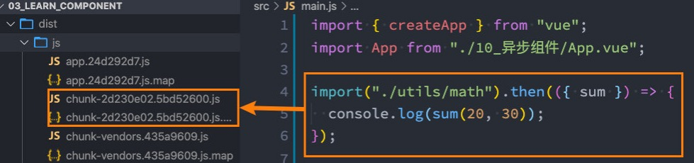
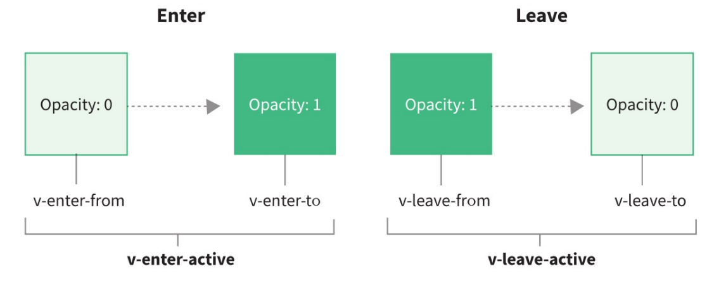
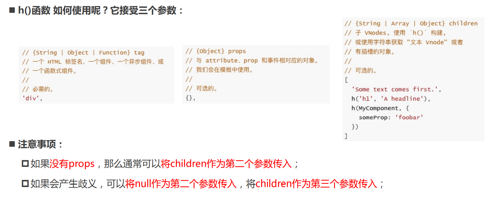
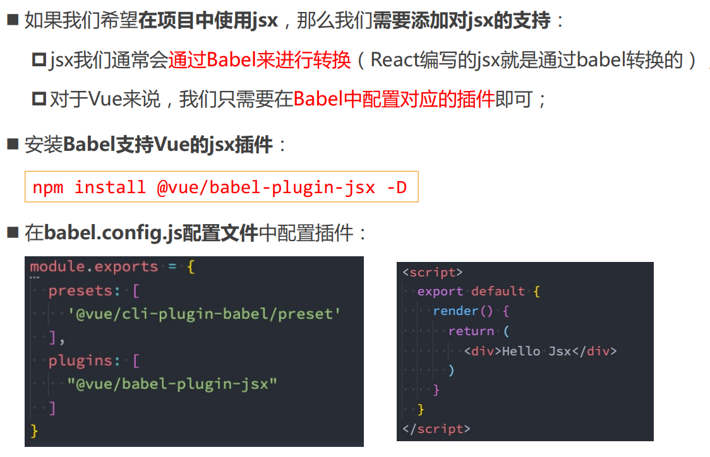
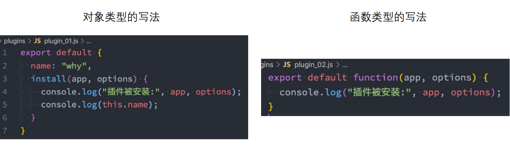

# 知识点

## 一、小知识点

### 1.动态组件

> **动态组件**是使用 **component 组件**，通过一个特殊的attribute **is** 来实现.
>
> 动态组件**传值**通过**props**进行传值。

```javascript
<template>
  <div>
    <button
      v-for="item in tabs"
      :key="item"
      @click="itemClick(item)"
      :class="{ active: currentTab === item }"
    >
      {{ item }}
    </button>


    <!-- 2.动态组件 -->
    <!-- currentTab的值为components注册的组件，该组件需要设置name值 -->
    <component :is="currentTab"></component>
    <!-- 动态组件传值：通过props进行传递，然后home,about等组件通过props接受 -->
    <component
      :is="currentTab"
      name="tjx"
      :age="18"
      @pageClick="pageaClick"
    ></component>

  </div>
</template>

<script>
import Home from "./pages/Home.vue";
import Category from "./pages/Category.vue";
import About from "./pages/About.vue";
export default {
  data() {
    return {
      tabs: ["home", "about", "category"],
      currentTab: "home",
    };
  },
  methods: {
    itemClick(item) {
      this.currentTab = item;
    },
    pageaClick() {
      console.log("page内部发生点击");
    },
  },
  components: {
    Home,
    Category,
    About,
  },
};
</script>
```


### 2.keep-alive

> 在开发中某些情况我们希望继续**保持组件的状态**，而不是销毁掉，这个时候我们就可以使用一个内置组件： **keep-alive**。

**keep-alive属性：**

* **include** - string | RegExp | Array。只有名称匹配的组件会被缓存；
* **exclude** - string | RegExp | Array。任何名称匹配的组件都不 会被缓存；
* **max** - number | string。最多可以缓存多少组件实例，一旦达 到这个数字，那么缓存组件中最近没有被访问的实例会被销毁；

**注：**include 和 exclude prop 允许组件有条件地缓存：二者都可以用逗号分隔字符串、正则表达式或一个数组来表示；匹配首先检查组件自身的 name 选项；

```javascript
<!-- keep-alive -->
    <keep-alive include="about,home"
      ><component
        :is="currentTab"
        name="tjx"
        :age="18"
        @pageClick="pageaClick"
      ></component
    ></keep-alive>
```

### 3.缓存组件的生命周期

> 对于缓存的组件来说，再次进入时，我们是不会执行created或者mounted等生命周期函数的： 但是有时候我们确实希望监听到何时重新进入到了组件，何时离开了组件； 这个时候我们可以使用**activated** 和 **deactivated** 这两个生命周期钩子函数来监听；

### 4.Webpack的代码分包

> 默认情况下，在构建整个组件树的过程中，因为组件和组件之间是通过模块化直接依赖的，那么webpack在打包时就会将组件模块打包到一起（比如一个app.js文件中）； 这个时候随着项目的不断庞大，app.js文件的内容过大，会造成首屏的渲染速度变慢；
>
> 所以，对于一些不需要立即使用的组件，我们可以单独对它们进行拆分，拆分成一些小的代码块chunk.js；这些chunk.js会在需要时从服务器加载下来，并且运行代码，显示对应的内容；那么webpack中如何可以对代码进行分包呢?



### 5.Vue中实现异步组件

> 项目过大了，对于某些组件我们希望通过异步的方式来进行加载（目的是可以对其进行分包处理），那 么Vue中给我们提供了一个函数：**defineAsyncComponent**。

**defineAsyncComponent接受两种类型的参数：**

* 类型一：工厂函数，该工厂函数需要返回一个Promise对象；
* 类型二：接受一个对象类型，对异步函数进行配置；

```javascript
<template>
  <div>
    <suspene>
      <template #defautl>
        <async-category></async-category>
      </template>
      <template #fallback>
        <loading></loading>
      </template>
    </suspene>
  </div>
</template>

<script>
import {defineAsyncComponent} from 'vue'
import Loading from "./utils/Loading.vue"

// import AsyncCategory from "./utils/AsyncCategory.vue"
// 写法一：
const AsyncCategory = defineAsyncComponent(() => import('./utils/AsyncCategory.vue'))
// 写法二：
  // const AsyncCategory = defineAsyncComponent({
  //   loader: () => import('./utils/AsyncCategory.vue'),
  //   // 当AsyncCategory还未加载下来时，使用Loading组件占位
  //   loadingComponent: Loading,
  //   // 加载失败时显示这个组件
  //   errorComponent: Loading,
  //   // 延迟 显示loading组件之前，等待多长事件
  //   delay: 2000,
  //   // err:错误信息 retry:函数，调用retry尝试重新加载 attempts：记录尝试的次数
  //   // onError: function(err, retry, attempts) {

  //   // }
  // })

  export default {
    components: {
      AsyncCategory,
      Loading
    }
  }
</script>
```

### 6.异步组件和Suspense

> Suspense是一个内置的全局组件，该组件有两个插槽：
>
> * default：如果default可以显示，那么显示default的内容；
> * fallback：如果default无法显示，那么会显示fallback插槽的内容；

```html
<template>
  <div>
    <suspene>
      <template #defautl>
        <async-category></async-category>
      </template>
      <template #fallback>
        <loading></loading>
      </template>
    </suspene>
  </div>
</template>
```

### 7.$refs的使用

```javascript
<template>
  <div>
    <h2 ref="haha">haha</h2>
    <button @click="btnClick">get</button>
    <nav-bar ref="navBar"></nav-bar>
  </div>
</template>

<script>
import NavBar from "./NavBar.vue"
  export default {
    components: {
      NavBar
    },
    data() {
      return {
        names: ['abc','csb']
      }
    },
    methods: {
      btnClick() {
        console.log(this.$refs.haha);
        console.log(this.$refs.navBar.message);
        this.$refs.navBar.sayHello();
      }
    }
  }
</script>
```

### 8.组件的v-model

 **App.vue：**

```javascript
<template>
  <div>
    <!-- <input type="text" v-model="message"> -->

    <!-- 组件上使用v-model -->
    <!-- <tjx-input v-model="message"></tjx-input> -->
    <!-- <tjx-input :modelValue="message" @update:model-value="message = $event"></tjx-input> -->

    <!-- 绑定两个v-model -->
    <tjx-input v-model="message" v-model:title="title"></tjx-input>

    <h1>{{message}}</h1>
    <h2>{{title}}</h2>

    
  </div>
</template>

<script>
import TjxInput from "./TjxInput.vue"
  export default {
    data() {
      return {
        message: "hello world",
        title: "dsfsd"
      }
    },
    components: {
      TjxInput
    }
  }
</script>
```

**TjxInput.vue：**

```javascript
<template>
  <div>
    <input type="text" v-model="value" />
    <input type="text" v-model="titles" />
  </div>
</template>

<script>
export default {
  props: {
    modelValue: String,
    title: String,
  },
  emits: ["update:modelValue", "update:title"],
  computed: {
    value: {
      set(value) {
        this.$emit("update:modelValue", value);
      },
      get() {
        return this.modelValue;
      },
    },
    titles: {
      set(titles) {
        this.$emit("update:title", titles);
      },
      get() {
        return this.title;
      },
    },
  },
};
</script>
```

### 9.Mixin

> 目前我们是使用组件化的方式在开发整个Vue的应用程序，但是组件和组件之间有时候会存在相同的代码逻辑，我 们希望对相同的代码逻辑进行抽取。 在Vue2和Vue3中都支持的一种方式就是使用**Mixin**来完成： Mixin提供了一种非常灵活的方式，来分发Vue组件中的可复用功能； 一个Mixin对象可以包含任何组件选项； 当组件使用Mixin对象时，所有Mixin对象的选项将被 混合 进入该组件本身的选项中；

#### (1)基本使用

> 一般会创建一个**mixins**文件夹，其中编写会多次复用的代码，然后在需要用的组件中通过**mixins属性**进行复用。

**APP.vue：**

```javascript
<template>
  <div>
    <h2>{{message}}</h2>
    <button @click="foo">按钮</button>
  </div>
</template>

<script>
import {demoMixin} from "./mixins/demoMixin.js"
  export default {
    mixins: [demoMixin],
    data() {
      return {
        title: "hello world",
      }
    },
    created() {
      console.log("fsdlfjsdlf");
    }
  }
</script>
```

**demoMixin.js：**

```javascript
export const demoMixin = {
  data() {
    return {
      message: "tjx"
    }
  },
  methods: {
    foo() {
      console.log("demo mixin foo");
    }
  },
  created() {
    console.log("执行了demo mixin created");
  }
}
```

#### (2)Mixin的合并规则

* 如果是data函数的返回值对象：返回值对象默认情况下会进行合并；如果data返回值对象的属性发生了冲突，那么会保留组件自身的数据；
* 如果是生命周期钩子函数：生命周期的钩子函数会被合并到数组中，都会被调用；
* 值为对象的选项，例如 methods、components 和 directives，将被合并为同一个对象：比如都有methods选项，并且都定义了方法，那么它们都会生效；但是如果对象的key相同，那么会取组件对象的键值对；

#### (3)全局混入Mixin

```javascript
// 通过app的mixin方法进行全局混入
app.mixin({
  data() {
    return {}
  },
  methods: {

  },
  created() {
    console.log("全局混入");
  }
})
```

### 10.extends

> 另外一个类似于Mixin的方式是通过**extends**属性： 允许声明扩展另外一个组件，类似于Mixins；

```html
<script>
import BasePage from "./BasePage.vue"
  export default {
    extends: BasePage,
    data() {
      return {
        content: "content"
      }
    }
  }
</script>
```


## 二、动画

> 想要给一个组件的显示和消失添加某种过渡动画，可以很好的增加用户体验：
>
> **React**框架本身并没有提供任何动画相关的API，所以在React中使用过渡动画我们需要使用一个第三方库 react-transition-group；
>
> **Vue**中为我们提供一些内置组件和对应的API来完成动画，利用它们我们可以方便的实现过渡动画效果；

### 1.Vue的transition动画

> Vue 提供了 **transition** 的封装组件，在下列情形中，可以给任何元素和组件添加进入/离开过渡：
>
> **条件渲染** (使用 v-if)条件展示 (使用 v-show) 
>
> **动态组件** 
>
> **组件根节点**

#### (1)transition执行过程

**当插入或删除包含在 transition 组件中的元素时，Vue 将会做以下处理：**

* 自动嗅探目标元素是否应用了CSS过渡或者动画，如果有，那么在恰当的时机添加/删除 CSS类名；
* 如果 transition 组件提供了**JavaScript钩子函数**，这些钩子函数将在恰当的时机被调用；
* 如果没有找到JavaScript钩子并且也没有检测到CSS过渡/动画，DOM插入、删除操作将会立即执行；

#### (2)过渡动画class

* **v-enter-from**：定义进入过渡的开始状态。在元素被插入之前生效，在元素被插入之后的下一帧移除。
* **v-enter-active**：定义进入过渡生效时的状态。在整个进入过渡的阶段中应用，在元素被插入之前生效，在过渡/动 画完成之后移除。这个类可以被用来定义进入过渡的过程时间，延迟和曲线函数。 
* **v-enter-to**：定义进入过渡的结束状态。在元素被插入之后下一帧生效 (与此同时 v-enter-from 被移除)，在过渡/ 动画完成之后移除。
* **v-leave-from**：定义离开过渡的开始状态。在离开过渡被触发时立刻生效，下一帧被移除。
* **v-leave-active**：定义离开过渡生效时的状态。在整个离开过渡的阶段中应用，在离开过渡被触发时立刻生效，在 过渡/动画完成之后移除。这个类可以被用来定义离开过渡的过程时间，延迟和曲线函数。
* **v-leave-to**：离开过渡的结束状态。在离开过渡被触发之后下一帧生效 (与此同时 v-leave-from 被删除)，在过渡/ 动画完成之后移除。

**class的name命名规则如下**：

* 如果我们使用的是一个没有name的transition，那么所有的class是以 v- 作为默认前缀；
* 如果我们添加了一个name属性，比如 ，那么所有的class会以 why- 开头；



```javascript
<template>
  <div>
    <button @click="isShow = !isShow">显示与隐藏</button>
    <transition name="tjx">
      <h2 v-if="isShow">hello world</h2>
    </transition>
  </div>
</template>

<script>
  export default {
    data() {
      return {
        isShow: true
      }
    }
  }
</script>

<style scoped>
.tjx-enter-from,
.tjx-leave-to {
  opacity: 0;
}

.tjx-enter-to,
.tjx-leave-from {
  opacity: 1;
}

.tjx-enter-active,
.tjx-leave-active {
  transition: opacity 2s ease;
}
</style>
```

#### (3)animation实现动画

> 通过**transition**来实现的动画效果，另外我们也可以通过**animation**来实现。

```javascript
<template>
  <div>
    <div><button @click="isShow = !isShow">显示与隐藏</button></div>

    <transition name="tjx">
      <h2 v-if="isShow" class="title">hello world</h2>
    </transition>
  </div>
</template>

<script>
export default {
  data() {
    return {
      isShow: true,
    };
  },
};
</script>

<style scoped>
.title {
  display: inline-block;
}
.tjx-enter-active {
  animation: bounce 1s ease;
}
.tjx-leave-active {
  animation: bounce 1s ease reverse;
}
@keyframes bounce {
  0% {
    transform: scale(0);
  }
  50% {
    transform: scale(1.2);
  }
  100% {
    transform: scale(1);
  }
}
</style>
```

#### (4)同时设置transition和animation动画

> Vue为了知道过渡的完成，内部是在监听 transitionend 或 animationend，到底使用哪一个取决于元素应用的 CSS规则： 如果我们只是使用了其中的一个，那么Vue能自动识别类型并设置监听；
>
> 但是如果我们同时使用了过渡和动画呢？ 并且在这个情况下可能某一个动画执行结束时，另外一个动画还没有结束；在这种情况下，我们可以设置 **type** 属性为 **animation** 或者 **transition** 来明确的告知Vue**监听的类型**；

#### (5)显示指定动画时间

> 可以显示的来指定过渡的时间，通过 **duration** 属性。 
>
> **duration**可以设置两种类型的值：
>
> **number**类型：同时设置进入和离开的过渡时间； 
>
> **object**类型：分别设置进入和离开的过渡时间；

```javascript
<template>
  <div>
    <div><button @click="isShow = !isShow">显示与隐藏</button></div>

    <!-- 根据type的值决定根据哪个动画来决定结束 -->
    <!-- duration:决定动画的事件 -->
    <transition name="tjx" type="transition" :duration="1000">
      <h2 v-if="isShow" class="title">hello world</h2>
    </transition>
  </div>
</template>

<script>
export default {
  data() {
    return {
      isShow: true,
    };
  },
};
</script>

<style scoped>
.title {
  display: inline-block;
}

.tjx-enter-from,
.tjx-leave-to {
  opacity: 0;
}

.tjx-enter-active,
.tjx-leave-active {
  transition: opacity 2s ease;
}

.tjx-enter-active {
  animation: bounce 1s ease;
}
.tjx-leave-active {
  animation: bounce 1s ease reverse;
}
@keyframes bounce {
  0% {
    transform: scale(0);
  }
  50% {
    transform: scale(1.2);
  }
  100% {
    transform: scale(1);
  }
}
</style>
```

#### (6)过渡的模式mode

> 是如果我们不希望同时执行进入和离开动画，那么我们需要设置**transition**的过渡模式： 
>
> **in-out**: 新元素先进行过渡，完成之后当前元素过渡离开；
>
> **out-in**: 当前元素先进行过渡，完成之后新元素过渡进入；

```javascript
<template>
  <div>
    <div><button @click="isShow = !isShow">显示与隐藏</button></div>

    <transition name="tjx" mode="in-out">
      <h2 v-if="isShow" class="title">hello world</h2>
      <h2 v-else class="title">hello yn</h2>
    </transition>
  </div>
</template>

<script>
export default {
  data() {
    return {
      isShow: true,
    };
  },
};
</script>

<style scoped>
.title {
  display: inline-block;
}

.tjx-enter-from,
.tjx-leave-to {
  opacity: 0;
}

.tjx-enter-active,
.tjx-leave-active {
  transition: opacity 2s ease;
}

.tjx-enter-active {
  animation: bounce 1s ease;
}
.tjx-leave-active {
  animation: bounce 1s ease reverse;
}
@keyframes bounce {
  0% {
    transform: scale(0);
  }
  50% {
    transform: scale(1.2);
  }
  100% {
    transform: scale(1);
  }
}
</style>
```

#### (7)appear初次渲染

> 默认情况下，首次渲染的时候是没有动画的，如果我们希望给他添加上去动画，那么就可以增加另外一个属性 **appear**

```javascript
<template>
  <div>
    <div><button @click="isShow = !isShow">显示与隐藏</button></div>

    <!-- appear:刚开始就进行一次动画 -->
    <transition name="tjx" mode="out-in" :appear="true">
      <component :is="isShow ? 'home' : 'about'"></component>
    </transition>
  </div>
</template>

```


### 2.animate.css

> 如何使用Animate库呢？ 
>
> 第一步：需要安装animate.css库：**npm install animate.css**
>
> 第二步：导入animate.css库的样式：import "animate.css"
>
> 第三步：使用animation动画或者animate提供的类；

* 用法一：直接使用animate库中定义的 **keyframes** 动画；
* 用法二：直接使用animate库提供给我们的**类**；

```html
<template>
  <div>
    <div><button @click="isShow = !isShow">显示与隐藏</button></div>

    <transition enter-active-class="animate__animated animate__fadeInDown" leave-active-class="animate__animated animate__flipInY">
      <h2 class="title" v-if="isShow">heoodfsls</h2>
    </transition>
  </div>
</template>
```


### 3.gsap库

> 通过JavaScript来实现一些动画的效果，这个时候我们可以选择使用gsap库来完成。
>
> 第一步：需要安装gsap库：**npm install gsap**
>
> 第二步：导入gsap库；
>
> 第三步：使用对应的api即可；

#### (1)JavaScript钩子

> 在使用动画之前，我们先来看一下transition组件给我们提供的JavaScript钩子，这些钩子可以帮助我们监听动画执行到 什么阶段了

```javascript
<template>
  <div>
    <div><button @click="isShow = !isShow">显示与隐藏</button></div>

    <transition @before-enter="beforeEnter"
                @enter="enter"
                @after-enter="afterEnter"
                @before-leave="beforeLeave"
                @leave="leave"
                @afterLeave="afterLeave">
      <h2 class="title" v-if="isShow">heoodfsls</h2>
    </transition>
  </div>
</template>

<script>
export default {
  data() {
    return {
      isShow: true,
    };
  },
  methods: {
    beforeEnter() {
      console.log("beforeEnter");
    },
    enter() {
      console.log("enter");
    },
    afterEnter() {
      console.log("afterEnter");
    },
    beforeLeave() {
      console.log("beforeLeave");
    },
    leave() {
      console.log("leave");
    },
    afterLeave() {
      console.log("afterLeave");
    }
  }
};
</script>

<style scoped>
.title {
  display: inline-block;
}

</style>
```

* 当我们使用JavaScript来执行过渡动画时，需要进行 done 回调，否则它们将会被同步调用，过渡会立即完成。 
* 添加 **:css="false"**，也会让 Vue 会跳过 CSS 的检测，除了性能略高之外，这可以避免过渡过程中 CSS 规则的影响。

#### (2)gsap库的使用

```javascript
<template>
  <div>
    <div><button @click="isShow = !isShow">显示与隐藏</button></div>

    <!-- :css="false" 不再执行css动画 -->
    <transition @enter="enter" @leave="leave" :css="false">
      <h2 class="title" v-if="isShow">heoodfsls</h2>
    </transition>
  </div>
</template>

<script>
import gsap from "gsap";
export default {
  data() {
    return {
      isShow: true,
    };
  },
  methods: {
    enter(element, done) {
      console.log("enter");
      // gsap.to(element, {})
      gsap.from(element, {
        scale: 0,
        x: 200, // translateX:200px
        onComplete: done,
      });
    },
    leave(element, done) {
      console.log("leave");
      gsap.to(element, {
        scale: 0,
        x: 200, // translateX:200px
        onComplete: done,
      });
    },
  },
};
</script>

<style scoped>
.title {
  display: inline-block;
}
</style>
```

#### (3)gsap实现数字变化

```javascript
<template>
  <div class="app">
    <input type="number" step="100" v-model="counter">
    <h2>{{showCounter}}</h2>
  </div>
</template>

<script>
import gsap from "gsap";
export default {
  data() {
    return {
      counter: 0,
      showNumber: 0
    };
  },
  computed: {
    showCounter() {
      return this.showNumber.toFixed(0)
    }
  },
  watch: {
    counter(newValue) {
      gsap.to(this, {
        duration: 1,
        showNumber: newValue
      })
    }
  }
};
</script>

<style scoped>
.title {
  display: inline-block;
}
</style>
```


### 4.列表的过渡

> 望渲染一个列表，并且该列表中添加删除数据也希望有动画执行呢？ 这个时候我们要使用  `<transition-group>`组件来完成；

**使用 有如下的特点**： 

* 默认情况下，它不会渲染一个元素的包裹器，但是你可以指定一个元素并以 tag attribute 进行渲染；
* 过渡模式不可用，因为我们不再相互切换特有的元素；
* 内部元素总是需要提供唯一的 key attribute 值；
* CSS 过渡的类将会应用在内部的元素中，而不是这个组/容器本身；

#### (1)列表过渡的移动动画

> 中虽然新增的或者删除的节点是有动画的，但是对于哪些其他需要移动的节点是没有动画的：
>
> 我们可以通过使用一个新增的 v-move 的class来完成动画；
>
> 它会在元素改变位置的过程中应用； 
>
> 像之前的名字一样，我们可以通过name来自定义前缀；

```javascript
<template>
  <div>
    <button @click="addNum">添加数字</button>
    <button @click="removeNum">删除数字</button>

    <transition-group tag="p" name="tjx">
      <span v-for="item in numbers" :key="item" class="item">{{item}}</span>
    </transition-group>
  </div>
</template>

<script>
  export default {
    data() {
      return {
        numbers: [0, 1, 2, 3, 4, 5, 6, 7, 8, 9],
        numCounter: 10
      }
    },
    methods: {
      addNum() {
        this.numbers.splice(this.randomIndex(), 0, this.numCounter++)
      },
      removeNum() {
         this.numbers.splice(this.randomIndex(), 1)
      },
      randomIndex() {
        return Math.floor(Math.random() * this.numbers.length)
      }
    }
  }
</script>

<style scoped>
.item {
  margin-right: 10px;
}

.tjx-enter-from,
.tjx-leave-to {
  opacity: 0;
  transform: translateY(30px);
}

.tjx-enter-active,
.tjx-leave-avtive {
  transition: all 1s ease;
}

.tjx-leave-avtive {
  position: absolute;
}

.tjx-move {
  transition: transform 1s ease;
}

</style>
```


## 三、compositionAPI

### 1.setup

> 为了开始使用Composition API，我们需要有一个可以实际使用它（编写代码）的地方；在Vue组件中，这个位置就是 **setup 函数**；setup其实就是组件的另外一个选项：只不过这个选项强大到我们可以用它来替代之前所编写的大部分其他选项；比如methods、computed、watch、data、生命周期等等；

#### (1)setup函数的参数

> **setup函数**的参数，它主要有两个参数：第一个参数：**props**  ；第二个参数：**context**

**props**：它其实就是父组件传递过来的属性会被放到**props**对象中，我们在setup中如果需要使用，那么就可 以直接通过props参数获取；

* 对于定义props的类型，我们还是和之前的规则是一样的，在props选项中定义；
* 并且在**template**中依然是可以正常去使用**props**中的属性，比如message；
* 如果我们在**setup**函数中想要使用**props**，那么**不可以通过 this** 去获取，因为**setup**没有绑定this；
* 因为**props**有直接作为**参数**传递到setup函数中，所以我们可以**直接通过参数**来使用即可；

**context**：我们也称之为是一个SetupContext，它里面包含三个属性：

* **attrs**：所有的非prop的attribute；
* **slots**：父组件传递过来的插槽（这个在以渲染函数返回时会有作用，后面会讲到）；
* **emit**：当我们组件内部需要发出事件时会用到emit（因为我们不能访问this，所以不可以通过 this.$emit发出事件）；

#### (2)setup的返回值

> **setup返回值**的作用：
>
> * setup的返回值可以在模板**template**中被使用；也就是说我们可以通过setup的返回值来替代**data**选项；
> * 可以返回一个执行函数来代替在**methods**中定义的方法；
> * 但是返回值在template中使用不是响应式的，需要进行处理才行；

```vue
<template>
  <div>
    <h2>{{ message }}</h2>
    <h2>{{ messagea }}</h2>

    <h2>counter: {{counter}}</h2>
    <button @click="addNum">+1</button>
  </div>
</template>

<script>
export default {
  props: {
    message: {
      type: String,
      required: true,
    },
  },

  // setup(props, context) {
  setup() {
    let counter = 100;
    // 局部函数
    const addNum = () => {
      counter++
      // counter改变了，但是界面中h2中的counter没有改变，不是响应式的
      console.log(counter);
    }
    return {
      messagea: "return setup",
      counter,
      addNum
    }

  },
};
</script>
```


### 2.reactive API

> 为在**setup**中定义的数据提供**响应式**的特性，那么我们可以使用**reactive**的函数

```vue
<template>
  <div>
    <h2>{{ message }}</h2>
    <h2>{{ messagea }}</h2>

    <h2>counter: {{ sate.counter }}</h2>
    <button @click="addNum">+1</button>
  </div>
</template>

<script>
import { reactive } from "vue";
export default {
  props: {
    message: {
      type: String,
      required: true,
    },
  },

  // setup(props, context) {
  setup() {
    // 需要进行响应式的数据放到reactive中,使用时需要sate. 的方式
    const sate = reactive({
      counter: 100
    })
    // 局部函数
    const addNum = () => {
      sate.counter++;
      // counter改变了，但是界面中h2中的counter没有改变，不是响应式的，通过reactive实现响应式
      console.log(sate.counter);
    };
    return {
      messagea: "return setup",
      sate,
      addNum,
    };
  },
};
</script>
```

**Reactive判断的API**：

* **isProxy** :检查对象是否是由 reactive 或 readonly创建的 proxy。 
* **isReactive** :检查对象是否是由 reactive创建的响应式代理： p 如果该代理是 readonly 建的，但包裹了由 reactive 创建的另一个代理，它也会返回 true； 
* **isReadonly** :检查对象是否是由 readonly 创建的只读代理。
* **toRaw**:返回 reactive 或 readonly 代理的原始对象（不建议保留对原始对象的持久引用。请谨慎使用）。 
* **shallowReactive**:创建一个响应式代理，它跟踪其自身 property 的响应性，但不执行嵌套对象的深层响应式转换 (深层还是原生对象)。
* **shallowReadonly**:创建一个 proxy，使其自身的 property 为只读，但不执行嵌套对象的深度只读转换（深层还是可读、可写的）。


### 3.ref API

#### (1)基本使用

> **reactive API**对传入的类型是有限制的，它要求我们必须传入的是一个**对象或者数组类型**：如果我们传入一个**基本数据类型（String、Number、Boolean）会报一个警告**；这个时候Vue3给我们提供了另外一个API：**ref API**
>
> * ref 会返回一个可变的响应式对象，该对象作为一个 响应式的引用 维护着它内部的值，这就是ref名称的来源； 
> * 它内部的值是在ref的 value 属性中被维护的；

```vue
<template>
  <div>
    <h2>{{ message }}</h2>
    <h2>{{ messagea }}</h2>

    <!-- 当在template中使用ref会自动解包，不能counter.value，直接counter就可以了 -->
    <h2>counter: {{ counter }}</h2>
    <button @click="addNum">+1</button>
  </div>
</template>

<script>
import { ref } from "vue";
export default {
  props: {
    message: {
      type: String,
      required: true,
    },
  },

  setup() {
    let counter = ref(100)
    // 局部函数
    const addNum = () => {
      // 使用时还是需要 counter.value的方式
      counter.value++;
      console.log(counter.value);
    };
    return {
      messagea: "return setup",
      counter,
      addNum,
    };
  },
};
</script>
```

* 在**模板**中引入ref的值时，Vue会**自动**帮助我们进行**解包操作**，所以我们并**不需要**在模板中通过 ref.value 的方式 来使用； 
* 但是在 setup 函数**内部**，它依然是一个 ref引用， 所以对其进行操作时，我们依然需要使用 **ref.value**的方式；

#### (2)ref自动解包

* 模板中的解包是浅层的解包，如果我们将ref放到一个**reactive**的属性当中，那么在模板中使用时，它会自动解包；

```vue
<template>
  <div>
    <h2>{{ message }}</h2>
    <h2>{{ messagea }}</h2>

    <!-- 当在template中使用ref会自动解包，不能counter.value，直接counter就可以了 -->
    <h2>counter: {{ counter }}</h2>
    <!-- ref是浅层解包，当ref被一个对象包裹时，还是需要使用.value的方式进行使用 -->
    <h2>counter: {{ info.counter.value }}</h2>
    <!-- 当ref最外层是被reactive所包裹时，这是它又会进行解包 -->
    <h2>counter: {{ reactiveInfo.counter }}</h2>
    <button @click="addNum">+1</button>
  </div>
</template>

<script>
import { ref,reactive } from "vue";
export default {
  props: {
    message: {
      type: String,
      required: true,
    },
  },

  setup() {
    let counter = ref(100)

    const info = {
      counter
    }

    const reactiveInfo = reactive({
      counter
    })
    // 局部函数
    const addNum = () => {
      // 使用时还是需要 counter.value的方式
      counter.value++;
      console.log(counter.value);
    };
    return {
      messagea: "return setup",
      counter,
      addNum,
      info,
      reactiveInfo
    };
  },
};
</script>
```

#### (3)toRefs和toRef

> 如果我们使用ES6的解构语法，对**reactive**返回的对象进行**解构**获取值，那么之后无论是修改结构后的变量，还是修改reactive 返回的state对象，数据都**不再是响应式的**： 那么有没有办法让解构出来的属性是响应式的呢？ Vue为我们提供了一个**toRefs**的函数，可以将**reactive**返回的对象中的属性都转成**ref**；
>
> 如果我们只希望转换**一个reactive对象**中的属性为ref, 那么可以使用**toRef**的方法;

```vue
<template>
  <div>
    <!-- <h2>{{ info.name }}-{{ info.age }}</h2> -->
    <h2>{{ name }}-{{ age }}</h2>
    <button @click="changeAge">修改age</button>
  </div>
</template>

<script>
// import { reactive, toRefs, toRef } from "vue";
import { reactive, toRef } from "vue";
export default {
  setup() {
    const info = reactive({ name: "tjx", age: 19 });
    // 解构后的数据不是响应式的，这里的解构只是取值
    // const {name,age} = info

    // 1.toRefs：将reactive对象中的所有属性转化为ref，建立链接
    // 为了解构后的值也是响应式的，可以使用toRefs
    // let {name, age} = toRefs(info)

    // 2.toRef: 只转化一个属性
    let {name} = info
    let age = toRef(info, "age")

    const changeAge = () => {
      // info.age++;
      // 使用toRefs后：
      age.value++
    };

    return {
      info,
      changeAge,
      name,
      age
    };
  },
};
</script>

<style scoped>
</style>
```

#### (4)ref其他API

* **unref**：如果我们想要获取一个ref引用中的value，那么也可以通过unref方法：如果参数是一个 ref，则返回内部值，否则返回参数本身；这是 val = isRef(val) ? val.value : val 的语法糖函数；
* **isRef**：判断值是否是一个ref对象。
* **shallowRef**：创建一个浅层的ref对象； 
* **triggerRef**：手动触发和 shallowRef 相关联的副作用

```vue
<template>
  <div>
    <h2>{{ info }}</h2>
    <button @click="changeInfo">修改age</button>
  </div>
</template>

<script>
import {  shallowRef, triggerRef } from "vue";
export default {
  setup() {
    const info = shallowRef({name: 'tjx'})

    const changeInfo = () => {
      // ref默认情况下是深层响应式
      // info.value.name = 'james'
      // 为了让他是浅层的响应式，我们可以使用shallowRef
      info.value.name = "james"

      // triggerRef用于手动触发这个浅层的ref为深层的ref
      triggerRef(info)
    }

    return {
      info,
      changeInfo
    };
  },
};
</script>
```


### 4.readonly

> 通过**reactive**或者**ref**可以获取到一个响应式的对象，但是某些情况下，传入给其他地方（组件）的这个 响应式对象希望在另外一个地方（组件）被使用，但是**不能被修改**，这个时候如何防止这种情况的出现呢？**Vue3**为我们提供了**readonly**的方法； **readonly会返回原生对象的只读代理（也就是它依然是一个Proxy，这是一个proxy的set方法被劫持，并且不 能对其进行修改）**；

**在开发中常见的readonly方法会传入三个类型的参数：** 

* 类型一：普通对象；
* 类型二：reactive返回的对象；
* 类型三：ref的对象；

```javascript
// 普通对象
    const info = {name: "tjx"}
    const readonlyInfo = readonly(info)

    // 响应式对象
    const info2 = reactive({
      name: 'tjx'
    })
    const readonlyInfo2 = readonly(info)

    // 响应式对象
    const info3 = ref({
      name: 'tjx'
    })
    const readonlyInfo3 = readonly(info)
```


### 5.computed

> 计算属性**computed**：当我们的某些属性是依赖其他状态时，我们可以使用计算属性来处理 ,在**Options API**中，我们是使用**computed选项**来完成的； 在**Composition API**中，我们可以在 setup 函数中使用 **computed 方法**来编写一个计算属性;

```vue
<template>
  <div>
    <h2>{{ fullName }}</h2>
    <button @click="changeName">修改firstName</button>
  </div>
</template>

<script>
import { ref, computed } from 'vue'
  export default {
    setup() {
      const fistName = ref("Kobe")
      const lastName = ref("Bryant")

      // 用法一：传入一个getter函数 computed返回的是一个ref对象
      // const fullName = computed(() => fistName.value + lastName.value)

      // 用法二：传入一个对象，对象包含getter和setter
      const fullName = computed({
        get: () => fistName.value + lastName.value,
        set(newValue) {
          const names = newValue.split(" ")
          fistName.value = names[0]
          lastName.value = names[1]
        }
      })

      const changeName = () => {
        // fistName.value = 'James'
        // 因为computed返回值是一个ref所以要使用 .value
        fullName.value = "hello tjx"
      }

      return {
        fullName,
        changeName
      }
    }
  }
</script>

<style scoped>
</style>
```

### 6.数据侦听

> 在**Composition API**中，我们可以使用**watchEffect**和**watch**来完成**响应式数据**的**侦听**； **watchEffect**用于自动收集响应式数据的依赖；**watch**需要手动指定侦听的数据源；

#### (1)watchEffect

> 当侦听到某些响应式数据变化时，我们希望执行某些操作，这个时候可以使用 watchEffect。

**基本使用：**

* watchEffect传入的函数会被立即执行一次，并且在执行的过程中会收集依赖；
* 只有收集的依赖发生变化时，watchEffect传入的函数才会再次执行；

```javascript
// watchEffect：自动收集响应式的依赖
      const name = ref("tjx")
      const age = ref(18)

      const changeName = () => name.value = "kobe"
      const changeAge = () => age.value++

      // 默认一开始的时候就会执行一次
      watchEffect(() => {
        console.log(name.value,age.value);
      })
```

**停止侦听：**在发生某些情况下，我们希望**停止侦听**，这个时候我们可以**获取watchEffect的返回值函数**，**调用该函数**即可。

```javascript
// watchEffect：自动收集响应式的依赖
    const stop = watchEffect(() => {
      console.log(name.value, age.value);
    });

    const changeName = () => (name.value = "kobe");
    const changeAge = () => {
      age.value++
      if (age.value > 25) {
        stop()
      }
    }
```

**清除副作用：**

>  什么是清除副作用呢？ 如开发中需要在侦听函数中执行网络请求，但是在网络请求还没有达到的时候，就停止了侦听器， 或者侦听器侦听函数被再次执行了。那么上一次的网络请求应该被取消掉，这个时候我们就可以清除上一次的副作用；

* 在我们给**watchEffect**传入的函数被回调时，其实可以获取到一个参数：**onInvalidate** ；当**副作用即将重新执行** 或者 **侦听器被停止** 时**会执行该函数传入的回调函数**；我们可以在传入的回调函数中，执行一些清除工作；

```javascript
const stop = watchEffect((onInvalidate) => {
      // 模拟网络请求
      const timer = setTimeout(() => {
        console.log("网络i请求成功");
      }, 2000)

      // 根据name和age两个变量清除额外的副作用
      onInvalidate(() => {
        // 在这个函数中清楚额外的副作用
        clearTimeout(timer)
        console.log("onInvalidatae");
      })
      console.log(name.value, age.value);
    });
```

**setup中使用ref：**只需要定义一个ref对象，绑定到元素或者组件的ref属性上即可；

```javascript
<template>
  <div>
    <h2 ref="title">哈哈哈</h2>
  </div>
</template>

<script>
import { ref, watchEffect } from "vue";
export default {
  setup() {
    const title = ref(null)

    watchEffect(() => {
      console.log(title.value);
    }, {
      // pre:提前执行（默认） post:等挂载完成后再执行
      flush: "pre"
    })
      
    return {
      title
    }
  },
};
</script>
```

#### (2)watch

> **watch**需要侦听特定的数据源，并在回调函数中执行副作用； 默认情况下它是惰性的，只有当被侦听的源发生变化时才会执行回调；
>
> 与watchEffect的比较，watch允许我们： 懒执行副作用（第一次不会直接执行）； 更具体的说明当哪些状态发生变化时，触发侦听器的执行；访问侦听状态变化前后的值；

**侦听单个数据源：**

> watch侦听函数的数据源有两种类型：一个**getter函数**：但是该getter函数必须引用可响应式的对象（比如reactive或者ref）；直接写入一个可响应式的对象，reactive或者ref（比较常用的是ref）；

```vue
<template>
  <div>
    <h2 ref="title">哈哈哈</h2>
    <button @click="changeDate">修改</button>
  </div>
</template>

<script>
import { reactive,  ref,  watch } from "vue";
export default {
  setup() {
    const info = reactive({name: 'tjx', age: 18})

    // 1.侦听watch时，传入一个getter函数
    // watch(() => info.name, (newValue, oldValue) => {
    //   console.log("newValue:", newValue, "oldValue:", oldValue);
    // })

    // 2.传入一个可响应式对象：ref对象/reactive对象
    // 情况一：reactive对象获取到的newValue和oldValue本身都是reactive对象
    // watch(info, (newValue, oldValue) => {
    //   console.log("newValue:", newValue, "oldValue:", oldValue);
    // })
    // 如果希望newValue和oldValue是一个普通对象
    watch(() => {
      return {...info}
    }, (newValue, oldValue) => {
      console.log("newValue:", newValue, "oldValue:", oldValue);
    })
    // 情况二：ref对象获取到的newValue和oldValue是值本身
    // const name = ref("tjx")
    // watch(name, (newValue, oldValue) => {
    //   console.log("newValue:", newValue, "oldValue:", oldValue);
    // })

    const changeDate = () => {
      info.name = "yinnan"
      // name.value = "yinnan"
    }

    return {
      changeDate
    }
    
  },
};
</script>
```

**侦听多个数据源：**

```vue
<template>
  <div>
    <h2 ref="title">哈哈哈</h2>
    <button @click="changeDate">修改</button>
  </div>
</template>

<script>
import { reactive,  ref,  watch } from "vue";
export default {
  setup() {
    // 定义可响应式对象
    const info = reactive({name: 'tjx', age: 18})
    const name = ref("tjx")

    // 侦听器：侦听多个对象通过 []
    // watch([info, name], (newValue, oldValue) => {
    watch([() => ({...info}), name], (newValue, oldValue) => {
      console.log("newValue:", newValue, "oldValue", oldValue);
    })

    const changeDate = () => {
      info.name = "yinnan"
    }

    return {
      changeDate,
      info
    }
  },
};
</script>
```

**侦听响应式对象：**

 ```vue
<template>
  <div>
    <h2 ref="title">哈哈哈</h2>
    <button @click="changeDate">修改</button>
  </div>
</template>

<script>
import { reactive, watch } from "vue";
export default {
  setup() {
    // 定义可响应式对象
    const info = reactive({
      name: "tjx",
      age: 18,
      friend: {
        name: 'yinnan'
      }
    });

    // 侦听器：默认可以深度侦听
    // watch(info, (newValue, oldValue) => {
    //   console.log("newValue:", newValue, "oldValue", oldValue);
    // });
    // 但是通过这种解构的方式就不能进行深度侦听
    watch(() => ({...info}), (newValue, oldValue) => {
      console.log("newValue:", newValue, "oldValue", oldValue);
    }, {
      deep: true, // 深度侦听
      immediate: true, // 立即执行
    });

    const changeDate = () => {
      info.friend.name = "yinnanlover";
    };

    return {
      changeDate,
      info,
    };
  },
};
</script>
 ```

### 7.生命周期钩子

> 过 setup 可以用来替代 data 、 methods 、 computed 、watch 等等这些选项，也可以替代 生命周 期钩子。 那么setup中如何使用生命周期函数呢？可以使用直接导入的 **onX** 函数注册生命周期钩子；

| option API    | Hook inside setup |
| ------------- | ----------------- |
| beforeCreate  | Not needed*       |
| created       | Not needed*       |
| beforeMount   | onBeforeMount     |
| Mounted       | onMounted         |
| beforeUpdate  | onBeforeUpdate    |
| updated       | onupdated         |
| beforeUnmount | onBeforeUnmount   |
| unmounted     | onUnmounted       |
| activated     | onActivated       |
| deactivated   | onDeactivated     |

**注：**因为setup是围绕beforeCreate和created生命周期钩子运行的，所以不需要显示地定义他们。换句话说，这些钩子编写的任何代码都因该直接在setup函数中编写；

```vue
<template>
  <div>
    <button @click="counterAdd">{{counter}}</button>
  </div>
</template>

<script>
import {onMounted, onUpdated, onUnmounted, ref} from 'vue'
  export default {
    setup() {
      onMounted(() => {
        console.log("app mounted");
      })
      onUpdated(() => {
        console.log("app updated");
      })
      onUnmounted(() => {
        console.log("app unmounted");
      })

      const counter = ref(0)
      const counterAdd = () => {
        counter.value++
      }

      return {
        counter,
        counterAdd
      }
    }
  }
</script>

<style scoped>

</style>
```

### 8.Provid和Inject

> 事实上我们之前还学习过Provide和Inject，Composition API也可以替代之前的 Provide 和 Inject 的选项。

* 我们可以通过 **provide**来提供数据： 可以通过 provide 方法来定义每个 Property；provide可以传入两个参数： **name：提供的属性名称**； **value：提供的属性值**；

* 在 **后代组件** 中可以通过 inject 来注入需要的属性和对应的值： 可以通过 inject 来注入需要的内容； inject可以传入两个参数：要 inject 的 property 的 name；默认值；

**子组件：**

```vue
<template>
  <div>
    <h2>{{name}}</h2>
    <h2>{{counter}}</h2>
    <button @click="homeIncrement">home++</button>
  </div>
</template>

<script>
import {inject} from "vue"
  export default {
    setup() {
      // inject有两个参数，第二个参数为默认值
      const name = inject("name")
      const counter = inject("counter")

      const homeIncrement = () => counter.value++
      return {
        name,
        counter,
        homeIncrement
      }
    }
  }
</script>
```

**父组件：**

```vue
<template>
  <div>
    <home></home>
    <h2>"app counter" {{counter}}</h2>
    <button @click="increment">app++</button>
  </div>
</template>

<script>
import { provide, ref, readonly } from "vue";
import Home from "./Home.vue";
export default {
  components: {
    Home,
  },
  setup() {
    const name = ref("tjx");
    let counter = ref(100);

     // 1.为了增加 provide 值和 inject 值之间的响应性，我们可以在 provide 值时使用 ref 和 reactive。
    // 2.为了实现单项数据流（子不能改变父数据）这里可以通过readonly
    provide("name", readonly(name));
    provide("counter", readonly(counter));

    const increment = () => counter.value++;

    return {
      increment,
      counter
    };
  },
};
</script>

<style scoped>
</style>
```


## 四、高级语法补充

### 1.h函数

> Vue推荐在绝大数情况下使用模板来创建你的HTML，然后一些特殊的场景，你真的需要JavaScript的**完全编程**的 能力，这个时候你可以使用 **渲染函数** ，它比模板更接近编译器；Vue在生成真实的DOM之前，会将我们的节点转换成VNode，而VNode组合在一起形成一颗树结构，就是虚 拟DOM（VDOM）；之前编写的 template 中的HTML 最终也是使用**渲染函数**生成对应的VNode； 如果你想充分的利用JavaScript的编程能力，我们可以自己来编写 createVNode 函数，生成对应的 VNode：**使用 h()函数**：h() 函数是一个用于创建 vnode 的一个函数；其实更准备的命名是 createVNode() 函数，但是为了简便在Vue将之简化为 h() 函数；

**如何使用：**



**基本使用：**h函数可以在两个地方使用： **render函数选项中**； **setup函数选项中**（setup本身需要是一个函数类型，函数再返回h函数创建的VNode）；

**render函数实现计数器：**

```vue
<script>
import {h} from "vue"
  export default {
    data() {
      return {
        counter: 0
      }
    },
    render() {
      return h("h2", {class: "app"}, [
        h("h2", null, `当前计数:${this.counter}`),
        h("button", {
          onClick: () => this.counter++
        }, "+1"),
        h("button", {
          onClick: () => this.counter--
        }, "-1"),
      ])
    }
  }
</script>

<style scoped>

</style>
```

**setup实现计数器：**

```vue
<script>
import { h, ref } from "vue";
export default {
  setup() {
    const counter = ref(0);

    // setup代替render函数
    return () => {
      return h("h2", { class: "app" }, [
        h("h2", null, `当前计数:${counter.value}`),
        h(
          "button",
          {
            onClick: () => counter.value++,
          },
          "+1"
        ),
        h(
          "button",
          {
            onClick: () => counter.value--,
          },
          "-1"
        ),
      ]);
    };
  },
};
</script>

<style scoped>
</style>
```

### 2.jsx

**jsx的babel配置：**



**App.vue：**

```vue
<script>
import HelloWorld from "vue"
  export default {
    data() {
      return {
        counter: 100
      }
    },
    render() {
      const increment = () => this.counter++
      const decrement = () => this.counter--
      return (
        <div>
          <h2>当前计数:{this.counter}</h2>
          <button onClick={increment}>+</button>
          <button onClick={decrement}>-</button>
          <HelloWorld></HelloWorld>
        </div>
      )
    }
  }
</script>

<style scoped>

</style>
```

**HelloWorld.vue：**

```vue
<script>
  export default {
    render() {
      return (
        <div>
          <h2>HelloWorld</h2>
        </div>
      )
    }
  }
</script>

<style scoped>

</style>
```

### 3.自定义指令

> 在Vue中，代码的复用和抽象主要还是通过组件； p通常在某些情况下，你需要对DOM元素进行底层操作，这个时候就会用到自定义指令；自定义指令分为两种：**自定义局部指令**：组件中通过 **directives** 选项，只能在当前组件中使用； **自定义全局指令**：**app**的 **directive** 方法，可以在任意组件中被使用；

**自定义局部指令：**

```vue
<template>
  <div>
    <input type="text" v-focus> 
  </div>
</template>

<script>
  export default {
    // 局部指令
    directives: {
      focus: {
        mounted(el) {
          console.log("focus");
          el.focus()
        }
      }
    }
  }
</script>
```

**自定义全局指令：**

```javascript
const app = createApp(App)

// 全局自定义指令
app.directive("focus", {
  mounted(el) {
    console.log("focus");
    el.focus()
  }
})

app.mount('#app')
```

**指令的生命周期：**

* **created**：在绑定元素的 attribute 或事件监听器被应用之前调用； 
* **beforeMount**：当指令第一次绑定到元素并且在挂载父组件之前调用； 
* **mounted**：在绑定元素的父组件被挂载后调用； 
* **beforeUpdate**：在更新包含组件的 VNode 之前调用； 
* **updated**：在包含组件的 VNode 及其子组件的 VNode 更新后调用； 
* **beforeUnmount**：在卸载绑定元素的父组件之前调用； 
* **unmounted**：当指令与元素解除绑定且父组件已卸载时，只调用一次；

```vue
<template>
  <div>
    <button v-if="counter < 2" v-tjx.aaa="'tjx'" @click="increment">当前计数{{counter}}</button>
  </div>
</template>

<script>
import {ref} from "vue"
  export default {
    // 局部指令
    directives: {
      tjx: {
        created(el, bindings, vnode, preVnode) {
          console.log("tjx created");
          console.log(el, bindings, vnode, preVnode);
          // 获取指令传递的参数
          console.log(bindings.value);
          // 指令的修饰符
          console.log(bindings.modifiers);
        },
        beforeMount() {
          console.log("tjx beforeMount");
        },
        mounted() {
          console.log("tjx mounted");
        },
        beforeUpdate() {
          console.log("tjx beforeUpdate");
        },
        updated() {
          console.log("tjx updated");
        },
        beforeUnmount() {
          console.log("tjx beforeUnmount");
        },
        unmounted() {
          console.log("tjx unmount");
        }
      }
    },
    setup() {
      const counter = ref(0)
      const increment = () => counter.value++;
      return {
        counter,
        increment
      }
    }
  }
</script>
```

**时间格式化指令：**

```javascript
import dayjs from 'dayjs'

export default function registerFormatTime(app) {
  app.directive("format-time", {
    mounted(el, bindings) {
      let formatString = bindings.value;
      
      if (!formatString) {
        formatString = "YYYY-MM-DD HH:mm:ss"
      }

      const textContent = el.textContent;
      let timestamp = parseInt(textContent)
      if (textContent.length === 10) {
        timestamp = timestamp * 1000
      }
      el.textContent = dayjs(timestamp).format(formatString)
    }
  })
}
```

### 4.Teleport

> 在组件化开发中，我们封装一个组件A，在另外一个组件B中使用： 那么组件A中template的元素，会被挂载到组件B中template的某个位置；最终我们的应用程序会形成一颗DOM树结构；但是某些情况下，我们希望组件不是挂载在这个组件树上的，可能是移动到Vue app之外的其他位置： 比如移动到body元素上，或者我们有其他的div#app之外的元素上；这个时候我们就可以通过**teleport**来完成；

**它有两个属性**：  to：指定将其中的内容移动到的目标元素，可以使用选择器；disabled：是否禁用 teleport 的功能；

```vue
<template>
  <div class="app">
    <teleport to="#tjx">
      <h2>当前计数</h2>
      <button>+1</button>
      <hello-world></hello-world>
    </teleport>

    <!-- 都会放到tjx中去 -->
    <teleport to="#tjx">
      <h2>hhhhh</h2>
    </teleport>
  </div>
</template>

<script>
import {getCurrentInstance} from "vue"
import HelloWorld from "./HelloWorld.vue"
export default {
  components: {
    HelloWorld
  },
  mounted() {
    console.log(this.$name);
  },
  setup() {
    // 在setup中获取全局属性
    const instance = getCurrentInstance();
    console.log(instance.appContext.config.globalProperties.$name);
  }
};
</script>

<style scoped>
</style>
```

### 5.vue插件

> 通常我们向Vue全局添加一些功能时，会采用插件的模式，它有两种编写方式： **对象类型**：一个对象，但是必须包含一个 **install** 的函数，该函数会在安装插件时执行； **函数类型**：一个function，这个函数会在安装插件时自动执行；

**插件可以完成的功能没有限制，比如下面的几种都是可以的**： 

* 添加全局方法或者 property，通过把它们添加到 config.globalProperties 上实现；
* 添加全局资源：指令/过滤器/过渡等；
* 通过全局 mixin 来添加一些组件选项；
* 一个库，提供自己的 API，同时提供上面提到的一个或多个功能；

