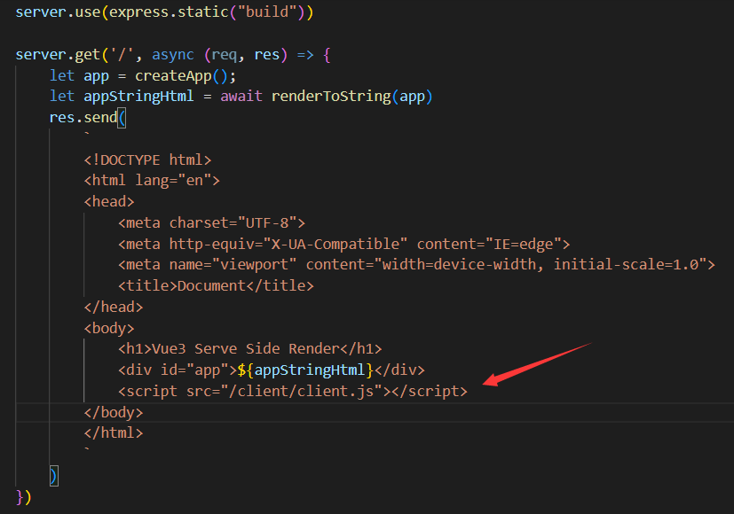
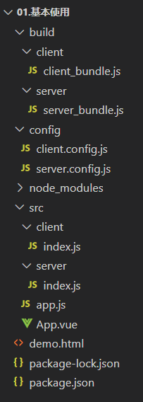
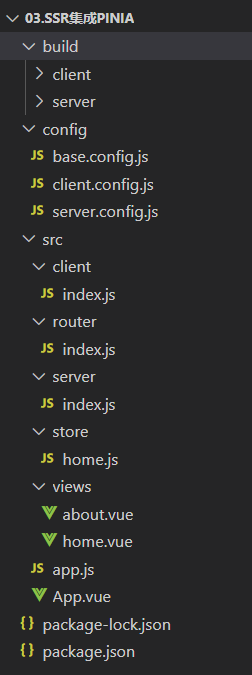
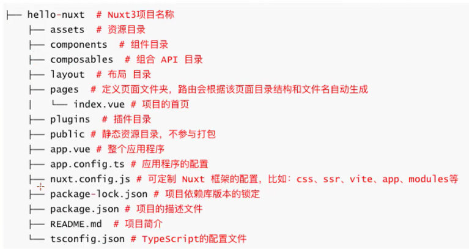
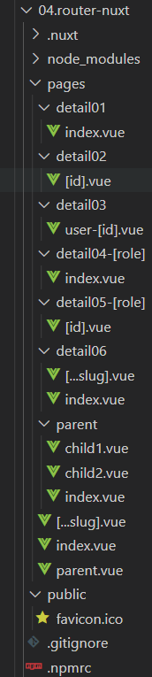

# 服务的渲染

## 一、原生

> ​	通过vue提供的**createSSRApp**创建app实例，服务端通过从**@vue/server-renderer**中导出的**renderToString**，将app实例转为**html字符串**，再将html字符串插入到返回给客户端的html代码中。
>
> ​	再通过打包client代码将之转为js代码插入到返回给客户端的html代码中，用于**激活**。

### 1.基本使用

* 创建一个vue组件**App.vue**

```vue
<template>
  <div class="app" style="border: 1px solid red">
    <h2>Vue App</h2>
    <div>{{ count }}</div>
    <button @click="addCounter">+1</button>
  </div>
</template>

<script setup>
import { ref } from 'vue';
const count = ref(100)
function addCounter() {
    count.value++
}
</script>

<style lang="less" scoped>
</style>
```

* 创建**app.js**文件，使用vue提供的**createSSRApp**函数将**App.vue**传入生成一个实例并导出。

```javascript
import { createSSRApp } from 'vue'
import App from './App.vue'

// 写成一个函数的原因：避免跨请求状态的污染
// 通过函数来返回app实例，可以保证每个请求都会返回新的app实例，来避免跨域请求状态的污染
export default function createApp() {
    let app = createSSRApp(App)
    return app
}
```

* 在server文件夹下创建index.js文件，启动一个express服务，从**@vue/server-renderer**中导出一个**renderToString**函数，将**app.js中导出的app实例**传入renderToString函数中生成一个**html字符串**，将该html字符串**放入html模板中返回给客户端**。（此时客户端得到页面是静态，还**没有数据的响应式等功能**，需要**激活**）。

* 创建**server.config.js**文件用于将server中的index.js进行打包。

```javascript
let path = require("path")
let nodeExternals = require("webpack-node-externals")
let {VueLoaderPlugin} = require("vue-loader/dist/index")

module.exports = {
    // 运行在node环境
    target: 'node',
    // 开发环境
    mode: "development",
    // 打包入口
    entry: "./src/server/index.js",
    // 打包出口
    output: {
        filename: "server_bundle.js",
        path: path.resolve(__dirname, "../build/server")
    },
    // 一下后缀的文件可省略后缀
    resolve: {
        extensions: ['.js', '.json', '.wasm', '.jsx', '.vue']
    },
    // 排除node_module中的包
    externals: [nodeExternals()], 
    // 打包
    module: {
        rules: [
            {
                test: /\.js$/,
                loader: "babel-loader",
                options: {
                    presets: ["@babel/preset-env"]
                }
            }, 
            {
                test: /\.vue$/,
                loader: 'vue-loader'
            }
        ]
    },
    // 打包插件
    plugins: [new VueLoaderPlugin()]
}
```

* 在client文件夹下创建文件index.js，用于生成后续**激活**需要的js文件。

```javascript
import {createApp} from 'vue'

import App from '../App.vue'

let app = createApp(App)
app.mount("#app")
```

* 创建**client.config.js**文件用于将client中的index.js进行打包，打包后得到的js文件就是用于激活的。

```javascript
let path = require("path")
let {VueLoaderPlugin} = require("vue-loader/dist/index")
let {DefinePlugin} = require('webpack')

module.exports = {
    target: 'web',
    mode: "development",
    entry: "./src/client/index.js",
    output: {
        filename: "client_bundle.js",
        path: path.resolve(__dirname, "../build/client")
    },
    resolve: {
        extensions: ['.js', '.json', '.wasm', '.jsx', '.vue']
    },
    module: {
        rules: [
            {
                test: /\.js$/,
                loader: "babel-loader",
                options: {
                    presets: ["@babel/preset-env"]
                }
            }, 
            {
                test: /\.vue$/,
                loader: 'vue-loader'
            }
        ]
    },
    // DefinePlugin用于关闭在浏览器运行时报的警告
    plugins: [new VueLoaderPlugin(), new DefinePlugin({
        __VUE_PROD_DEVTOOLS__: false,
        __VUE_OPTIONS_API__: false
    })]
}
```

* 将用于激活的js文件在html模板中进行引用，实现激活，之后再浏览器访问，页面便具有vue的响应式等功能。




**目录结构：**



**package.json:**

```json
{
  "description": "",
  "scripts": {
    "dev": "nodemon ./src/server/index.js",
    "start": "nodemon ./build/server/server_bundle.js",
    "build:server": "webpack --config ./config/server.config.js --watch",
    "build:client": "webpack --config ./config/client.config.js --watch"
  },
  "dependencies": {
    "express": "^4.18.2",
    "vue": "^3.2.47"
  },
  "devDependencies": {
    "nodemon": "^2.0.21",
    "webpack": "^5.76.2",
    "webpack-cli": "^5.0.1",
    "webpack-node-externals": "^3.0.0",
    "@babel/preset-env": "^7.20.2",
    "babel-loader": "^9.1.2",
    "vue-loader": "^17.0.1"
  }
}
```


### 2.集成路由

> 基本操作和上面一样。

* 创建views文件夹用于存放vue组件。在该文件夹作用创建home.vue和about.vue；

```vue
<template>
    <div class="home" style="border: 1px solid green">
      <h2>Home</h2>
      <div>{{ count }}</div>
      <button @click="addCounter">+1</button>
    </div>
  </template>
  
  <script setup>
  import { ref } from 'vue';
  const count = ref(200)
  function addCounter() {
      count.value++
  }
  </script>
  
  <style lang="less" scoped>
  </style>
```

* 创建router文件夹，并在其中创建路由配置文件；

```javascript
import {createRouter} from "vue-router"

const routes = [
    {
        path: "/",
        component: () => import("../views/home.vue")
    },
    {
        path: "/about",
        component: () => import("../views/about.vue")
    }
]
// 当初的是一个函数，原因有导出app相同，注意之类需要传入一个路由模式的参数，在服务端需要传入用什么路由模式
export default function(history) {
    return createRouter({
        history,
        routes
    })
}
```

* 在express服务中安装路由插件；

```javascript
let express = require("express")
let server = express()


import { renderToString } from "@vue/server-renderer"
// 内存路由：node用
import { createMemoryHistory } from "vue-router"
import createApp from "../app"
import createRouter from "../router"

// 部署静态资源
server.use(express.static("build"))

server.get('/', async (req, res) => {
    let app = createApp();

    // 安装路由插件
    let router = createRouter(createMemoryHistory())
    app.use(router)
    await router.push(req.url || "/") // 等待页面跳转好
    await router.isReady() // 等待（异步）路由加载完成，再渲染

    let appStringHtml = await renderToString(app)
    res.send(
        `
        <!DOCTYPE html>
<html lang="en">
<head>
    <meta charset="UTF-8">
    <meta http-equiv="X-UA-Compatible" content="IE=edge">
    <meta name="viewport" content="width=device-width, initial-scale=1.0">
    <title>Document</title>
</head>
<body>
    <h1>Vue3 Serve Side Render</h1>
    <div id="app">${appStringHtml}</div>
    <script src="/client/client.js"></script>
</body>
</html>
        `
    )
})

server.listen(3000, () => {
    console.log("start node server on 3000 ");
})
```

* 在client下的index.js文件中安装路由插件；

```javascript
import {createApp} from 'vue'
import createRouter from "../router"

import App from '../App.vue'
import { createWebHistory } from 'vue-router'

let app = createApp(App)

// 安装路由插件
let router = createRouter(createWebHistory())
app.use(router)

// 等待路由准备好
router.isReady().then(() => {
    app.mount("#app")
})
```

* 最后通过命令对客户端和服务端代码进行打包，再运行服务端代码进行浏览器访问测试

**注意：App.vue：**

```vue
<template>
  <div class="app" style="border: 1px solid red">
    <h2>Vue App</h2>
    <div>{{ count }}</div>
    <button @click="addCounter">+1</button>

    <div>
      <!-- 路由跳转 -->
      <router-link to="/">
        <button>home</button>
      </router-link>
      <router-link to="/about">
        <button>about</button>
      </router-link>
    </div>

    <router-view></router-view>
  </div>
</template>

<script setup>
import { ref } from 'vue';
const count = ref(100)
function addCounter() {
    count.value++
}
</script>
```


### 3.集成pinia

> 基本操作和上面一样。

* 创建store文件夹并在其中创建store

```javascript
import {defineStore} from "pinia"

export const useHomeStore = defineStore("home", {
    state() {
        return {
            count: 0
        }
    },
    actions: {
        increment() {
            this.count++
        },
        decrement() {
            this.count--
        }
    }
})
```

* 在server中安装pinia插件；

```javascript
let express = require("express")
let server = express()


import { renderToString } from "@vue/server-renderer"
// 内存路由：node用
import { createMemoryHistory } from "vue-router"
import createApp from "../app"
import createRouter from "../router"
import { createPinia } from "pinia"

// 部署静态资源
server.use(express.static("build"))

server.get('/', async (req, res) => {
    let app = createApp();

    // 安装路由插件
    let router = createRouter(createMemoryHistory())
    app.use(router)
    await router.push(req.url || "/") // 等待页面跳转好
    await router.isReady() // 等待（异步）路由加载完成，再渲染

    // 安装pinia插件
    let pinia = createPinia()
    app.use(pinia)

    let appStringHtml = await renderToString(app)
    res.send(
        `
        <!DOCTYPE html>
<html lang="en">
<head>
    <meta charset="UTF-8">
    <meta http-equiv="X-UA-Compatible" content="IE=edge">
    <meta name="viewport" content="width=device-width, initial-scale=1.0">
    <title>Document</title>
</head>
<body>
    <h1>Vue3 Serve Side Render</h1>
    <div id="app">${appStringHtml}</div>
    <script src="/client/client.js"></script>
</body>
</html>
        `
    )
})

server.listen(3000, () => {
    console.log("start node server on 3000 ");
})
```

* 在client中安装pinia插件；

```javascript
import {createApp} from 'vue'
import createRouter from "../router"

import App from '../App.vue'
import { createWebHistory } from 'vue-router'
import { createPinia } from 'pinia'

let app = createApp(App)

// 安装路由插件
let router = createRouter(createWebHistory())
app.use(router)

// 安装pinia插件
let pinia = createPinia()
app.use(pinia)

// 等待路由准备好
router.isReady().then(() => {
    app.mount("#app")
})
```

* 进行打包，运行，测试

**目录结构：**其中**base.config.js**是通过**let { merge } = require("webpack-merge")**将公共代码进行了合并。




## 二、Nuxt

> Nuxt会自动导入**辅助函数、组个API给Vue API，无需手动导入**；
>
> 基于规范的目录结构，Nuxt还可以对自己的组件、插件使用**自动导入**；

### 1.创建项目

* （1）创建项目：npx nuxi init < project-name>
* （2）进入到项目目录安装依赖：npm install

**注：**如果报错尝试**ping raw.githubusercontent.com**是否通，不通需要进行配置，win电脑host配置路由：**c:/Windows/System32/drivers/etc/hosts**，在该文件中添加一行：**185.199.108.133 raw.githubusercontent.com**即可。

* 目录结构：[目录结构](https://nuxt.com/docs/guide/directory-structure/nuxt)



### 2.配置文件

> **nuxt.config.ts**为nuxt的位置文件；

* **runtimeConfig**：运行是配置，即定义环境变量，可通过.env中的环境变量来覆盖，优先级：.env > runtimeConfig
* **appConfig：**应用配置，定义在构建时确定的公共配置，该配置会和app.config.ts的配置合并（优先级 app.config.ts > appConfig）；
* **app：**app配置。head:每个页面上设置head信息，支持useHead配置和内置组件。
* **ssr：**指定渲染模式；
* **router：**配置路由相关信息，不如客户端渲染可以配置hash路由；
* **modules：**配置Nuxt扩展的模式，比如：@pinia/nuxt @nuxt/image
* **routeRules：**定义路由规则，可以更改路由的渲染模式或分配基于路由缓存策略；
* **builder：**可以指定用vite还是webpack来构建应用，默认vite

**runtimeConfig  vs  app.config：**前者定义环境变量，如运行时需要指定的私有或公共token；后者定义公共变量，如在构建时确定的公共token、网站配置。

****

**nuxt.config.ts：**

```typescript
// https://nuxt.com/docs/api/configuration/nuxt-config
// defineNuxtConfig为辅助函数，不需要导报
export default defineNuxtConfig({
    // 运行是配置，即定义环境变量，可通过.env中的环境变量来覆盖，优先级：.env > runtimeConfig
    runtimeConfig: {
        // 服务端可获取
        appKey: "aabbcc", // server
        // 服务端和客户端都可以获取
        public: {
            baseURL: "http:/codercba.com" // client and server
        }
    },
    // 2.定义应用的配置
    appConfig: {
        // title: "hello nuxt3",
        // them: {
        //     primary: "yellow"
        // }
    },
    // 3. app 配置 
    app: {
        // 给app所有的页面的head添加的配置（seo,添加外部的资源）
        head: {
            title: "tjx",
            charset: "UTF-8",
            viewport: "",
            meta: [
                {
                    name: "keywords",
                    content: "科教"
                },
                {
                    name: "description",
                    content: "手机商城 电商"
                }
            ],
            link: [
                {
                    rel: "shortcut icon",
                    href: "favicon.ico",
                    type: "image/x-icon"
                }
            ],
            style: [
                {
                    children: "body{color: red;}"
                }
            ]
        }
    },
    // 4.渲染模式
    ssr: false, // false为单页面模式
    // 5.更改路由模式
    router: {
        options: {
            hashMode: true // 只在spa有效
        }
    },
    // 6.路径别名
    alias: {},
    // 7.配置nuxt拓展的模块
    modules: [],
    // 8.定义路由规则，可更改为路由的渲染模式或分配基于路由缓存策略
    routeRules: {},
    // 9.指定vite还是webpack来构建应用，默认vite
    // builder: {},
    telemetry:false
})
```

**app.config.ts：**app.config.ts配置文件的选项不能使用env环境变量来覆盖，与runtimeConfig不同。（不要将敏感信息放在app.config中，该文件客户端公开

```typescript
export default defineAppConfig({
  title: "hello nuxt3",
  them: {
    primary: "yellow",
  },
});
```

**app.vue：**

```vue
<template>
  <div>
    <h2>hello nuxt3</h2>
    
    <!-- 通过内置组件添加 优先级：内置组件 > .vue中的 > nuxt.config.ts -->
    <Head>
      <Meta name="key" content="key key key" />
    </Head>
  </div>
</template>

<script setup>
// 1.判断代码的运行环境
// if (process.server) {
//   console.log("运行在server");
// }
// if (process.client) {
//   console.log("运行在client");
// }
// // 获取环境变量
// const runtimeConfig = useRuntimeConfig()
// if (process.server) {
//   console.log(runtimeConfig.appKey);
//   console.log(runtimeConfig.public.baseURL);
// }
// if (process.client) {
//   console.log(runtimeConfig.appKey);
//   console.log(runtimeConfig.public.baseURL);
// }

// 3.获取appConfig
// let appConfig = useAppConfig()
// console.log(appConfig.title);
// onMounted(() => {
//   console.log(appConfig.them.primary);
// })

// 4.动态的给app所有的页面添加 head的内容
useHead({
  title: "app useHead", // 支持ref
  meta: [
    {
      name: "desc",
      content: "科教啊"
    }
  ],
  style: [],
  link: [],
  script: [
    {
      src: "http:/tjx.com",
      body: true
    }
  ]
})
</script>
```

### 3.内置组件

**常用内置组件：**

* SEO组件：Html、Body、Head、Title、Meta等；
* NuxtWelcome：欢迎组件，该组件是@nuxt/ui的一部分；
* NuxtLayout：是Nuxt自带的页面布局组件；
* **NuxtPage：**占位组件，需要显示位于目录中的顶级或嵌套页面pages/，是对router-view的封装；
* **ClientOnly：**该组件中的默认插槽的内容只在客户端渲染，而fallback插槽的内容只在服务端渲染；
* NuxtLink：Nuxt自带的页面导航组件，是RouterLink组件和a标签的封装；

```html
<template>
  <div>
     <!-- 组件 -->
    <!-- NuxtWelcome:欢迎页面组件， 该组件是@nuxt/ui的一部分 -->
    <NuxtWelcome />
    <!-- NuxtPage:是Nuxt自带的页面占位组件，需要显示位于目录中的顶级或嵌套页面 pages/ 是对router-view的封装 -->
    <!-- ClientOnly: 该组件中的默认插槽的内容只在客户端渲染 -->
    <ClientOnly fallback="loading>>">
      <div>只会在客户端渲染，通过js生成的</div>
    </ClientOnly>

    <NuxtPage></NuxtPage>
  </div>
</template>
```

### 4.css样式

> css样式在nuxt.config.ts中进行引入。

**基本步骤：**

* 1.在assets中编写样式；
* 2.nuxt.config中的css选项配置；
* 3.安装sass依赖：npm i -D sass；

**定义全局变量步骤：**

* 在assets中编写样式变量；
* 在nuxt.config中的vite选项中配置；
* 在任意组件中或scss文件中直接使用；

```typescript
// https://nuxt.com/docs/api/configuration/nuxt-config
export default defineNuxtConfig({
    telemetry:false,
    css: [
        // 引入css样式
        "@/assets/styles/main.css",
        "@/assets/styles/global.scss",
        "@/assets/iconfonts/iconfont.css"
    ],
    // 全局变量
    vite: {
        css: {
            preprocessorOptions: {
                scss: {
                    // 自动的给scss模块添加额外的数据
                    additionalData: "@use '~/assets/styles/variables.scss' as *;"
                }
            }
        }
    }
})
```

**使用：**

```vue
<template>
  <div>
    <!-- 资源的访问 -->
    <!-- public资源的访问 -->
    <!-- 
    <div class="bg-image"></div> -->
    <!-- assets资源的访问 -->
    <!--  -->
    <!-- 
    <div class="bg-image"></div> -->

    <!-- 字体图标的使用 -->
    <div class="iconfont icon-chahao"></div>
    <div class="iconfont icon-icon-test"></div>

    <NuxtPage></NuxtPage>
  </div>
</template>

<style>
  .global-style {
    color: red;
  }
  .bg-image {
    width: 200px;
    height: 200px;
    border: 1px solid red;
    /* public资源 */
    /* background-image: url(/public.png); */
    /* assets资源 */
    background-image: url(@asseta/images/a.png);
  }
</style>
```


### 5.资源引入

**public目录：**用作静态资产的公共服务器，可在应用程序上直接通过URL访问，如**/img/xxx.png**；

**assets目录：**assets经常用于存放如样式表/字体或SVG资产，可以使用**~/assets/**路径引用位置assets目录中的文件，也支持在css背景图片中使用。

**字体图标的使用：**先将字体图标放在assets目录下，字体文件可以使用**~/assets/**路径应用，在**nuxt.config**配置文件中导入全局样式，就可使用了。

### 6.新建项目

> 在pages目录下创建项目，Nuxt会根据该页面目录结构和其名字来自动生成对应路由。

**使用命令创建：**

* npx nuxi add page home
* npx nuxi add page detail/[id]
* npx nuxi add page user-[role]/[id]

### 7.路由导航

#### (1)组件导航NuxtLink

**属性：**

* to：支持路由路径、路由对象、URL
* href：to的别名
* replace：默认为false，是否替换当前路由
* activeClass：激活链接的类名
* target：和a标签的target一样，指定何种方式显示新页面

#### (2)路由导航

> **navigoteTo** 和 **useRouter**
>
> 可以使用**navigatoTo**,但是编程导航不利于SEO，**navigatoTo**在服务端客户端都可以用。当用户触发**goToProfile**()方法时，通过navigateTo函数来实现动态导航。建议：goToProfile方法总是返回navigateTo函数或返回异步函数。

**navigateTo(to, options)函数：**

* **replace**：默认**false**，为true时会替换当前路由页面
* external：默认**false**，**不允许导航到外部链接**，true则允许

**useRouter API：**

* back：页面返回 == router.go(-1)
* forward：页面前进，同router.go(1)
* go：页面返回或前进
* push：以编程方式导航到新页面
* replace：以编程方式导航到新页面，但会替换当前路由
* beforeEach：每次导航前执行
* afterEach：每次导航后执行

#### (3)动态路由

* pages/detail/[id].vue   -> /detail/:id
* pages/detail/user-[id].vue   -> /detail/user-:id
* pages/detail/[role]/[id].vue   -> /detail/:role/:id
* pages/detail-[role]/[id].vue   -> /detail-:role/:id

```vue
<template>
  <div>
    <!-- 使用组件的方式导航 -->
    <NuxtLink to="/">
      <button>home</button>
    </NuxtLink>
    <NuxtLink
      :to="{
        path: '/category',
        query: {
          id: 100,
        },
      }"
    >
      <button>category</button>
    </NuxtLink>
    <NuxtLink href="/cart" active-class="a">
      <button>cart</button>
    </NuxtLink>
    <NuxtLink to="https://www.jd.com" target="_blank">
      <button>跳转到外部地址</button>
    </NuxtLink>
    <hr />

    <!-- 通过navigateTo的方式导航 -->
    <NuxtLink @click="goToCategory()">
      <button>category</button>
    </NuxtLink>
    <hr />

    <!-- 通过编程的方式进行导航 -->
    <button @click="goTo">cart</button>
    <button @click="back">back</button>

    <NuxtPage></NuxtPage>
  </div>
</template>

<script setup>
function goToCategory() {
  // return navigateTo("/category")
  // return navigateTo({
  //   path: "/category",
  //   query: {
  //     id: 300
  //   },
  // },{
  //   replace: true // 是否替换当前页面
  // })
  // 跳转到外部链接，不利于seo优化
  return navigateTo("https://www.jd.com", {
    external: true,
  });
}

let router = useRouter();
function goTo() {
  router.push("/cart");
}
function back() {
  router.go(-1);
}
router.beforeEach((to, from) => {
  console.log(to);
  console.log(from);
});
</script>
```

#### (4)嵌套路由

> 在Nuxt中，嵌套路由根据目录结构和文件的名称自动生成。

* 1.创建一个一级路由，如parent.vue
* 2.创建按一个与一级路由同名同级的文件夹，如parent
* 3.在parent文件夹下创建一个嵌套的路由：
* * 如：parent/child.vue，则为一个二级路由页面
  * 如：parent/index.vue，则为二级路由默认的页面
* 4.需要在parent.vue中添加NuxtPage路由占位

```vue
<template>
  <div>
    <NuxtLink to="/">
      <button>首页</button>
    </NuxtLink>
    <NuxtLink to="/detail02/23">
      <button>detail02:id</button>
    </NuxtLink>
    <NuxtLink to="/detail02/23">
      <button>detail02:id</button>
    </NuxtLink>
    <NuxtLink to="/detail03/user-123">
      <button>detail02/user-123</button>
    </NuxtLink>
    <NuxtLink to="/detail04-admin">
      <button>detail04:admin</button>
    </NuxtLink>
    <NuxtLink to="/detail05-admin/123">
      <button>detail04:admin:id</button>
    </NuxtLink>

    <NuxtLink to="/parent">
      <button>parent</button>
    </NuxtLink>
    <NuxtPage></NuxtPage>
  </div>
</template>
```

**目录结构：**



**注：**

* [...slug].vue为捕获所有不匹配路由跳转到的页面。
* 获取路由传递过来的参数：useRoute().param.xxx

#### (5)路由中间件

> Nuxt提供了一个可制定的路由中间件，用来监听路由的导航，包括：局部和局部监听。

**路由中间件分为三种：**

* 匿名（或内联）definePageMeta函数定义，可监听局部路由。可监听局部路由。当注册多个中间件时，会按照注册顺序来执行。
* 命名路由中间件：在middleware目录下定义，并会自动加载中间件。

```vue
<template>
  <div class="index">
    index

  </div>
</template>

<script setup>
// 路由中间件
definePageMeta({
    middleware: [
        // 匿名
        function(to, from) {
            // console.log(to);
            // console.log(from);
            console.log("第一个中间件");
            // 如果返回的是“” 或 null 或 没有返回语句，name就会执行下一个中间件
            // 如果返回的是navigateTo，直接但会到新页面，下一个中间件不会执行
            // return navigateTo("/detail02")
            // return abortNavigation("终止导航")
        },
        // 第二个中间件
        function (to, from ) {
            console.log("第二个中间件");
        },
    ],
    // 可以在middleware中创建公共路由，需要使用的时候通过这个方式导入
    middleware: ["home"]
})
</script>
```

* 局部路由中间件（优先级比前面的高，支持两端），在middleware目录中创建文件并加.global后缀，如auth.global.ts

#### (6)路由验证

> Nuxt支持对每个页面路由进行验证，通过definePageMeta中的validate属性来对路由进行验证。volidate属性接受一个回调函数，回调函数中以route作为参数。

* 返回值支持bool和对象
* 路由验证失败，可以自定义错误页面：在项目根目录（不是pages目录）新建error.vue

```vue
<template>
  <div class="home">
    detail03 id: {{ id }}

  </div>
</template>

<script setup>
let route = useRoute()
const {id} = route.params

// 路由参数的验证
definePageMeta({
    validate: (route) => {
        // return /\d+$/.test(route.params.id)
        return {
            statusCode: 404,
            statusMessage: "valide router"
        }
    }
})
</script>

<style lang="less" scoped>
</style>
```

### 8.Nuxt插件

**Nuxt3支持自定义插件进行扩展，常见插件有两种方式：**

* 方式一：直接**useNuxtApp**()中的**provide(name,value)**方式直接创建，如可在App.vue中创建。NuxtApp提供了访问Nuxt共享运行上下文的方法和属性：**provide、hooks、callhook**
* 方式二：在**plugins**目录中创建插件。顶级和子目录index文件写的插件会在创建Vue应用程序时自动加载注册；**.server或.client后缀插件，可区分服务端和客户端，用时需要分环境**。

**步骤：**

* 1.在plugins目录下创建plugins/price.ts插件
* 2.接着defineNuxtPlugin函数创建插件，参数是一个回调函数
* 3.在组件中使用useNuxtApp()来拿到插件中的方法

```vue
<template>
  <div>
    <NuxtLayout>
      <NuxtPage></NuxtPage>
    </NuxtLayout>
  </div>
</template>

<script setup>
// 插件
const nuxtApp = useNuxtApp()
nuxtApp.provide("formaDate", () => {
  return "2002-2-2"
})
nuxtApp.provide("version", "1.1.1")
console.log(nuxtApp.$formaDate);
console.log(nuxtApp.$version);
console.log(nuxtApp.$formPrice(12.232));
</script>
```

**plugins下创建price.ts文件：**

```typescript
export default defineNuxtPlugin((nuxtApp) => {
    return {
        provide: {
            // 自定义的插件，格式化价格的插件，（常见vue实例时就会自动注册）
            formPrice: (price: number) => {
                return price.toFixed(2)
            }
        }
    }
})
```


### 9.生命周期

> [Lifecycle Hooks · Nuxt](https://nuxt.com/docs/api/advanced/hooks)

```vue
<template>
  <div>
    <NuxtPage></NuxtPage>
  </div>
</template>

<script setup>
  let nuxtApp = useNuxtApp()
  nuxtApp.hook("app:created", (vueApp) => {
        console.log("app:created");
    })
    nuxtApp.hook("app:beforeMount", (vueApp) => {
        console.log("app:beforeMount");
    })
    nuxtApp.hook("vue:setup", () => {
        console.log("vue:setup");
    })
    nuxtApp.hook("app:rendered", (vueApp) => {
        console.log("app:rendered");
    })
    nuxtApp.hook("app:mounted", (vueApp) => {
        console.log("app:mounted");
    })
</script>
```

**plugins下的lifecycle.ts：**

```typescript
export default defineNuxtPlugin((nuxtApp) => {
    // 监听app的生命周期
    nuxtApp.hook("app:created", (vueApp) => {
        console.log("app:created");
    })
    nuxtApp.hook("app:beforeMount", (vueApp) => {
        console.log("app:beforeMount");
    })
    nuxtApp.hook("vue:setup", () => {
        console.log("vue:setup");
    })
    nuxtApp.hook("app:rendered", (vueApp) => {
        console.log("app:rendered");
    })
    nuxtApp.hook("app:mounted", (vueApp) => {
        console.log("app:mounted");
    })
})
```

### 10.获取数据

* 1.**useAdyncData**(key, func)：专门解决异步获取数据的函数，会阻止页面导航。发起异步请求需要用到**$fetch**全局函数；$fetch是(url, opts)是一个类原生fetch的跨平台请求库。
* 2.**useFetch**(url, opts)：用于获取任意的URL地址的数据，会阻止页面导航，本质是useAsyncData(key, () => $fetch(url, opts))的语法糖。

```typescript
<template>
  <div class="home">
    index

  </div>
</template>

<script setup>
const BASE_URL = "http://codercba.com:9060/juanpi/api"

// 1.使用$fetch发起网络请求
// server client 都会发起请求，发起两次，一般不用
// $fetch(BASE_URL + "/homeInfo", {
//     method: "GET"
// }).then((res) => {
//     console.log(res);
// })

// 2.使用官方提供的hooks API (在刷新页面时，可以减少客户端发起的一次请求)
// const {data} = await useAsyncData("homeInfo", () => {
//     return $fetch(BASE_URL + "/homeInfo", {method: "GET"})
// })

// 3.useAdyncData简写 (官方建议)
// const {data} = await useFetch(BASE_URL + "homeInfo", {
//   method: "GET"
// })

// 4.useFetch 的 options GET
// const { data } = await useFetch("/homeInfo", {
//   method: "GET",
//   baseURL: BASE_URL,
//   query: {
//     name: "liujun"
//   },
//   // params: 
//   // body: {}
//   // headers: {}
// })
// 5.useFetch 的 options POST
// const { data } = await useFetch("/goods", {
//   method: "POST",
//   baseURL: BASE_URL,
//   body: {
//     count: 6
//   }
// })

// 6.拦截器
const {data} = await useFetch("/goods", {
  method: "POST",
  baseURL: BASE_URL,
  body: {
    count: 6
  },
  // 请求的拦截
  onRequest({request, options}) {
    console.log(options.method);
    // options.headers = {
    //   token: "xxx"
    // }
  },
  onRequestError({request, options, error}) {
    console.log("onRequestError");
  },
  onResponse({request, response, options}) {
    console.log("onResponse");
  },
  onResponseError({request, response, options, error}) {
    console.log("onResponseError");
  }
})
console.log(data);
</script>
```

* 3.**useLazyFetch**(url, opts)：用于获取任意URL数据，不会阻止页面导航，本质和useFetch的lazy属性设置true一样。
* 4.**useLazyAsyncData**(key, func)：撞门解决异步获取数据的函数，不会阻止页面的导航，本质和useAsyncData的lazy属性设置true一样。

```typescript
<template>
  <div class="lazy">
    lazy
  </div>
</template>

<script setup>
const BASE_URL = "http://codercba.com:9060/juanpi/api"

// 1.useFetch 默认会阻塞页面的导航(在未添加lazy:true之前需要等待请求结束后再执行onMounted)
// const {data} = await useFetch(BASE_URL + "/homeInfo", {
//     method: "GET",
//     lazy: true // 不会阻塞页面的导航 (先打印undefined再执行onMounted的)
// })
// console.log(data.value?.data);
// onMounted(() => {
//     console.log("onMounted");
// })

// 2.简写(lazy:true)
const {data} = await useLazyFetch(BASE_URL + "/homeInfo", {
    method: "GET",
})
console.log(data.value?.data);
// 确保一定可以拿到这个data数据
watch(data, (newData) => {
    console.log("data=>", data);
})
onMounted(() => {
    console.log("onMounted");
})
</script>
```

```typescript
<template>
  <div class="refresh">
    <button @click="refreshPage">refresh</button>
    {{ pending }}
  </div>
</template>

<script setup>
const BASE_URL = "http://codercba.com:9060/juanpi/api"
let count = ref(1)
// 1.点击刷新时,是在server端发起网络请求,客户端不会发起网络请求,水合之后客户端是可以获得当前数据
const {data, refresh, pending} = await useFetch(BASE_URL + "/goods", {
    method: "POST",
    body: {
        count
    }
})
console.log(data.value.data);

function refreshPage() {
    count.value++
    refresh() // client 刷新请求
}
</script>
```

**注：这些函数只能用在setup or Lifecycle Hooks中。**

### 11.useFetch的封装

**定义类并导出**:

```typescript
import type { AsyncData, UseFetchOptions } from "nuxt/app";

const BASE_URL = "http://codercba.com:9060/juanpi/api/";
type Methods = "GET" | "POST";

export interface IResultData<T> {
  code: number;
  data: T;
}

class HYRequest {
  request<T = any>(
    url: string,
    method: Methods,
    data?: any,
    options?: UseFetchOptions<T>
  ): Promise<AsyncData<T, Error>> {
    return new Promise((resolve, reject) => {
      const newOptions: UseFetchOptions<T> = {
        baseURL: BASE_URL,
        method: method,
        ...options,
      };
      if (method === "GET") {
        newOptions.query = data;
      }
      if (method === "POST") {
        newOptions.body = data;
      }
      useFetch<T>(url, newOptions as any)
        .then((res) => {
          // res => {data: T, pending, refresh, error...} => AsyncData
          resolve(res as AsyncData<T, Error>);
        })
        .catch((error) => {
          reject(error);
        });
    });
  }
  get<T = any>(url: string, params?: any, options?: UseFetchOptions<T>) {
    return this.request(url, "GET", params, options)
  } 
  post<T = any>(url: string, params?: any, options?: UseFetchOptions<T>) {
    return this.request(url, "POST", params, options)
  } 
}

export default new HYRequest();
```

**使用：**1.请求集合到一个文件中

```typescript
import hyRequest from "./index"

import type { IResultData } from "./index"
export const fetchHomeInfoData = () => {
    return hyRequest.get<IResultData<any>>("/homeInfo")
}
```

**使用：**2.在vue组件中使用

```vue
<template>
  <div class="use-fetch">
use-fetch
  </div>
</template>

<script setup lang="ts">
import hyRequest from "@/services/index"
import type { IResultData } from "@/services/index";
import { fetchHomeInfoData } from "~~/services/home";
// hyRequest.get<IResultData<any>>("/homeInfo").then((res) => {
//   console.log(res);
// })
// const {data} = await hyRequest.get<IResultData<any>>("/homeInfo")
// console.log("a:", data.value?.data);

const {data} = await fetchHomeInfoData()
console.log(data.value?.data, "aaa");

</script>
```

### 12.编写服务端接口

> 创建**server文件夹**并在其中创建**api文件夹**，在**api文件夹**加中编写接口，文件名就是**url**路径，文件名添加**后缀.get .post**即为什么请求。

**homeInfo.ts：**

```typescript
export default defineEventHandler((event) => {
    let {req, res} = event.node
    console.log(req.method);
    console.log(req.url);
    
    return {
        code: 200,
        data: "liujun",
        age: 19
    }
})
```

**login.get.ts：**

```typescript
export default defineEventHandler((event) => {
    return {
        code: 200,
        data: "liujun",
        age: 19,
        token: "aabbcc"
    }
})
```

**login.post.ts：**

```typescript
export default defineEventHandler(async (event) => {
    const query = getQuery(event)
    const method = getMethod(event)
    const body = await readBody(event)
    const bodyRaw = await readRawBody(event)
    console.log(query, method, body, bodyRaw);
    
    return {
        code: 200,
        data: "liujun",
        age: 19,
        token: "aabbcc"
    }
})
```

**组件中使用：**

```vue
<template>
  <div class="login">
    login
    <button @click="login()">登录</button>
  </div>
</template>

<script setup lang="ts">
// const {data} = await useFetch("/api/homeInfo")
// const {data} = await useFetch("/api/login", {method: "GET"})

async function login() {
  const { data } = await useFetch("/api/login?id=100", {
    method: "POST",
    body: {
      username: "admin",
      password: 123456,
    },
  });
  console.log(data.value?.code);
  const cookie = useCookie("token", {
    maxAge: 10, // 10s
  });
  cookie.value = data.value?.token as string;
  return navigateTo("/") // 登录成功回到首页
}
</script>
```

### 13.全局状态共享

#### (1)sueState

> Nuxt跨页面、跨组件全局状态共享可使用useState(支持Server和Client)；

* **useState< T>(init?:() => T|Ref< T>):Ref< T>**
* **useState< T>(key:string, init?:() => T|Ref< T>):Ref< T>**
* **init**:为状态提供初始值的函数，该函数支持返回一个Ref类型；**key**:唯一key，确保在跨域请求获取该数据时，保证数据的唯一性。为空时会根据文件和行号自动生成唯一key。

**使用步骤：**

* 1.在**composables**目录下创建一个模块，如：composables/states.ts
* 2.在states.ts中使用useState定义需要全局共享的状态，并导出
* 3.在组件中导入states.ts导出的全局状态

**注：**

* useState只能用在setup函数和Lifecycle Hooks中

**useLoginInfo.ts：**

```typescript
export default function() {
    return useState("counter", () => {
        return {
            name: "tjxiyn",
            age: 18,
            hobby: "watch"
        }
    })
}
```

**useCounter.ts：**

```typescript
// export default function() {
//     return useState("counter", () => 100)
// }

export const useCounter = () => {
    return useState("counter", () => 100)
}
```

**使用：**

```vue
<template>
  <div class="index">
    index
    <div>{{ counter }}</div>
    <button @click="addCounter">+1</button>
    <div>{{ loginInfo }}</div>
  </div>
</template>

<script setup>

const counter = useCounter();
const loginInfo = useLoginInfo()
function addCounter() {
  counter.value++;
}
```

#### (2)pinia

**安装依赖：**

* npm install @pinia/nuxt --save：@pinia/nuxt会处理state同步问题，比如不需要关心序列化或XSS攻击等问题。
* npm install pinia --save：若安装失败，添加--legacy-peer-deps告诉NPM忽略对等依赖并继续安装。或使用yarn

**注：**使用前需要在nuxt.config文件中添加：modules:['@pinia/nuxt']

**步骤：**

* 在store文件夹下创建store，home.ts

```typescript
import {defineStore} from "pinia"

export interface IState{
    counter: number,
    homeInfo: Object
}
export const useHometore = defineStore("home", {
    state: (): IState => {
        return {
            counter: 0,
            homeInfo: {}
        }
    },
    actions: {
        increment() {
            this.counter++
        },
        async fetchHomeData() {
            const url = "http://codercba.com:9060/juanpi/api/homeInfo"
            const {data} = await useFetch<any>(url);
            this.homeInfo = data.value.data
            console.log(this.homeInfo);
            
        }
    }
})
```

* 使用：

```vue
<template>
  <div class="category">
    category
    <button @click="addCounter">+1</button>
    {{ counter }}
    <button @click="getHomeInfo">fetchHomeInfoData</button>
  </div>
</template>

<script setup lang="ts">
import { storeToRefs } from 'pinia';
import { useHometore } from '~~/store/home';
const homeStore = useHometore()
const {counter} = storeToRefs(homeStore)
function addCounter() {
  homeStore.increment()
}
function getHomeInfo() {
  homeStore.fetchHomeData()
}
console.log(homeStore.homeInfo);

</script>
```

```vue
<template>
  <div class="cart">
    cart
    <button @click="addCounter">+1</button>
    {{ counter }}
  </div>
</template>

<script setup lang="ts">
import { storeToRefs } from 'pinia';
import { useHometore } from '~~/store/home';
const homeStore = useHometore()
const {counter} = storeToRefs(homeStore)
function addCounter() {
  homeStore.increment()
}
</script>
```


### 14.集成element-plus

**步骤：**

* 1.**安装依赖**
  * npm install element-plus --save
  * npm install unplugin-element-plus --save-dev
* 2.配置Babel对EP的转译，配置自动导入样式

```typescript
// https://nuxt.com/docs/api/configuration/nuxt-config
import ElementPlus from "unplugin-element-plus/vite"
export default defineNuxtConfig({
  telemetry: false,
  build: {
    transpile: ["element-plus/es"]
  },
  vite: {
    plugins: [ElementPlus()]
  }
});
```

* 3.在组件中导入组件，并使用

```vue
<template>
  <div>
    <el-button type="success">button</el-button>
    <nuxt-link to="/"></nuxt-link>
    <NuxtPage></NuxtPage>
  </div>
</template>

<script setup>
import {ElButton} from "element-plus/dist/index.full.js"
</script>
```

