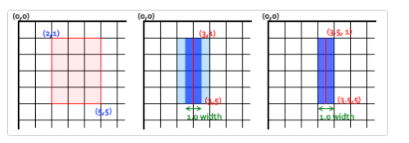
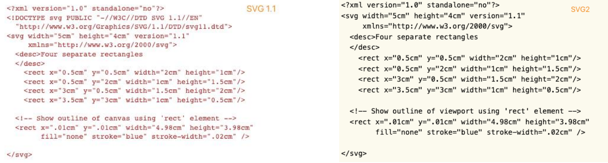
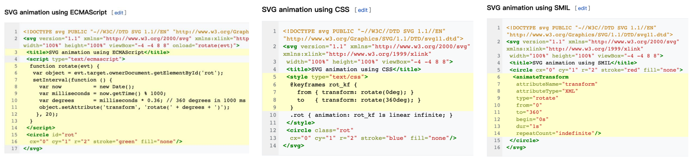

# 数据可视化

## 一、CSS3

### 1.2D动画

> CSS3 **transform**属性允许你**旋转，缩放，倾斜或平移**给定元素。

**常见的函数transform function有：**

* 平移：translate(x, y) 
* 缩放：scale(x, y) 
* 旋转：rotate(deg) 
* 倾斜：skew(deg, deg)

**坐标系：**

> 用transform属性变换的元素会受**transform-origin**属性值的影响，该属性用于指定形变的原点。

* CSS 中的每个元素都有一个坐标系，其原点位于元素的**左上角**，左上角这被称为**初始坐标系**。 
* **用transform时，坐标系的原点默认会移动到元素的中心**。
* transform-origin属性的默认值为50% 50%，即该原点将会作为变换元素的中心点。 
* 用transform属性旋转或倾斜元素，会变换或倾斜元素的坐标系。**并且该元素所有后续变换都将基于新坐标系的变换。**

**transform-origin：**

* 一个值： 设置 x轴 的原点， y轴为默认值 50%。
* 两个值： 设置 x轴 和 y轴 的原点
* 三个值： 设置 x轴、 y轴 和 z轴 的原点


### 2.3D动画

#### (1)常见transform function

* 平移：translate3d(x, y, z) 、 translateX(x) 、translateY(y)、translateZ(z) 
* 缩放：scale3d(x, y, z) 、scaleX(y)、scaleY(y)、scaleZ(z)、 
* 旋转：rotate3d(x, y, z, a) 、 rotateX(x)、rotateY(y)、rotateZ(z)

**注：**3D形变函数会创建一个合成层来启用GPU硬件加速，比如： translate3d、 translateZ、 scale3d 、 rotate3d ...

#### (2)3D透视

> 透视：perspective  定了观察者与 z=0 平面的距离，使具有三维位置变换的元素产生透视效果（z表示Z轴）。 z>0 的三维元素比正常的大，而 z<0 时则比正常的小，大小程度由该属性的值决定。

* 只有一个值，**none**：没有应用 perspective 样式时的默认值。 **length**：定观察者距离 z=0 平面的距离(如右图d的距离，单位px)。 为元素及其内容应用透视变换。当值为 0 或负值时，无透视变换。
* 透视的两种使用方式：
* * 1.在父元素上定义 CSS 透视属性
  * 2.如果它是子元素或单元素子元素，可以使用函数 perspective()

#### (3)3D空间

> 3D空间：**transform-style** ,该CSS属性用于设置元素的子元素是定位在 3D 空间中还是平展在元素的2D平面中。 在3D空间中同样是可以使用透视效果。

**值类型：**

* flat：指示元素的子元素位于元素本身的平面内;
* preserve-3d：指示元素的子元素应位于 3D 空间中。

#### (4)3D背面可见性

> 背面可见性：**backface-visibility** ，该CSS 属性 backface-visibility 指定某个元素当背面朝向观察者时是否可见。

**注：**

* visible：背面朝向用户时可见。
* hidden：背面朝向用户时不可见。

#### (5)案例

```html
<!DOCTYPE html>
<html lang="en">
  <head>
    <meta charset="UTF-8" />
    <meta http-equiv="X-UA-Compatible" content="IE=edge" />
    <meta name="viewport" content="width=device-width, initial-scale=1.0" />
    <title>webpack-logo</title>
    <style>
      html,
      body {
        padding: 0;
        margin: 0;
        width: 100%;
        height: 100%;
        background-color: #2b3a42;

        display: flex;
        justify-content: center;
        align-items: center;
      }

      ul {
        margin: 0;
        padding: 0;
        list-style: none;
      }

      .webpack-logo {
        width: 100%;
        height: 200px;
        /* border: 1px solid red; */

        position: relative;
      }

      .cube-inner {
        position: absolute;
        left: 50%;
        top: 50%;
        /* 关键,不要用 transform */
        margin: -25px 0px 0px -25px;
        width: 50px;
        height: 50px;
        /* background-color: red; */

        /* 启用3D空间 */
        transform-style: preserve-3d;
        transform: rotateX(-33.5deg) rotateY(45deg);
        /* 帧动画 */
        animation: innerLoop 6s ease-in-out infinite;
      }

      @keyframes innerLoop {
        0% {
          transform: rotateX(-33.5deg) rotateY(45deg);
        }

        50%,
        100% {
          transform: rotateX(-33.5deg) rotateY(-315deg);
        }
      }

      .cube-inner li {
        position: absolute;
        top: 0;
        left: 0;
        width: 100%;
        height: 100%;
        background-color: #175d96;
        border: 1px solid white;
      }

      .cube-inner .top {
        transform: rotateX(90deg) translateZ(25px);
      }

      .cube-inner .bottom {
        transform: rotateX(-90deg) translateZ(25px);
      }

      .cube-inner .front {
        transform: rotateX(0deg) translateZ(25px);
      }

      .cube-inner .back {
        transform: rotateX(-180deg) translateZ(25px);
      }
      .cube-inner .left {
        transform: rotateY(-90deg) translateZ(25px);
      }

      .cube-inner .right {
        transform: rotateY(90deg) translateZ(25px);
      }

      /* cube outer */
      .cube-outer {
        position: absolute;
        left: 50%;
        top: 50%;
        /* 关键,不要用 transform */
        margin: -50px 0px 0px -50px;
        width: 100px;
        height: 100px;

        /* 启用3D空间 */
        transform-style: preserve-3d;
        transform: rotateX(-33.5deg) rotateY(45deg);
        /* 帧动画 */
        animation: outerLoop 6s ease-in-out infinite;
      }

      @keyframes outerLoop {
        0% {
          transform: rotateX(-33.5deg) rotateY(45deg);
        }

        50%,
        100% {
          transform: rotateX(-33.5deg) rotateY(405deg);
        }
      }

      .cube-outer li {
        position: absolute;
        top: 0;
        left: 0;
        width: 100%;
        height: 100%;
        background-color: rgba(141, 214, 249, 0.5);
        border: 1px solid white;
      }

      .cube-outer .top {
        transform: rotateX(90deg) translateZ(50px);
      }

      .cube-outer .bottom {
        transform: rotateX(-90deg) translateZ(50px);
      }

      .cube-outer .front {
        transform: rotateX(0deg) translateZ(50px);
      }

      .cube-outer .back {
        transform: rotateX(-180deg) translateZ(50px);
      }
      .cube-outer .left {
        transform: rotateY(-90deg) translateZ(50px);
      }

      .cube-outer .right {
        transform: rotateY(90deg) translateZ(50px);
      }
    </style>
  </head>
  <body>
    <div class="webpack-logo">
      <!-- cube-inner -->
      <ul class="cube-inner">
        <li class="top"></li>
        <li class="bottom"></li>
        <li class="front"></li>
        <li class="back"></li>
        <li class="left"></li>
        <li class="right"></li>
      </ul>

      <!-- cube-outer -->
      <ul class="cube-outer">
        <li class="top"></li>
        <li class="bottom"></li>
        <li class="front"></li>
        <li class="back"></li>
        <li class="left"></li>
        <li class="right"></li>
      </ul>
    </div>
  </body>
</html>
```


### 3.浏览器渲染流程

* 1.解析HTML，**构建DOM Tree** 
* 2.对CSS文件进行解析，**解析出对应的规则树** 
* 3.DOM Tree + CSSOM 生成 Render Tree 
* 4.布局（Layout）：计算出每个节点的宽度、高度和位置信息。 页面元素位置、大小发生变化，往往会导致其他节点联动， 需要重新计算布局，这个过程称为**回流**（Reflow）。 
* 5.绘制（Paint）：将可见的元素绘制在屏幕中。默认标准流是在同一层上绘制，一些特殊属性会**创建新的层**绘制，这些层称为**渲染层**。一些不影响布局的 CSS 修改也会导致该渲染层**重绘**（Repaint），**回流必然会导致重绘**。 
* 6. Composite合成层：一些特殊属性会创建一个新的合成层（ CompositingLayer ），并可以利用**GPU来加速绘制**，这是浏览器的 一种优化手段。合成层确实可以提高性能，但是它以消耗内存为代价，**因此不能滥用作为 web 性能优化策略和过度使用。**


### 4.CSS3动画性能优化

* 1.创建一个新的渲染层（减少回流） 
* * 有明确的定位属性（relative、fixed、sticky、absolute） 
  * 透明度（opacity 小于 1） 
  * 有 CSS transform 属性（不为 none） 
  * 当前有对于 opacity、transform、fliter、backdrop-filter 应用动画 
  * backface-visibility 属性为 hidden
* 2.创建合成层。合成层会开始GPU加速页面渲染，但不能滥用 
* * 对 opacity、transform、fliter、backdropfilter应用了animation或transition（需要是active的animation或者 transition）
  * 有 3D transform 函数：比如： translate3d、 translateZ、 scale3d 、 rotate3d ... 
  * will-change 设置为 opacity、transform、top、left、bottom、right，比如：will-change: opacity , transform; 其中 top、left等需要设置明确的定位属性，如 relative 等


## 二、Canvas

> Canvas提供了非常多的JavaScript绘图API（比如：绘制路径、矩形、圆、文本和图像等方法），与元素可以绘制 各种2D图形。 
>
> Canvas API 主要聚焦于 2D 图形。当然也可以使用元素对象的 WebGL API 来绘制 2D 和 3D 图形。 
>
> Canvas的应用场景：可以用于动画、游戏画面、数据可视化、图片编辑以及实时视频处理等方面。

### 1.优缺点

**Canvas 优点**： 

* Canvas提供的功能更原始，**适合像素处理，动态渲染和数据量大的绘制，如：图片编辑、热力图、炫光尾迹特效等**。
* Canvas非常适合图像密集型的游戏开发，**适合频繁重绘许多的对象**。
* Canvas能够以 .png 或 .jpg 格式保存结果图像，适合**对图片进行像素级的处理。** 

**Canvas 缺点：** 

* 在**移动端**可以能会因为Canvas数量多，而导致内存占用超出了手机的承受能力，导致浏览器崩溃。
* Canvas 绘图只能通过JavaScript脚本操作（all in js）。
* Canvas 是由一个个像素点构成的图形，放大会使图形变得颗粒状和像素化，导致模糊。


### 2.绘制矩形

**Canvas 绘图的矩形方法**： 

* **fillRect(x, y, width, height)**： 绘制一个填充的矩形
* **strokeRect(x, y, width, height)**： 绘制一个矩形的边框 
* **clearRect(x, y, width, height)**： 清除指定矩形区域，让清除部分完全透明。

**注：** x 与 y 指定了在canvas画布上所绘制矩形的左上角（相对于原点）的坐标（不支持 undefined ）；width 和 height 设置矩形的尺寸。


### 3.路径

> 图形的基本元素是路径。路径是通过不同颜色和宽度的线段或曲线相连形成的不同形状的点的集合。路径是可由很多子路径构成，这些子路径都是在一个列表中，列表中所有子路径（线、弧形等）将构成图形。一个路径，甚至一个子路径，通常都是闭合的。

**使用路径绘制图形的步骤**： 

* 1.创建路径起始点（**beginPath**）。 
* 2.使用画图命令去画出路径( arc 、lineTo )。 
* 3.把路径闭合( **closePath** , 不是必须)。 
* 4.通过描边(**stroke**)或填充路径区域(**fill**)来渲染图形。

**绘制路径时用到的函数：** 

* **beginPath()**：新建一条路径，生成之后，图形绘制命令被指向到新的路径上绘图，不会关联到旧的路径。
* **closePath()**：闭合路径之后图形绘制命令又重新指向到 beginPath之前的上下文中。 
* **stroke()**：通过线条来绘制图形轮廓/描边（针对当前路径图形）。
* **fill()**：通过填充路径的内容区域生成实心的图形（针对当前路径图形）。


### 4.绘制直线

**移动画笔（moveTo）方法** ：

* moveTo 方法是**不能画出任何东西**，但是它也是路径列表的一部分
* moveTo 可以想象为在纸上作业，一支钢笔或者铅笔的笔尖从一个点到另一个点的**移动过程**。 
* moveTo(x, y)： 将笔移动到指定的坐标 x 、 y 上。
* 当 canvas 初始化或者beginPath()调用后，我们通常会使用moveTo(x, y)函数**设置起点**。 
* 使用moveTo函数能够绘制一些不连续的路径。

**绘制直线（lineTo）方法** ：

* lineTo(x, y)： 绘制一条从当前位置到指定 (x ，y)位置的直线。 该方法有两个参数(x ， y)代表坐标系中直线结束的点。 开始点和之前的绘制路径有关，之前路径的结束点就是接下来的开始点。 当然开始点也可以通过moveTo(x, y)函数改变。

**绘制一条直线步骤：** 

*  1.调用 beginPath() 来生成路径。本质上，路径是由很多子路径（线、弧形、等）构成。
* 2.调用moveTo、lineTo函数来绘制路径（路径可以是连续也可以不连续）
* 3.闭合路径 closePath()，虽然不是必需的，但是通常都是要闭合路径。
* 4.调用stroke()函数来给直线描边。

```html
<body>
  <canvas id="tutorial" width="300" height="300px">
    你的浏览器不兼容Canvas,请升级您的浏览器!
  </canvas>
  <script>
    window.onload = function() {
      let canvasEl = document.getElementById('tutorial')
      if(!canvasEl.getContext){
        return
      }
      let ctx = canvasEl.getContext('2d') // 2d | webgl
      
      ctx.lineWidth = 10
      // 1.创建一个新的路径
      ctx.beginPath()
      // 2.使用的绘图的命名(ctx对象中的 属性 和 API)
      ctx.moveTo(10, 10)
      ctx.lineTo(100, 10)
      // 3.闭合路径
      // ctx.closePath() // 不是必须
      // 4.描边或填充
      ctx.stroke()  // 绘制线条只能用 stroke填充,不用 fill
    }
  </script>
</body>
```


### 5.绘制三角

**步骤**：

* 1.调用 beginPath() 来生成路径。
* 2.调用moveTo()、lineTo()函数来绘制路径。
* 3.闭合路径 closePath()，不是必需的。closePath() 方法会通过绘制一条从当前点到开始点的直线来闭合图形。如果图形是已经闭合了的，即当前点为开始点，该函数什么也不做。
* 4.调用stroke()函数来给线描边，或者调用fill()函数来填充（**使用填充 fill 时，路径会自动闭合，而 stroke 不会**）。

```html
<body>
  <canvas id="tutorial" width="300" height="300px">
    你的浏览器不兼容Canvas,请升级您的浏览器!
  </canvas>
  <script>
    window.onload = function() {
      let canvasEl = document.getElementById('tutorial')
      if(!canvasEl.getContext){
        return
      }
      let ctx = canvasEl.getContext('2d') // 2d | webgl
      
      // 1.描边三角形
      ctx.beginPath()
      ctx.moveTo(50, 0)
      ctx.lineTo(100, 50)
      ctx.lineTo(50, 100)
      // ctx.closePath()
      ctx.stroke()

      // 2.实心的三角形
      ctx.beginPath()
      ctx.moveTo(150, 0)
      ctx.lineTo(200, 50)
      ctx.lineTo(150, 100)
      // ctx.closePath()
      ctx.fill() // 它会 自动闭合路径
    }
  </script>
</body>
```


### 6.绘制圆

**绘制圆弧或者圆，使用arc()方法**： arc(x, y, radius, startAngle, endAngle, anticlockwise)，该方法有六个参数：

* **x、y**：为绘制圆弧所在圆上的圆心坐标。 
* **radius**：为圆弧半径。
* **startAngle、endAngle**：该参数用弧度定义了开始以及结束的弧度。这些都是以 x 轴为基准。 
* **anticlockwise**：为一个布尔值。为 true ，是逆时针方向，为false，是顺时针方向，默认为false。

**注：arc() 函数中表示角的单位是弧度，不是角度。**

```html
<body>
  <canvas id="tutorial" width="300" height="300px">
    你的浏览器不兼容Canvas,请升级您的浏览器!
  </canvas>
  <script>
    window.onload = function() {
      let canvasEl = document.getElementById('tutorial')
      if(!canvasEl.getContext){
        return
      }
      let ctx = canvasEl.getContext('2d') // 2d | webgl
      
      // 1.每个图形都绘制在一个路径中
      // ctx.beginPath()
      // ctx.arc(50, 50, 25, 0, Math.PI * 2, false)
      // ctx.stroke()

      // ctx.beginPath()
      // ctx.arc(150, 150, 25, 0, Math.PI)
      // ctx.stroke()
     
      // 2.在一个路径中绘制多个图形
      ctx.beginPath()
      ctx.arc(50, 50, 25, 0, Math.PI * 2, false)
      ctx.moveTo(175, 150)
      ctx.arc(150, 150, 25, 0, Math.PI)
      // ctx.closePath()
      ctx.stroke()
    }
  </script>
</body>
```


### 7.色彩 Color

**给图形上色：**

* **fillStyle** = color： 设置图形的填充颜色，需在 fill() 函数前调用。
* **strokeStyle** = color： 设置图形轮廓的颜色，需在 stroke() 函数前调用。

**注意：**

* color 可以是表示 CSS 颜色值的字符串，支持：关键字、十六进制、rgb、rgba格式。默认情况下，线条和填充颜色都是黑色（CSS 颜色值 #000000）。
* 设置了 strokeStyle 或者 fillStyle 的值，这个新值就会成为新绘制的图形的默认值。若要给图形上不同的颜色，需要重新设置 fillStyle 或 strokeStyle 的值。
* fill() 函数是图形填充，fillStyle属性是设置填充色；stroke() 函数是图形描边，strokeStyle属性是设置描边色


### 8.透明度

**绘制半透明的图形：**

* 1.strokeStyle 和 fillStyle属性结合**RGBA**；
* 2.**globalAlpha 属性**：globalAlpha = 0~1，这个属性影响到 canvas 里**所有图形**的透明度， 有效的值范围是 0.0（完全透明）到 1.0（完全不透明），默认是 1.0。

```html
<body>
  <canvas id="tutorial" width="300" height="300px">
    你的浏览器不兼容Canvas,请升级您的浏览器!
  </canvas>
  <script>
    window.onload = function() {
      let canvasEl = document.getElementById('tutorial')
      if(!canvasEl.getContext){
        return
      }
      let ctx = canvasEl.getContext('2d') // 2d | webgl
      
      // 针对于Canvas中所有的图形生效
      ctx.globalAlpha = 0.3

      // 2.修改画笔的颜色
      // ctx.fillStyle = 'rgba(255, 0, 0, 0.3)'
      ctx.fillRect(0,0, 100, 50) // 单位也是不用写 px

      ctx.fillStyle = 'blue'
      ctx.fillRect(200, 0, 100, 50)

      ctx.fillStyle = 'green' // 关键字, 十六进制, rbg , rgba
      ctx.beginPath()
      ctx.rect(0, 100, 100, 50)
      ctx.fill()
    }
  </script>
</body>
```


### 9.线型

> 调用lineTo()函数绘制的线条，是可以通过一系列属性来设置线的样式:
>
> * lineWidth = value： 设置线条**宽度**。
> * lineCap = type： 设置线条**末端样式**。
> * lineJoin = type： 设定线条与线条间**接合处的样式**。

#### (1)lineWidht

* 设置线条宽度的属性值必须为正数。默认值是 1.0px，不需单位。（ 零、负数、Infinity和NaN值将被忽略）
* 线宽是指给定路径的中心到两边的粗细。即在路径的两边各绘制线宽的一半。
* 若想要绘制一条从 (3,1) 到 (3,5)，宽度是 1.0 的线条，你会得到像第二幅图一样的结果。 路径的两边个各延伸半个像素填充并渲染出1像素的线条（深蓝色部分）两边剩下的半个像素又会以实际画笔颜色一半色调来填充（浅蓝部分）实际画出线条的区域为（浅蓝和深蓝的部分），填充色大于1像素了，这就是为何宽度为 1.0 的线经常并不准确的原因。
* 要解决这个问题，必须对路径精确的控制。如，1px的线条会在路径两边各延伸半像素，那么像第三幅图那样绘制从 (3.5 ,1) 到 (3.5,  5) 的线条，其边缘正好落在像素边界，填充出来就是准确的宽为 1.0 的线条。



#### (2)lineCap

**lineCap： 线段端点显示的样子**

*  butt 截断，默认是 butt。
*  round 圆形 
* square 正方形

#### (3)lineJoin

**lineJoin：线段连接处所显示的样子**

* round 圆形 
* bevel 斜角 
* miter 斜槽规，默认是 miter。


### 10.绘制文本

**渲染文本**：

* illText(text, x, y [, maxWidth])：在 (x,y) 位置，填充指定的文本，绘制的最大宽度（可选）
* strokeText(text, x, y [, maxWidth]) ：在 (x,y) 位置，绘制文本边框 ，绘制的最大宽度（可选）。

**文本的样式**（需在绘制文本前调用）：

* **font = value**： 当前绘制文本的样式。这个字符串使用和 CSS font 属性相同的语法。默认的字体是：10px sans-serif。
* **textAlign = value**：文本对齐选项。可选的值包括：start, end, left, right or center. 默认值是 start
* **textBaseline = value**：基线对齐选项。可选的值包括：top, hanging, middle, alphabetic, ideographic, bottom；默认值是 **alphabetic**。

```html
<body>

  <canvas id="tutorial" width="300" height="300px">
    你的浏览器不兼容Canvas,请升级您的浏览器!
  </canvas>

  <script>
    window.onload = function() {
      let canvasEl = document.getElementById('tutorial')
      if(!canvasEl.getContext){
        return
      }
      let ctx = canvasEl.getContext('2d') // 2d | webgl
      
      ctx.font = '60px sen-serif'
      ctx.textAlign = 'center'
      ctx.textBaseline = 'middle'
      ctx.strokeStyle ="red"
      ctx.fillStyle ="red"

      // 将字体绘制在 100, 100 这个坐标点
      ctx.fillText('Ay', 100, 100)
      // ctx.strokeText('Ay', 100, 100)
    }
  </script>
</body>
```


### 11.绘制图片

**绘制图片，drawImage 方法有三种形态：**

* drawImage(image, x, y) ：其中 image 是 image 或者 canvas 对象，x 和 y 是其在目标 canvas 里的起始坐标。
* drawImage(image, x, y, width, height) ：这个方法多了 2 个参数：width 和 height，这两个参数用来控制 当向 canvas 画入时应该缩放的大小 
* drawImage(image, sx, sy, sWidth, sHeight, dx, dy, dWidth, dHeight) ：第一个参数和其它的是相同的，都是一个图像或者另一个 canvas 的引用。其它 8 个参数最好是参照右边的图解，前 4 个 是定义图像源的切片位置和大小，后 4 个则是定义切片的目标显示位置和大小。

```html
<body>
  <canvas id="tutorial" width="300" height="300">
    你的浏览器不兼容Canvas,请升级您的浏览器!
  </canvas>
    
  <script>
    window.onload = function() {
      let canvasEl = document.getElementById('tutorial')
      if(!canvasEl.getContext){
        return
      }
      let ctx = canvasEl.getContext('2d') // 2d | webgl
      
      // 1.准备一张图片
      var image = new Image()
      image.src = '../images/backdrop.png'

      image.onload = function() {
        // 2.开始用Canvas来绘制图片
        ctx.drawImage(image, 0, 0, 180, 130)

        // 3.绘制折线
        ctx.beginPath()
        ctx.moveTo(40, 100)
        ctx.lineTo(50, 70)
        ctx.lineTo(60, 90)
        ctx.lineTo(100, 30)
        ctx.lineTo(170, 90)
        ctx.stroke()
      }
    }
  </script>
</body>
```


### 12.绘画状态保持与恢复

> **Canvas绘画状态**是当前绘画时所产生的样式和变形的一个快照。Canvas在绘画时，会产生相应的绘画状态，其实我们是可以将某些绘画的状态存储在栈中来为**以后复用**。Canvas 绘画状态的可以调用 **save** 和 **restore** 方法是用来保存和恢复，这两个方法都没有参数，并且它们是**成对存在**的。

 **保存和恢复绘画状态 ：**

* save()：保存画布 (canvas) 的所有绘画状态 
* restore()：恢复画布 (canvas) 的所有绘画状态

**绘画状态包括**：

* 当前应用的变形（即**移动，旋转和缩放**），如属性：strokeStyle, fillStyle, globalAlpha, lineWidth, lineCap, lineJoin, miterLimit, shadowOffsetX, shadowOffsetY, shadowBlur, shadowColor, font, textAlign, textBaseline ...... 
* 当前的裁切路径（clipping path）


### 13.变形

> Canvas和CSS3一样也是支持变形，形变是一种更强大的方法，可以将坐标原点移动到另一点、形变可以对网格进行旋转和缩放。

#### (1)移动-translate

* **translate**方法，它用来移动 canvas 和它的原点到一个不同的位置。**translate(x, y)** :x 是左右偏移量，y 是上下偏移量（无需单位）。
* 若不使用 translate方法，那么所有矩形默认都将被绘制在相同的（0,0）坐标原点。
*  translate方法可让我们任意放置图形，而不需要手工一个个调整坐标值。

```html
<body>
  <canvas id="tutorial" width="300" height="300px">
    你的浏览器不兼容Canvas,请升级您的浏览器!
  </canvas>
  <script>
    window.onload = function() {
      let canvasEl = document.getElementById('tutorial')
      if(!canvasEl.getContext){
        return
      }
      let ctx = canvasEl.getContext('2d') // 2d | webgl
      
      // 1.形变( 没有保存状态)
      // ctx.translate(100, 100)
      // ctx.fillRect(0,0, 100, 50) // 单位也是不用写 px

      // ctx.translate(100, 100)
      // ctx.strokeRect(0, 0, 100, 50)

      // 1.形变(保存形变之前的状态)
      ctx.save()
      ctx.translate(100, 100)
      ctx.fillRect(0,0, 100, 50) // 单位也是不用写 px
      ctx.restore() // 恢复了形变之前的状态( 0,0)

      ctx.save() // (保存形变之前的状态)
      ctx.translate(100, 100)
      ctx.fillStyle = 'red'
      ctx.fillRect(0, 0, 50, 30)
      ctx.restore()
    }
  </script>
</body>
```

#### (2)旋转-rotate

**rotate(angle)**方法，它用于以原点为中心旋转 canvas，即沿着 z轴 旋转：

* rotate(angle)只接受一个参数：旋转的角度 (angle)，它是顺时针方向，以弧度为单位的值。 
* 角度与弧度的 JS 表达式：弧度=( Math.PI / 180 ) * 角度 ，即 1角度 = Math.PI/180 个弧度。
* 比如：旋转90°：Math.PI / 2； 旋转180°：Math.PI ； 旋转360°：Math.PI * 2； 旋转-90°：-Math.PI / 2； ✓ 旋转的中心点始终是 canvas 的原坐标点，如果要改变它，我们需要用到 translate方法。

```html
<body>
  <canvas id="tutorial" width="300" height="300px">
    你的浏览器不兼容Canvas,请升级您的浏览器!
  </canvas>
  <script>
    window.onload = function() {
      let canvasEl = document.getElementById('tutorial')
      if(!canvasEl.getContext){
        return
      }
      let ctx = canvasEl.getContext('2d') // 2d | webgl
      
      // 保存形变之前的状态
      ctx.save()
      // 1.形变
      ctx.translate(100, 100)
      // 360 -> Math.PI * 2
      // 180 -> Math.PI
      // 1 -> Math.PI / 180
      // 45 -> Math.PI / 180 * 45
      ctx.rotate(Math.PI / 180 * 45)
      ctx.fillRect(0, 0, 50, 50) 
  
      // ctx.translate(100, 0)
      // ctx.fillRect(0, 0, 50, 50)
      // 绘图结束(恢复形变之前的状态)
      ctx.restore()

      ctx.save()
      ctx.translate(100, 0)
      ctx.fillRect(0, 0, 50, 50)
      ctx.restore()
      // ....下面在继续写代码的话,坐标轴就是参照的是原点了
    }
  </script>
</body>
```

#### (3)缩放-scale

* scale方法可以缩放画布：scale(x, y) ：x 为水平缩放因子，y 为垂直缩放因子，也支持负数。如果比 1 小，会缩小图形，如果比 1 大会放大图形。默认值为 1。
* 画布初始情况下，是以左上角坐标为原点。如果参数为负实数，相当于以 x 或 y 轴作为对称轴镜像反转。例如，使用translate(0, canvas.height); scale(1,-1); 以 y 轴作为对称轴镜像反转。

* 默认情况下，canvas 的 1 个单位为 1 个像素。如果我们设置缩放因子是 0.5，1 个单位就变成对应 0.5 个像素，这样绘制出 来的形状就会是原先的一半。同理，设置为 2.0 时，1 个单位就对应变成了 2 像素，绘制的结果就是图形放大了 2 倍。

```html
<body>
  <canvas id="tutorial" width="300" height="300px">
    你的浏览器不兼容Canvas,请升级您的浏览器!
  </canvas>
  <script>
    window.onload = function() {
      let canvasEl = document.getElementById('tutorial')
      if(!canvasEl.getContext){
        return
      }
      let ctx = canvasEl.getContext('2d') // 2d | webgl
      
      // 保存形变之前的状态
      ctx.save()
      // 1.形变
      ctx.translate(100, 100) // 平移坐标系统
      ctx.scale(2, 2) // 对坐标轴进行了放大(2倍)
      ctx.translate(10, 0) // 10px  -> 20px
      ctx.fillRect(0, 0, 50, 50)
      // 绘图结束(恢复形变之前的状态)
      ctx.restore()
      // ....下面在继续写代码的话,坐标轴就是参照的是原点了
    }
  </script>
</body>
```


### 14.Canvas动画

> Canvas绘图都是通过JavaScript 去操控的，如要实现一些交互性动画是相当容易的。canvas可能最大的限制就是图像一旦绘制出来，它就是一直保持那样了。如需要执行动画，不得不对画布上所有图形进行一帧一帧的重绘（比如在1秒绘60帧就可绘出流畅的动画了）。为了实现动画，需要一些可以定时执行重绘的方法。在Canvas中有三种方法可以实现：分别为 **setInterval 、 setTimeout 和 requestAnimationFrame** 三种方法来定期执行指定函数进行重绘。

**基本步骤**（如要画出流畅动画，1s 需绘60帧）：

* 1.用 clearRect 方法清空 canvas ，除非接下来要画的内容会完全充满 canvas（例如背景图），否则你需要清空所有。 
* 2.保存 canvas 状态，如果加了 canvas 状态的设置（样式，变形之类的），又想在每画一帧之时都是原始状态的话， 你需要先保存一下，后面再恢复原始状态。 
* 3.绘制动画图形（animated shapes） ，即绘制动画中的一帧。
* 4.恢复 canvas 状态，如果已经保存了 canvas 的状态，可以先恢复它，然后重绘下一帧。

**setTimout定时器的缺陷**：

* setTimeout定时器不是非常精准的，因为setTimeout的回调函数是放到了宏任务中等待执行。如果微任务中一直有未处理完成的任务，那么setTimeout的回调函数就有可能不会在指定时间内触发回调。 如果想要更加平稳和更加精准的定时执行某个任务的话，可以使用requestAnimationFrame函数。

**requestAnimationFrame：**

* 要求浏览器在下次重绘之前调用该函数的回调函数来更新动画。 该方法需要传入一个回调函数作为参数，该回调函数会在浏览器下一次重绘之前执行，若想在浏览器下次重绘之前继续更新下一帧动画，那么在回调函数自身内必须再次调用 **requestAnimationFrame**()，通常每秒钟回调函数执行 **60 次左右**，也有可能会被降低。

**绘制秒针动画，绘制一帧的步骤：**

* 1.用 clearRect(x,y, w,h)方法，清空 canvas 。 
* 2.保存 canvas 状态 。
* 3.修改 canvas 状态 （样式、移动坐标、旋转等）。
* 4.绘制秒针图形（即绘制动画中的一帧） 。
* 5.恢复 canvas 状态 ，准备重绘下一帧。

```html
<body>
  <canvas id="tutorial" width="300" height="300px">
    你的浏览器不兼容Canvas,请升级您的浏览器!
  </canvas>
  <script>
    window.onload = function() {
      let canvasEl = document.getElementById('tutorial')
      if(!canvasEl.getContext){
        return
      }
      let ctx = canvasEl.getContext('2d') // 2d | webgl

      requestAnimationFrame(draw)
        
      /**
       这个函数就是动画的一帧
       // 现在这个函数在1秒钟会回调 61 次
      */
      function draw() {
        let second = new Date().getSeconds()
        console.log('draw')
        ctx.clearRect(0, 0, 300, 300)
        ctx.save()

        // 1.开始绘图
        ctx.translate(100, 100)
        ctx.rotate(Math.PI * 2 / 60 * second)
        ctx.lineWidth = 6
        ctx.lineCap = 'round'
        ctx.strokeStyle = 'red'

        ctx.beginPath()
        ctx.moveTo(0, 0)
        ctx.lineTo(0, -80)
        ctx.stroke()

        ctx.restore()
        requestAnimationFrame(draw)
      }
    }
  </script>
</body>
```


### 15.时钟案例

```html
<!DOCTYPE html>
<html lang="en">
<head>
  <meta charset="UTF-8">
  <meta http-equiv="X-UA-Compatible" content="IE=edge">
  <meta name="viewport" content="width=device-width, initial-scale=1.0">
  <title>Document</title>
  <style>
    body{
      margin: 0;
      padding: 0;
      background-image: url(../../images/grid.png);
    }
    canvas{
      background-color: rgba(255, 0, 0, 0.1);
    }
    .clock{
      width: 300px;
      height: 300px;
      margin: 10px;
      background-color: black;
      border-radius: 50px;
    }
  </style>
</head>
<body>

  <div class="clock">
    <canvas id="tutorial" width="300" height="300px">
      你的浏览器不兼容Canvas,请升级您的浏览器!
    </canvas>
  </div>

  <script>
    window.onload = function() {
      let canvasEl = document.getElementById('tutorial')
      if(!canvasEl.getContext){
        return
      }
      let ctx = canvasEl.getContext('2d') // 2d | webgl


      requestAnimationFrame(draw)

      /**
       1秒钟会回调 61次
      */
      function draw() {
        ctx.clearRect(0, 0, 300, 300)
        ctx.save()
        let time = new Date()
        let hours = time.getHours()
        let minute = time.getMinutes()
        let second = time.getSeconds()

        // 1.绘制背景(白色圆)
        drawBg()
        // 2.绘制的数字
        drawNumbers()
        // 3.绘制时针
        drawHours(hours, minute, second)
        // 3.绘制分针
        drawMinute(minute, second)
        // 4.绘制秒针
        drawSecond(second)
        // 5.绘制圆心
        drawCircle()
        // 6.画圆上的时针的刻度
        drawHoursTick()
        // 7.画圆上的分针的刻度
        drawMinuteTick()
        ctx.restore()
        requestAnimationFrame(draw)
      }

      function drawBg(){
        ctx.save()
        ctx.translate(150, 150)
        ctx.fillStyle ='white'
        ctx.beginPath()
        ctx.arc(0,0, 130, 0, Math.PI * 2)
        ctx.fill()
        ctx.restore()
      }

      function drawNumbers(){
        ctx.save()
        ctx.translate(150, 150)

        // 开始画 3 数字
        ctx.font = "30px fangsong"
        ctx.textBaseline = 'middle'
        ctx.textAlign = 'center'

        let numbers = [3, 4, 5, 6, 7, 8, 9, 10, 11, 12, 1, 2]
        for(let i =0; i<numbers.length; i++){
          // i = 3 , 0 
          // i = 4 , 占 1份, Math.PI * 2 / 12 * i  
          let x = Math.cos(Math.PI * 2 / 12 * i) * 100
          let y = Math.sin(Math.PI * 2 / 12 * i) * 100
          ctx.fillText(numbers[i], x, y)
        }
        ctx.restore()
      }
      function drawHours(hours, minute, second) {
        ctx.save()
        ctx.translate(150, 150) // 坐标轴原点在园的中心

        // Math.PI * 2 一整个圆
        // Math.PI * 2 / 12  1h
        // Math.PI * 2 / 12 / 60  1min
        // Math.PI * 2 / 12 / 60 / 60  1secon

        // 1h + 1min + 1 second = 弧度?
        ctx.rotate(
          Math.PI * 2 / 12 * hours +
          Math.PI * 2 / 12 / 60 * minute +
          Math.PI * 2 / 12 / 60 / 60 * second 
        )
        ctx.lineWidth = 5
        ctx.lineCap = 'round'
        ctx.beginPath()
        ctx.moveTo(0,0)
        ctx.lineTo(0, -50)
        ctx.stroke()
        ctx.restore()
      }

      function drawMinute(minute, second) {
        ctx.save()
        ctx.translate(150, 150) // 坐标轴原点在园的中心

        // Math.PI * 2 一整个圆
        // Math.PI * 2 / 60  1min
        // Math.PI * 2 / 60 / 60  1sec

        // 59min + 59 second = 弧度?
        ctx.rotate(
          Math.PI * 2 / 60 * minute +
          Math.PI * 2 / 60 / 60 * second 
        )
        ctx.lineWidth = 3
        ctx.lineCap = 'round'
        ctx.beginPath()
        ctx.moveTo(0,0)
        ctx.lineTo(0, -70)
        ctx.stroke()
        ctx.restore()
      }

      function drawSecond(second) {
        ctx.save()
        ctx.translate(150, 150) // 坐标轴原点在园的中心

        // Math.PI * 2 一整个圆
        // Math.PI * 2 / 60   1sec

        // 1 second = 弧度?
        ctx.rotate(
          Math.PI * 2 / 60 * second 
        )
        ctx.strokeStyle = 'red'
        ctx.lineWidth = 2
        ctx.lineCap = 'round'
        ctx.beginPath()
        ctx.moveTo(0,0)
        ctx.lineTo(0, -80)
        ctx.stroke()
        ctx.restore()
      }

      function drawCircle() {
        ctx.save()
        ctx.translate(150, 150)

        ctx.beginPath()
        ctx.arc(0, 0, 8, 0, Math.PI*2)
        ctx.fill()

        ctx.fillStyle = 'gray'
        ctx.beginPath()
        ctx.arc(0, 0, 5, 0, Math.PI*2)
        ctx.fill()

        ctx.restore()
      }

      function drawHoursTick() {
        ctx.save()
        ctx.translate(150, 150)

        for(let j = 0; j< 12 ; j ++){
          ctx.rotate(Math.PI * 2 / 12 )
          ctx.lineWidth = 3
          ctx.beginPath()
          ctx.moveTo(0, -130)
          ctx.lineTo(0, -122)
          ctx.stroke()
        }

        ctx.restore()
      }

      function drawMinuteTick() {
        ctx.save()
        ctx.translate(150, 150)
        for(let j = 0; j< 60 ; j ++){
          ctx.rotate(Math.PI * 2 / 60 )
          ctx.lineWidth = 1
          ctx.beginPath()
          ctx.moveTo(0, -130)
          ctx.lineTo(0, -125)
          ctx.stroke()
        }
        ctx.restore()
      }
    }
  </script>
</body>
</html>
```


## 三、SVG

### 1.SVG优点

* **扩展好**：矢量图像在浏览器中放大缩小不会失真，可被许多设备和浏览器中使用。而光栅图像（PNG 、JPG）放大缩小会失真。 矢量图像是基于矢量的点、线、形状和数学公式来构建的图形，该图形是没有像素的，放大缩小是不会失真的。光栅图像是由像素点构建的图像——微小的彩色方块，大量像素点可以形成高清图像，比如照片。图像像素越多，质量越高。
* **灵活**：SVG是W3C开发的标准，可结合其它的语言和技术一起使用，包括 CSS、JavaScript、 HTML 和 SMIL 。SVG图像可以 直接使用JS和CSS进行操作，使用时非常方便和灵活，因为SVG也是可集成到 DOM 中的。
* **可以动画**：SVG 图像可以使用 JS 、 CSS 和 SMIL 进行动画处理。对于 Web 开发人员来说非常的友好。
* **轻量级**：与其它格式相比，SVG 图像的尺寸非常小。根据图像的不同，PNG 图像质量可能是 SVG 图像的 50 倍。
* **可打印**：SVG 图像可以以任何分辨率打印，而不会损失图像质量。
* **利于SEO**：SVG 图像被搜索引擎索引。因此，SVG 图像非常适合 SEO（搜索引擎优化）目的。
* **可压缩**：与其它图像格式一样，SVG 文件支持压缩。
* **易于编辑**：只需一个文本编辑器就可以创建 SVG 图像。设计师通常会使用 Adobe Illustrator （AI）等矢量图形工具创建和编辑。


### 2.SVG初体验

#### (1)基本步骤

* 1.新建一个 svg 文件，在文件第一行编写XML文件声明 
* 2.编写 一个元素，并给该元素添加如下属性：
* * version： 指定使用svg的版本，值为 1.0 和 1.1，并没有 2.0。
  * baseProfile：SVG 2 之前，version 和 baseProfile 属性用来验证和识别 SVG 版本。而**SVG2后不推荐使用这两个属性了**。
  * **width / height** ：指定svg画布（视口）的宽和高，默认值分别为300和150，默认使用px单位。
  * **xmlns**：给svg元素帮定一个命名空间（http://www.w3.org/2000/svg） 意味着这个  标签和它的子元素都属于该命名空间下。
* 3.在< svg >元素中添加 图形（比如：< rect >） 元素 
* 4.在浏览器直接预览 或 嵌入到 HTML中预览（嵌入HTML有6种方案）

#### (2)绘制SVG矢量图的方式

* 1.在一个单独的svg文件中绘制，svg文件可直接在浏览器预览或嵌入到HTML中使用（推荐）

**1.0版本：**

```html
<?xml version="1.0" encoding="UTF-8" standalone="no" ?>
<!DOCTYPE svg PUBLIC "-//W3C//DTD SVG 1.1//EN" "http://www.w3.org/Graphics/SVG/1.1/DTD/svg11.dtd">
<!-- 
 version="1.0"
 baseProfile="full" 正确渲染svg内容时所需要最小SVG语言概述(版本); full:正常的svg语言概述  basic:基本SVG语言概述  tiny: 轻量级SVG语言概述
 xmlns: 指定svg元素  和 svg内的子元素都是属于 http://www.w3.org/2000/svg 这个命名空间下
 -->
<svg
 version="1.0"
 baseProfile="full"
 width="100"
 height="100"
 xmlns="http://www.w3.org/2000/svg"
>
  <rect x="0" y="0" width="100" height="100"></rect>
  <title>我是svg title</title>
</svg>
```

**2.0版本：**


```html
<?xml version="1.0" standalone="no" ?>
<svg
 width="100"
 height="100"
 xmlns="http://www.w3.org/2000/svg"
>
  <rect x="0" y="0" width="100" height="100"></rect>
</svg>
```

* 2.直接在HTML文件中使用svg元素来绘制（推荐）

```html
<!DOCTYPE html>
<html lang="en">
<head>
  <meta charset="UTF-8">
  <meta http-equiv="X-UA-Compatible" content="IE=edge">
  <meta name="viewport" content="width=device-width, initial-scale=1.0">
  <title>Document</title>
</head>
<body>
  <!-- 1.创建svg 1.0 -->
  <svg
    version="1.0"
    baseProfile="full"
    width="100"
    height="100"
    xmlns="http://www.w3.org/2000/svg"
  > 
   <rect x="0" y="0" width="100" height="100"></rect>
  </svg>

  <!-- 2.创建svg 2.0 -->
  <svg
    width="100"
    height="100"
    xmlns="http://www.w3.org/2000/svg"
  > 
   <rect x="0" y="0" width="100" height="100"></rect>
  </svg>

    <!-- 3.创建svg 2.0 简写 
      xmlns="http://www.w3.org/2000/svg" 这个命名空间浏览器的解析器会自动添加

      默认w 300px  h: 150px
    -->
  <svg> 
    <rect x="0" y="0" width="100" height="100"></rect>
  </svg>
</body>
</html>
```

* 3.直接使用JavaScript代码来生成svg矢量图。 

```html
<body>
  <script>
    window.onload = function() {
//   使用JS脚本来创建SVG时，创建的元素都是需要添加命名空间的 比如：创建<svg>或者<rect>元素都需要添加命名空间（http://www.w3.org/2000/svg） 对于元素上的属性如果不带前缀的，命名空间赋值为null。
//   因为在XML1.1命名空间规范中建议，不带前缀的属性（带前缀xlink:href）命名空间的名称是没有值的，这时命名空间的值必须使用null值。
//   创建 SVG 常用的 DOM2 API：
//       reateElementNS（ns，elname）：创建SVG元素
//       setAttributeNS（ns，attrname，value）：给SVG元素添加属性
//       getAttributeNS（ns，attrname）：获取SVG元素上的属性
//       hasAttributeNS（ns, attrname）： 判断SVG元素上是否存在某个属性
//       removeAttributeNS（ns，attname）：删除SVG元素上的某个属性
//       更多的API：https://developer.mozilla.org/zh-CN/docs/Web/SVG/Namespaces_Crash_Course

      // 1.创建svg 和 rect 元素
      let xmlns = 'http://www.w3.org/2000/svg'
      let svgEl = document.createElementNS(xmlns, 'svg') 
      let rectEl = document.createElementNS(xmlns, 'rect') 

      // 2.给svg 和 rect 元素对象添加属性
      svgEl.setAttributeNS(null, 'version', '1.0')
      svgEl.setAttributeNS(null, 'width', 100)
      svgEl.setAttributeNS(null, 'height', 100)

      rectEl.setAttributeNS(null, 'width', 50)
      rectEl.setAttributeNS(null, 'height', 50)
      
      // 3.将svg添加到 body上
      svgEl.appendChild(rectEl)
      document.body.appendChild(svgEl)
    }

  </script>

</body>
```

* 4.使用AI（Adobe IIIustractor）矢量绘图工具来绘制矢量图，并导出为svg文件（推荐）


### 3.XML 和 DTD声明

* 由于 SVG 是一个 XML 文件格式。在编写XML文档时，通常是推荐编写XML声明。因为在 XML **1.0 中，XML 声明是可选**的，推荐写但不是强制性。 然而，在 XML 1.1 中，声明是强制性的，如果没有声明，则自动暗示该文档是 XML 1.0 文档。所以**建议在编写SVG文件时也编写一个 XML 声明**。

* **SVG的XML声明格式**： **< ?xml version="1.0" encoding="UTF-8" standalone="no" ?>**：
* * **version** 指定版本（必填）
  * **encoding** 指定XML文档的编码（可选，默认是UTF-8）
  * **standalone**：指定当前 XML 文档是否依赖于外部标记声明（可选，使用该属性时，需和DTD声明一起用才有意义）。默认为no：代表依赖外部标记声明 ；yes：代表依赖内部默认的标记声明

* SVG文档结构：
* * SVG1.1文档结构：https://www.w3.org/TR/SVG11/struct.htm
  * SVG2.0文档结构：https://www.w3.org/TR/SVG2/struct.html#Namespace（SVG2 version和baseProfile属性已删除，也不推荐写文档类型声明（DTD）。其中元素是用来描述该文件的。）




### 4.引入SVG

* 1.img元素：作为一张图片使用，不支持交互，只兼容ie9以上 
* 2.CSS背景：作为一张背景图片使用，不支持交互
* 3.直接在HTML文件引用源文件：作为HTML 的DOM元素，支持交互，只兼容ie9以上 
* 4.object元素（了解）。支持交互式 svg，能拿到object的引用，为 SVG 设置动画、更改其样式表等
* 5.iframe元素（了解） 。支持交互式 svg，能拿到iframe的引用，为 SVG 设置动画、更改其样式表等 
* 6.embed元素（了解） 。支持交互式 svg，能拿到embed的引用，为 SVG 设置动画、更改其样式表等，对旧版浏览器有更好的支持。

```html
// 1.

// 2.
background-image: url(./rect.svg);
// 3.
<body>
  <svg
    width="100"
    height="100"
    xmlns="http://www.w3.org/2000/svg"
  >
    <rect x="0" y="0" width="100" height="100"></rect>
  </svg>
</body>
```


### 5.SVG坐标系

* SVG 使用的坐标系统（网格系统）和 Canvas的差不多。坐标系是 **以左上角为 (0,0) 坐标原点，坐标以像素为单位**，x 轴正方向 是向右，y 轴正方向是向下。
* < svg>元素**默认宽为 300px, 高为 150px**。元素默认被网格所覆盖。
* < svg>的 transform 属性可以用来移动、旋转、缩放SVG中的某个元素，如中某个元素用了变形，该元素内部会建立 一个新的坐标系统，**该元素默认后续所有变化都是基于新创建的坐标系统**。
* **视口坐标系**是在视口上建立的坐标系，**原点在视口左上角的点(0, 0)**，x轴正向向右，y轴正向下。
* **用户坐标系**：用户坐标系是建立在 SVG 视口上的坐标系。该坐标系最初与视口坐标系相同——它的原点位于视口的左上角。使用viewBox属性，可以修改初始用户坐标系，使其不再与视口坐标系相同。
* 为什么要有两个坐标系：因为SVG是矢量图，支持任意缩放。在用户坐标系统绘制的图形，最终会参照视口坐标系来进行等比例缩放。


### 6.绘制图形

#### (1)矩形

**绘制矩形（rect**）元素会在屏幕上绘制，有6 个基本属性可以控制它在屏幕上的位置和形状。

* x ：矩形左上角的 x 轴位置
* y ：矩形左上角的 y轴位置
* width ：矩形的宽度
* height ：矩形的高度 
* rx ：圆角的 x 轴方位的半径 
* ry ：圆角的 y 轴方位的半径 。

```html
<body>
  <svg width="300" height="300" xmlns="http://www.w3.org/2000/svg" >
    <rect x="0" y="0" width="100" height="50"></rect>
    <rect x="100" y="100" width="100" height="50" rx="20" ry="20"></rect>
  </svg>
</body>
```

#### (2)圆

**绘制圆形（circle）** 元素会在屏幕上绘制圆形，有 3 个基本属性用来设置圆形

* r ：圆的半径 
* cx ：圆心的 x轴位置 
* cy ：圆心的 y轴位置

```html
<body>
  <svg width="300" height="300" xmlns="http://www.w3.org/2000/svg" >
    <circle cx="100" cy="100" r="50" fill="red"></circle>
  </svg>
</body>
```

#### (3)椭圆

**绘制椭圆（ellipse）**< ellipse>元素是 < circle> 元素更通用的形式，它可以分别缩放圆的 x 半径和 y 半径.

* rx :椭圆的 x轴半径 
* ry :椭圆的 y轴半径 
* cx :椭圆中心的 x轴位置
* cy :椭圆中心的 y轴位置

```html
<body>
  <svg width="300" height="300" xmlns="http://www.w3.org/2000/svg" >
    <ellipse cx="100" cy="100" rx="25" ry="50" fill="red"></ellipse>
  </svg>
</body>
```

#### (4)直线

**绘制直线（line）**绘制直线，它取两个点的位置作为属性，指定这条线的起点和终点位置。需描边才能显示，不支持填充和Canvas线条一样。

* x1 :起点的 x 轴位置 
* y1 :起点的 y轴位置 
* x2 :终点的 x轴位置 
* y2 :终点的 y轴位置

```html
<body>
  <svg width="300" height="300" xmlns="http://www.w3.org/2000/svg" >
    <!--  stroke , 而不是 fill -->
    <line x1="100" y1="100"  x2="200" y2="100" stroke="red" stroke-width="5"></line>
  </svg>
</body>
```

#### (5)折现

**绘制直线（polyline）**是一组连接在一起的直线。因为它可以有很多的点，折线的的所有点位置都放在一个 points 属性。默认会填充黑色

* **points** : 点集数列。每个数字用空白、逗号、终止命令符或者换行符分隔开。 每个点必须包含 2 个数字，一个是 x 坐标，一个是 y 坐标。所以点列表 (0,0), (1,1) 和 (2,2) 可以写成这样：“0 0, 1 1, 2 2”。

```html
<body>
  <svg width="300" height="300" xmlns="http://www.w3.org/2000/svg" > 
    <!-- 第1种写法 -->
    <!-- <polyline points="20 0, 80 50, 20, 100"></polyline> -->
    <polyline points="20 0, 80 50, 20, 100" fill="transparent" stroke="red"></polyline>
    <!-- 第2种写法 -->
    <!-- <polyline points="20 0 80 50 20 100"></polyline> -->
    <!-- 第3种写法 -->
    <!-- <polyline points="20 ,0 ,80 ,50 ,20, 100"></polyline> -->
  </svg>
</body>
```

#### (6)多边形

**绘制多边形（polygon）**和折线很像，它们都是由连接一组点集的直线构成。不同的是，< polygon > 的路径在最后一个点处自动 回到第一个点。需要注意的是，矩形也是一种多边形，也可以用多边形创建一个矩形，默认会填充黑。

* **points** :点集数列。每个数字用空白符、逗号、终止命令或者换行符分隔开。每个点必须包含 2 个数字，一个是 x 坐标，一个是 y 坐标。所以点列表 (0,0), (1,1) 和 (2,2) 推荐写成这样：“0 0, 1 1, 2 2”。路径绘制完后闭合图形，所以最终的直线将从位置 (2,2) 连接到位置 (0,0)。

```html
<body>
  <svg width="300" height="300" xmlns="http://www.w3.org/2000/svg" >
    <polygon points="20 0, 80 50, 20 100" fill="transparent" stroke="red"></polygon>
  </svg>
</body>
```

#### (7)路径

**绘制路径（path）** 可以用 < path >元素绘制矩形（直角矩形或圆角矩形）、圆形、椭圆、折线形、 多边形，以及一些其他的形状，例如贝塞尔曲线、2 次曲线等曲线。 默认会填充黑色，默认路径不会闭合

* **d** :一个点集数列，以及其它关于如何绘制路径的信息，必须M命令开头。所以点列表 (0,0), (1,1) 和 (2,2) 推荐写成这样：“M 0 0, 1 1, 2 2”。支持格式： “M 0 0, 1 1, 2 2”或 “M0 0, 1 1, 2 2” 或 “M 0 ，0 , 1， 1, 2， 2”或 “M 0 0 1 1 2 2”
*  < path>元素的形状是通过属性d定义的，属性d的值是一个 “**命令 + 参数** ”的序列。
* 每一个命令都有两种表示方式，一种是用大写字母，表示采用绝对 定位。另一种是用小写字母，表示采用相对定位.
* 属性 d采用的是用户坐标系统，不需标明单位。
*  直线命令
* * M / m：Move To 
  * L / l ：Line To 
  * Z / z：Close Path
  * H / h：horizontal 
  * V / v：vertical
* 曲线命令:
* * C ：三次贝塞尔曲线 
  * S：简写三次贝塞尔曲线
  * Q：二次贝塞尔曲线
  * T：简写二次贝塞尔曲线

```html
<body>
  <svg width="300" height="300" xmlns="http://www.w3.org/2000/svg" >
    <!-- 1.使用path 绘制一个三角形 -->
    <!-- <path d="M 20 0, 80 50, 20 100" fill="transparent" stroke="red"></path> -->

    <!-- 1.使用path 绘制一个闭合的三角形 -->
    <!-- <path d="M 20 0, 80 50, 20 100 Z" fill="transparent" stroke="red"></path> -->

    <!-- 1.使用 path 绘图的命令:
      M  moveTo
      Z  close path
      L  lineTo  
    -->
    <path d="M 20 0,L 80 50,L 20 100 Z" fill="transparent" stroke="red"></path>
  </svg>
</body>
```

#### (8)图片

* image 元素没设置 x , y 值，它们自动被设置为 0。 
* image 元素没设置 height 、width 时，默认为图片大小。
* width 、height 等于 0，将不会呈现这个图像。
* 需在 href 属性上引用外部的图像，不是src属性。
* href属性兼容性： https://developer.mozilla.org/en-US/docs/Web/SVG/Attribute/href#browser_compatibility

```html
<body>
  <!-- svg 2.0版本的语法 -->
  <svg width="300" height="300" xmlns="http://www.w3.org/2000/svg" >
    <image 
     x="0"
     y="0"
     href="../images/googlelogo_color_92x30dp.png"
     width="100"
     height="100"
    >
    </image>
  </svg>

    <!-- svg 1.0版本的语法 -->
    <svg 
      version="1.0"
      baseProfile="full"
      width="300" height="300" 
      xmlns="http://www.w3.org/2000/svg" 
      xmlns:xlink="http://www.w3.org/1999/xlink"
    >
      <image 
       x="0"
       y="0"
       xlink:href="../images/googlelogo_color_92x30dp.png"
       width="100"
       height="100"
      >
      </image>
    </svg>

     <!-- svg 2.0 + 1.0 版本的语法( 为了兼容以前的浏览器的写法 ) -->
      <svg 
        version="1.0"
        baseProfile="full"
        width="300" height="300" 
        xmlns="http://www.w3.org/2000/svg" 
        xmlns:xlink="http://www.w3.org/1999/xlink"
      >
        <image 
         x="0"
         y="0"
         xlink:href="../images/googlelogo_color_92x30dp.png"
         href="../images/googlelogo_color_92x30dp.png"
         width="100"
         height="100"
        >
        </image>
      </svg>
</body>
```

#### (9)文字

< text>元素是用来在SVG画布中绘制文字用的。

* x 和 y 属性决定了文本在用户坐标系中显示的位置。
* **text-anchor** 文本流方向属性，可以有 start、middle、end 或 inherit 值，默认值 start
* **dominant-baseline** 基线对齐属性 : 有 auto 、middle 或 hanging 值, 默认值：auto
* < tspan>元素用来标记大块文本的子部分，它必须是一个text元素或别的tspan元素的子元素。

```html
<body>
  <svg width="300" height="300" xmlns="http://www.w3.org/2000/svg" >
    <!-- 1.在svg中绘制一个文字 -->
    <text x="40" y="100" font-size="20">
      iPhone14 
      <tspan fill="red">¥100</tspan>
    </text>
  </svg>
</body>
```


### 7.元素的组合与服用

#### (1)组合

> **< g>元素**是用来组合元素的容器。添加到g元素上的变换会应用到其所有的子元素上。 添加到g元素的属性大部分会被其所有的子元素继承。g元素也可以用来定义复杂的对象，之后可以通过**< use>元素**来引用它们

**< g>元素的属性（该元素只包含全局属性）** 

* 核心属性：id
* 样式属性：class 、style
* Presentation Attributes（也可说是 CSS 属性，这些属性可写在CSS中，也可作为元素的属性用）：
* * cursor, display, fill, fill-opacity, opacity,… 
  * stroke, stroke-dasharray, stroke-dashoffset, stroke-linecap, stroke-linejoin 
  * 更多表示属性：https://developer.mozilla.org/en-US/docs/Web/SVG/Attribute/Presentation 
* 事件属性：onchange, onclick, ondblclick, ondrag… 
* 动画属性：transform
* 更多：https://developer.mozilla.org/en-US/docs/Web/SVG/Element/g

#### (2)复用

> SVG 是允许我们定义一些可复用元素的。即把可复用的元素定义在< defs>元素里面，然后通过元素来引用和显示。这样可以增加 SVG 内容的易读性、复用性和利于无障碍开发。

**< defs>元素，定义可复用元素：**

* 如：定义基本图形、组合图形、渐变、滤镜、样式等等。
* 在< defs >元素中定义的图形元素是不会直接显示的。
* 可在视口任意地方用来呈现在defs中定义的元素。
* 元素没有专有属性，使用时通常也不需添加任何属性。
* 定义的元素的坐标系参照哪个？用户坐标系

#### (3)引入元素(use)

> < use>元素从 SVG 文档中获取节点，并将获取到的节点复制到指定的地方。等同于深度克隆DOM节点，克隆到use元素所在的位置。克隆的节点是不可见的，当给元素应用CSS样式时须小心。因为克隆的 DOM 不能保证都会继承 元素上的CSS  属性，但是CSS可继承的属性是会继承的。

 **< use>元素的属性**：

* href： 需要复制元素/片段的 URL 或 ID（支持跨SVG引用）。默认值：无
* xlink:href：（SVG2.0已弃用）需要复制的元素/片段的 URL 或 ID 。默认值：无
* x / y ：元素的 x / y 坐标（相对复制元素的位置）。 默认值：0
* width / height ：元素的宽和高（在引入svg或symbol元素才起作用）。 默认值：0

```html
<body>
  <svg width="300" height="300" xmlns="http://www.w3.org/2000/svg">
    <defs>
      <!-- 0.样式 -->
      <style>
        rect{
          fill: green;
        }
      </style>
      <!-- 1.定义了一个矩形 -->
      <rect id="rectangle"  x="0" y="0" width="100" height="50"></rect>

      <!-- 2.定义了一个组合图形 -->
      <g id="logo" fill="transparent" stroke="red">
        <circle cx="50" cy="50" r="25"></circle>
        <circle cx="80" cy="50" r="25"></circle>
        <circle cx="110" cy="50" r="25"></circle>
        <circle cx="140" cy="50" r="25"></circle>  
      </g>
      <!-- 定义渐变 -->
      <!-- 滤镜 -->
    </defs>
    <!-- 在这里进行图形的复用 -->
    <!-- <use href="#rectangle"></use> -->
    <!-- <use x="100" y="100"  href="#rectangle"></use> -->

    <!-- <use href="#logo"></use> -->
    <!-- <use x="100" y="100" href="#logo"></use> -->
  </svg>

  <svg width="300" height="300" xmlns="http://www.w3.org/2000/svg" >
    <!-- 
      他的宽和高是没有生效的 ????  只用use引用的图形是 svg 或 symbol 才会起作用
     -->
    <use href="#rectangle" width="200" height="100" ></use>
  </svg>
  <svg width="300" height="300" xmlns="http://www.w3.org/2000/svg" >
    <use href="#logo"></use>
  </svg>
</body>
```

#### (4)symbol元素

> < symbol>元素和< defs>元素类似，也是用于定义可复用元素，然后通过< use>元素来引用显示。在< symbol>元素中定义的图形元素默认也是不会显示在界面上。 < symbol>元素常见的应用场景是用来定义各种小图标，比如：icon、logo、徽章等

**< symbol>元素的属性：**

* viewBox：定义当前  的视图框。
* x / y ：symbol元素的 x / y坐标。 ；默认值：0
* width / height：symbol元素的宽度。 默认值：0

< symbol>和< defs> 的区别：

* < defs>元素没有专有属性，而< symbol>元素提供了更多的属性.比如： viewBox、 preserveAspectRatio 、x、y、width、height等。 
* < symbol>元素有自己用户坐标系，可以用于制作SVG精灵图。 
* < symbol>元素定义的图形增加了结构和语义性，提高文档的可访问性。

 **SVG ICON文件-合并成SVG精灵图：https://www.zhangxinxu.com/sp/svgo**

```html
// 合成精灵图

<body>
  <!-- 这就是一张SVG精灵图: App.vue 的template中 -->
  <svg version="1.1"  xmlns="http://www.w3.org/2000/svg" style="display:none;">
    <symbol id="music" viewBox="0 0 1024 1024">
        <path fill="#d81e06" d="M512 1024a512 512 0 1 1 512-512 512 512 0 0 1-512 512zm0-992a480 480 0 1 0 480 480A480 480 0 0 0 512 32zm128 640a80 80 0 1 1 48-143.634V416l-224 64v192h-1.61A80.549 80.549 0 1 1 432 592.366V384a32 32 0 0 1 32-32l224-64a32 32 0 0 1 32 32v288h-1.61A80.018 80.018 0 0 1 640 672zm-256-64a48 48 0 1 0 48 48 48 48 0 0 0-48-48zm304-288l-224 64v64l224-64v-64zm-48 224a48 48 0 1 0 48 48 48 48 0 0 0-48-48z"/>
    </symbol>
    <symbol id="music_1" viewBox="0 0 1024 1024">
        <path fill="#d81e06" d="M512 56.89c251.351 0 455.11 203.759 455.11 455.11S763.352 967.11 512 967.11 56.89 763.352 56.89 512 260.648 56.89 512 56.89zm30.037 170.665h-3.185c-13.767 0-24.576 10.468-26.226 23.666-.057.683-.285 1.195-.341 1.878-.058.455-.285.853-.285 1.308v341.618c-14.962-7.964-31.687-12.914-49.778-12.914h-71.111c-58.88 0-106.666 47.787-106.666 106.667S332.23 796.445 391.11 796.445h71.111c58.88 0 106.667-47.787 106.667-106.667 0-2.447-.569-4.722-.74-7.111h.74V305.265l76.345 44.089a28.327 28.327 0 0 0 14.165 3.811c9.842 0 19.4-5.12 24.633-14.222 7.907-13.597 3.243-31.005-10.354-38.912l-116.451-67.186c-4.38-3.072-9.387-5.29-15.19-5.29zM462.223 640c27.42 0 49.777 22.357 49.777 49.778s-22.357 49.777-49.778 49.777h-71.111c-27.42 0-49.777-22.357-49.777-49.776 0-27.422 22.357-49.779 49.777-49.779h71.111z"/>
    </symbol>
    <symbol id="shouye" viewBox="0 0 1024 1024">
        <path fill="#d81e06" d="M981.638 396.91c-.5-.64-1.057-1.196-1.613-1.78L638.747 62.002C605.173 22.225 560.25.362 512.1.362h-.14c-48.26.027-93.267 22.002-126.842 61.946L43.73 394.824a33.308 33.308 0 0 0-1.67 1.78C-5.504 453.822 2.674 495.046 11.77 514.545c9.123 19.5 35.549 52.211 109.93 52.211h38.47v433.962c0 12.85 10.375 23.254 23.198 23.254h654.684c12.823 0 23.198-10.403 23.198-23.254v-430.15c0-12.824-10.375-23.227-23.198-23.227-12.824 0-23.2 10.403-23.2 23.226v406.924H679.249c.139-1.112.64-2.086.64-3.226V756.88c0-90.069-53.547-152.961-130.236-152.961h-75.744c-71.794 0-130.18 58.47-130.18 130.319v240.027c0 1.14.473 2.114.64 3.226H206.566V543.53c0-12.851-10.376-23.255-23.199-23.255H121.7c-35.049 0-60.445-9.513-67.9-25.452-7.343-15.744 1.307-40.945 23.171-67.565l341.333-332.46c.584-.584 1.14-1.168 1.641-1.808 24.73-29.736 57.413-46.147 92.072-46.175h.084c34.52 0 67.148 16.3 91.821 45.924.5.585 1.057 1.197 1.614 1.753l341.194 333.072c21.891 26.62 30.598 51.766 23.282 67.399-7.427 15.855-32.768 25.312-67.844 25.312-12.823 0-23.199 10.404-23.199 23.255 0 12.823 10.376 23.226 23.2 23.226 74.408 0 100.75-32.628 109.873-52.072 9.068-19.443 17.219-60.584-30.403-117.774zM390.125 974.265V734.238c0-46.23 37.58-83.838 83.783-83.838h75.744c50.152 0 83.838 42.781 83.838 106.48v217.385c0 1.14.5 2.114.667 3.226h-244.7c.168-1.112.668-2.086.668-3.226z"/>
    </symbol>
    <symbol id="touxiang-kong" viewBox="0 0 1024 1024">
        <path fill="#d81e06" d="M512 134.092c-208.758 0-377.908 169.15-377.908 377.908S303.242 889.908 512 889.908 889.908 720.758 889.908 512 720.758 134.092 512 134.092zm0 31.432c190.952 0 346.476 155.342 346.476 346.476 0 84.484-30.342 161.883-80.669 222.02-36.337-14.898-119.731-43.786-168.786-58.32-4.36-1.272-4.906-1.636-4.906-19.441 0-14.717 5.996-29.615 11.991-42.333 6.541-13.626 13.99-36.7 16.715-57.413 7.631-8.902 18.17-26.344 24.71-59.775 5.814-29.433 3.088-40.152-.727-50.145-.363-1.09-.908-2.18-1.09-3.089-1.454-6.904.545-42.696 5.632-70.494 3.452-19.077-.908-59.593-27.071-93.205-16.534-21.258-48.329-47.239-106.287-50.872h-31.795c-57.05 3.633-88.663 29.614-105.378 50.872-26.344 33.612-30.705 74.128-27.253 93.205 5.087 27.798 7.086 63.59 5.632 70.494-.363 1.272-.726 2.18-1.09 3.27-3.815 9.993-6.722 20.713-.726 50.146 6.722 33.43 17.078 50.872 24.709 59.775 2.725 20.712 10.356 43.605 16.715 57.413 4.724 9.993 6.904 23.619 6.904 42.878 0 17.987-.727 18.168-4.724 19.44-51.054 15.08-131.904 44.15-164.244 58.14-50.69-60.32-81.214-137.9-81.214-222.566 0-190.952 155.524-346.476 346.476-346.476z"/>
    </symbol>
    <symbol id="Video" viewBox="0 0 1024 1024">
        <path fill="#d81e06" d="M39.385 1024V0h945.23v1024H39.385zM196.923 78.77h-78.77v78.768h78.77V78.77zm0 157.538h-78.77v78.769h78.77v-78.77zm0 157.538h-78.77v78.77h78.77v-78.77zm0 157.539h-78.77v78.769h78.77v-78.77zm0 157.538h-78.77v78.77h78.77v-78.77zm0 157.539h-78.77v78.769h78.77v-78.77zM748.308 78.769H275.692v393.846h472.616V78.77zm0 472.616H275.692V945.23h472.616V551.385zM905.846 78.769h-78.77v78.77h78.77v-78.77zm0 157.539h-78.77v78.769h78.77v-78.77zm0 157.538h-78.77v78.77h78.77v-78.77zm0 157.539h-78.77v78.769h78.77v-78.77zm0 157.538h-78.77v78.77h78.77v-78.77zm0 157.539h-78.77v78.769h78.77v-78.77z"/>
    </symbol>
    <symbol id="video_1" viewBox="0 0 1024 1024">
        <path fill="#d81e06" d="M239.787 393.813c97.393 0 176.611-79.203 176.611-176.583S337.18 40.633 239.787 40.633c-97.366 0-176.583 79.218-176.583 176.597 0 97.38 79.203 176.583 176.583 176.583zm0-296.291c66.02 0 119.722 53.703 119.722 119.708s-53.703 119.694-119.722 119.694c-66.006 0-119.695-53.688-119.695-119.694 0-66.02 53.69-119.708 119.695-119.708z"/>
        <path fill="#d81e06" d="M175.716 217.244l-.072-3.797c-.056-1.621-.056-1.621.3-3.484a14.25 14.25 0 0 0-11.293-16.655 14.308 14.308 0 0 0-16.655 11.293 36.978 36.978 0 0 0-.796 9.785l.057 2.844a14.236 14.236 0 0 0 28.459.014zm-1.024-29.354a14.194 14.194 0 0 0 11.832-6.315 64.014 64.014 0 0 1 53.263-28.444 14.222 14.222 0 1 0 0-28.445 92.43 92.43 0 0 0-76.9 41.06 14.236 14.236 0 0 0 11.805 22.144zm463.303 205.923c97.408 0 176.611-79.203 176.611-176.583S735.403 40.633 637.995 40.633c-97.366 0-176.583 79.218-176.583 176.597.014 97.38 79.232 176.583 176.583 176.583zm0-296.291c66.033 0 119.722 53.703 119.722 119.708s-53.689 119.694-119.722 119.694c-66.006 0-119.695-53.688-119.695-119.694.015-66.02 53.704-119.708 119.695-119.708z"/>
        <path fill="#d81e06" d="M572.914 187.89a14.194 14.194 0 0 0 11.833-6.315 64 64 0 0 1 53.248-28.444 14.2 14.2 0 0 0 14.222-14.223 14.2 14.2 0 0 0-14.222-14.222 92.402 92.402 0 0 0-76.886 41.06 14.222 14.222 0 0 0 11.805 22.144zm406.343 268.956c-9.316-9.529-20.935-14.634-35.086-14.634-11.506 0-23.908 3.086-38.97 10.368a18042.596 18042.596 0 0 1-150.499 79.317l.697-10.667c.057-.697.085-2.787.085-3.498 0-55.34-44.23-103.254-98.588-103.254H128.711c-53.447 0-100.28 52.566-100.28 107.933v371.74c0 53.262 44.998 89.202 100.28 89.202h528.185c54.84 0 97.835-39.069 98.532-92.715-.015.057-.015.128-.029.029L753.92 867c37.788 18.944 96.498 49.38 150.94 78.051 1.55.825 2.973 1.536 4.665 2.077 14.806 4.551 26.596 7.68 37.96 7.751 20.266-.156 32.568-10.07 38.542-18.332 7.082-9.771 9.529-22.415 9.529-39.524v-384.17c0-11.336 1.45-38.002-16.3-56.008zm-38.898 439.566c-3.968-.938-8.206-2.26-11.164-3.171C737.877 792.519 731.22 792.348 722.773 792.348c-7.836 0-15.331 2.873-20.721 8.59-5.362 5.69-8.136 12.644-7.666 20.466l4.195 68.78c-.412 22.03-18.588 36.28-41.7 36.28h-528.17c-24.15 0-43.392-10.24-43.392-32.313v-371.74c0-24.093 21.177-51.044 43.392-51.044v-.014h528.185c22.315 0 41.202 22.3 41.685 45.468l-4.167 61.426a28.565 28.565 0 0 0 7.538 21.419 28.52 28.52 0 0 0 20.836 9.06c9.272 0 11.747-.03 208.17-105.089 3.883-1.877 6.827-2.958 8.96-3.584.342 2.546.57 6.287.484 11.876l-.043 384.483z"/>
        <path fill="#d81e06" d="M755.413 890.652l.043-.867c0 .299-.043.583-.043.867zm192.498 64.27l-.427-.028-.44.029h.867zm-192.455-65.137l.014-.327-.014.327zM286.123 499.797H165.319c-28.544 0-51.555 35.2-51.555 61.511v72.278a14.222 14.222 0 1 0 28.444-.014v-72.278c0-13.24 12.715-33.038 23.111-33.038h120.804a14.222 14.222 0 1 0 0-28.459zm71.11.015h-14.221a14.222 14.222 0 1 0 0 28.444h14.222a14.222 14.222 0 1 0 0-28.444z"/>
    </symbol>
  </svg>

  <!-- Vue 某个子组件 -->
  <svg width="50" height="50">
    <use href="#music"></use>
  </svg>
  <svg width="30" height="30">
    <use href="#music"></use>
  </svg>

  <svg width="30" height="30">
    <use href="#music_1"></use>
  </svg>

  <svg width="100" height="100">
    <use href="#shouye"></use>
  </svg>

  <svg width="400" height="400">
    <use href="#shouye"></use>
  </svg>

</body>
```


### 8.填充和描边

> 如果想要给SVG中的元素上色，一般有两种方案可以实现： 第一种：直接使用元素的属性，比如：填充（fill）属性、描边（stroke）属性等。第二种：直接编写CSS样式，因为SVG也是HTML中的元素，也支持用CSS的方式来编写样式。
>
> 在SVG中，绝大多数元素的上色都可通过 fill和stroke 两个属性来搞定:
>
> fill属性：设置对象填充颜色。支持：颜色名、十六进制值、rgb、 rgba 。
>
> stroke属性：设置绘制对象的边框颜色。支持：颜色名、十六进制值、rgb、 rgba 。

#### (1)填充

* **fill** 填充属性，专门用来给SVG中的元素填充颜色。  fill =“color”。支持：颜色名、十六进制值、rgb、 rgba 、 currentColor （继承自身或父亲字体color）。 
* **控制填充色的不透明** ：fill-opacity = ”number ”， 该属性专门用来控制填充色的不透明，值为 0 到 1。

```html
<body>
  <svg width="300" height="300" xmlns="http://www.w3.org/2000/svg" >
    <defs>
      <!-- <style>
        rect{
          color: red;
        }
      </style> -->
    </defs>
    <!-- 基本的使用 -->
    <!-- <rect x="10" y="10" width="100" height="100" 
     fill="red"
     fill-opacity="0.4"
    ></rect> -->

    <rect x="10" y="10" width="100" height="100" 
      fill="currentColor"
    ></rect>
  </svg>
</body>
```

#### (2)描边

* stroke = “color”： 指定元素边框填充颜色。 
* stroke-opacity = “number”：控制元素边框填充颜色的透明度。
* stroke-width = “number”：指定边框的宽度。注意，边框是以路径为中心线绘制的。
* stroke-linecap =“butt | square | round”：控制边框端点的样式。
* stroke-linejoin = “miter | round | bevel”:控制两条线段连接处样式
* stroke-dasharray =“number [, number , ….]”: 将虚线类型应用在边框上。
* stroke-dashoffset：指定在dasharray模式下路径的偏移量。

```html
<body>
  <svg width="300" height="300" xmlns="http://www.w3.org/2000/svg" >
    <rect x="10" y="10" width="100" height="100" 
      fill="transparent"
      stroke="red"
      stroke-width="3"
      stroke-opacity="1" 
    ></rect>
  </svg>
</body>
```

#### (3)CSS样式

> 直接编写CSS样式实现填充和描边除了定义元素的属性外，也可以通过CSS来实现填充和描边（CSS样式可写在defs中，也可写在HTML头部或外部等）。 语法和 HTML 里使用 CSS 一样，需要注意的是：需要把 background-color、border 改成 fill 和 stroke；不是所有的属性都能用 CSS 来设置，上色和填充的部分是可以用 CSS 来设置。比如，fill，stroke，stroke-dasharray 等可以用CSS设置；比如，路径的命令则不能用 CSS 设置。

* CSS样式优先级别：内联的style > defs中的style > 外部 / head内部 > 属性 fill


### 9.线性渐变

> SVG除了可以简单的填充和描边，还支持在填充和描边上应用渐变色。渐变有两种类型：线性渐变 和 径向渐变。编写渐变时，必须给渐变内容指定一个 id 属性，use引用需用到。 建议渐变内容定义在标签内部，渐变通常是可复用的。

**线性渐变的使用步骤：** 

* 1.在 SVG 文件的 defs 元素内部，创建一个< lineareGrandient>节点，并添加 id 属性。
* 2.在< linearGrandient>内编写几个< stop>结点。 给< stop>结点指定位置 **offset属性和 颜色stop-color属性**，用来指定渐变在特定的位置上应用什么颜色 ➢ offset 和 stop-color 这两个属性值，也可以通过 CSS 来指定。也可通过 stop-opacity 来设置某个位置的半透明度。
* 3.在一个元素的 fill 属性或 stroke 属性中通过ID来引用< linearGrandient>节点。
* 4.（可选）：控制渐变方向，通过 ( x1, y1 ) 和 ( x2, y2 ) 两个点控制。（0, 0） （0, 1）从上到下；（0, 0）（1, 0）从左到右。当然也可以通过 gradientTransform 属性 设置渐变形变。

```html
<body>
  <svg width="300" height="300" xmlns="http://www.w3.org/2000/svg" >
    <!-- 定义可以复用的元素: 样式, 渐变, 图形, 滤镜... -->
    <defs>
      <!-- 默认的渐变色 -->
      <linearGradient id="gradient1">
        <stop offset="0%" stop-color="red"></stop>
        <stop offset="50%" stop-color="green"></stop>
        <stop offset="100%" stop-color="blue"></stop>
      </linearGradient>

      <!-- 这个是制定渐变的方向 -->
      <linearGradient id="gradient2" x1="0" y1="0" x2="1" y2="1"  >
        <stop offset="0%" stop-color="red"></stop>
        <stop offset="50%" stop-color="green"></stop>
        <stop offset="100%" stop-color="blue"></stop>
      </linearGradient>

      <!-- 通过形变 渐变色(了解 ) -->
      <linearGradient id="gradient3" gradientTransform="rotate(0)">
        <stop offset="0%" stop-color="red"></stop>
        <stop offset="50%" stop-color="green"></stop>
        <stop offset="100%" stop-color="blue"></stop>
      </linearGradient>
    </defs>

    <rect x="0" y="0" width="100" height="50" fill="url(#gradient3)"></rect>
    
  </svg>
</body>
```


### 10.SVG毛玻璃

* 使用CSS的 backdrop-filter 或 filter 属性：
* * backdrop-filter：可以给一个元素后面区域添加模糊效果。 适用于元素背后的所有元素。为了看到效果，必须使元素或其背景至少部分透明。
  *  filter：直接将模糊或颜色偏移等模糊效果应用于指定的元素。
* 使用SVG的 filter 和 feGaussianBlur 元素（建议少用）：
* * < filter>：元素作为滤镜操作的容器，该元素定义的滤镜效果需要在SVG元素上的 filter 属性引用。 x ， y, width, height 定义了在画布上应用此过滤器的矩形区域。x， y 默认值为 -10%（相对自身）；width ，height 默认 值为 120% （相对自身） 。
  * < feGaussianBlur >：该滤镜专门对输入图像进行高斯模糊 ✓ stdDeviation 熟悉指定模糊的程度 
  * < feOffset>：该滤镜可以对输入图像指定它的偏移量。

```html
<body>

  <svg width="200" height="200" xmlns="http://www.w3.org/2000/svg" >
    <defs>
      <!-- 高斯模糊的 效果 -->
      <filter id="blurFilter" x="50%" y="50%" width="50%" height="25%">
        <feGaussianBlur stdDeviation="8"></feGaussianBlur>
      </filter>
      
    </defs>
    <image 
      href="../images/avatar.jpeg"
      width="200"
      height="200"
      filter="url(#blurFilter)"
    >
    </image>
  </svg>

</body>
```


### 11.形变

**transform属性支持的函数**：

* translate(x， y) 平移。
* rotate(z) / rotate(z， cx，cy) ：旋转。
* scale（x, y） ：缩放 
* skew(x, y) ：倾斜。
* matrix(a, b, c, d, e) ： 2*3的形变矩阵

**注意**：形变会不会修改坐标系？ 会，形变元素内部会建立一个新的坐标系，后续的绘图或形变都会参照新的坐标系。

#### (1)平移

translate(x, y)函数：

* 一个值时，设置x轴上的平移，而第二个值默认赋值为0
* 二个值时，设置x轴和y轴上的平移
* 注意：平移会不会修改坐标系？ 会，元素内部会建立一个新的坐标系。

```html
<body>
  <svg width="300" height="300" xmlns="http://www.w3.org/2000/svg" >
    <!-- 1.平移一个元素 -->
    <!-- <rect x="0" y="0" width="100" height="50"
      transform="translate(200, 200)"
    >
    </rect> -->

    <!-- 2.平移一个元素, 在元素的内部会创建一个新的坐标系统 -->
    <!-- <rect 
      transform="translate(100, 100)"
      x="-10" y="-10" width="100" height="50"
    >
    </rect> -->

    <!-- 2.平移一个元素, 在元素的内部会创建一个新的坐标系统 -->
    <g transform="translate(100, 100)">
      <rect 
        x="10" y="10" width="100" height="50"
      >
      </rect>
    </g>
  </svg>
</body>
```

#### (2)旋转

**rotate(deg, cx, cy) 函数**：

* 一个值时，设置z轴上的旋转的角度。
* 旋转会不会修改坐标系？ 会，坐标轴也会跟着旋转了
* 如何指定旋转原点？ 直接在rotate中指定 cx ,cy（相对于自身）； 或者使用CSS样式写动画。

```html
<body>
  <svg width="300" height="300" xmlns="http://www.w3.org/2000/svg" >
    <!-- 1.旋转一个元素 -->
    <!-- <rect 
      transform="rotate(45, 50, 25) translate(100, 0)"
      x="0" y="0" width="100" height="50"
    >
    </rect> -->

    <rect 
      transform="translate(100, 0) rotate(45, 50, 25)"
      x="0" y="0" width="100" height="50"
    >
    </rect>
  </svg>
</body>
```

#### (3)缩放

**scale(x, y)函数**：

* 二个值时：它需要两个数字，作为比率计算如何缩放。0.5 表示收缩到 50%。
* 一个值时：第二个数字被忽略了，它默认等于第一个值。 
* 缩放会不会修改坐标系？会，坐标轴被缩放了。
* 如何指定缩放的原点？ SVG属性实现需要 平移坐标 和 移动图形了；或者 直接使用CSS来写动画

```html
<body>
  <svg width="300" height="300" xmlns="http://www.w3.org/2000/svg" >
    <!-- 1.缩放一个元素 -->
    <!-- <rect 
      transform="translate(100, 100) scale(1, 2)"
      x="0" y="0" width="100" height="50"
    >
    </rect> -->

    <!-- 2.修改缩放的原点 -->
    <!-- <rect 
      transform="translate(100, 100) scale(2)"
      x="-25" y="-25" width="50" height="50"
    >
    </rect> -->
    
     <!-- 3.修改缩放的原点 -->
     <g  transform="scale(2)">
        <rect
          transform="translate(10, 0)"
          x="0" y="0" width="50" height="50"
        >
        </rect>
     </g>
  </svg>
</body>
```


### 12.stroke描边动画

**stroke 是描边属性，专门给图形描边。如果想给各种描边添加动画效果，需用到下面两个属性：** 

* stroke-dasharray =“number [, number , ….]”: 将虚线类型应用在描边上。 
* * 该值必须是用逗号分割的数字组成的数列，空格会被忽略。比如 3，5 :  第一个表示填色区域的长度为 3， 第二个表示非填色区域的长度为 5
* stroke-dashoffset：指定在dasharray模式下路径的偏移量。 
* * 值为number类型，除了可以正值，也可以取负值。

**描边动画实现步骤**：

*  1.先将描边设置为虚线 
* 2.接着将描边偏移到不可见处
* 3.通过动画让描边慢慢变为可见，这样就产生了动画效果了。

```html
<!DOCTYPE html>
<html lang="en">
<head>
  <meta charset="UTF-8">
  <meta http-equiv="X-UA-Compatible" content="IE=edge">
  <meta name="viewport" content="width=device-width, initial-scale=1.0">
  <title>Document</title>
  <style>
    body, ul{
      margin: 0;
      padding: 0;
    }
    body{
      background-image: url(../images/grid.png);
    }
    svg{
      background-color: rgba(255, 0, 0, 0.1);
    }
    #line1{
      /* 将线段设置为虚线 */
      stroke-dasharray:130px;
      /* 偏移 不可见 */
      stroke-dashoffset: 130px;
      animation:  line1Move 3s linear forwards;
    }
    @keyframes line1Move{
      100%{
        stroke-dashoffset: 0px;  /* 可见 */
      }
    }
  </style>

</head>
<body>
  <svg width="300" height="300" xmlns="http://www.w3.org/2000/svg" >
    <!-- 
      stroke , 而不是 fill
     -->
    <path
     id="line1"
     d="M 100 70, L 200 70, L 200 100"
     stroke="red"
     stroke-width="10"
     fill="transparent"
    >
    </path>
  </svg>
</body>
</html>
```

**雪糕路径描边动画案例：**

```html
<!DOCTYPE html>
<html lang="en">
  <head>
    <meta charset="UTF-8" />
    <meta http-equiv="X-UA-Compatible" content="IE=edge" />
    <meta name="viewport" content="width=device-width, initial-scale=1.0" />
    <title>Document</title>
    <!-- 0,  1.75 800,  2.5 200 -->
    <style>
      .inside-r,
      .inside-l,
      .drop,
      .stick,
      .outline{
        animation: lineMove 2s linear forwards;
      }
      .outline{
        /* 虚线  1019 */
        stroke-dasharray: 1020px;
        /* 不可见 */
        stroke-dashoffset: 1020px;
        
      }

      .stick{
        /* 这里本来是给 252px就行了,但是我们给800, 想加速 */
        stroke-dasharray: 800px;
        /* 不可见 */
        stroke-dashoffset: 800px;
        /* animation: lineMove 2s linear forwards; */
        animation-delay: 1.75s;
      }

      .drop{
        stroke-dasharray: 200px;
        stroke-dashoffset: 200px;
        /* animation: lineMove 2s linear forwards; */
        animation-delay: 2.5s;
      }

      .inside-l{
        stroke-dasharray: 800px;
        stroke-dashoffset: 800px;
        /* animation: lineMove 2s linear forwards; */
        animation-delay: 1s;
      }

      
      .inside-r{
        stroke-dasharray: 700px;
        stroke-dashoffset: 700px;
        /* animation: lineMove 2s linear forwards; */
      }

      @keyframes lineMove{
        100%{
          /* 可见 */
          stroke-dashoffset: 0px;
        }
      }
    </style>
  </head>
  <body>
    <svg
      id="popsicle"
      width="300"
      height="400"
      xmlns="http://www.w3.org/2000/svg"
      viewBox="0 0 177.3 449.1"
    >
      <g stroke="black" stroke-width="5px">
        <!-- 手柄 -->
        <path
          class="stick"
          d="M408.8,395.9V502.4a18.8,18.8,0,0,1-18.8,18.8h0a18.8,18.8,0,0,1-18.8-18.8V415.3"
          transform="translate(-301.2 -73.5)"
          fill="none"
        />
        <!-- 水滴 -->
        <path
          class="drop"
          d="M359.1,453.5c0,3.1-2.1,5.6-4.7,5.6s-4.7-2.5-4.7-5.6,2.1-8.3,4.7-8.3S359.1,450.4,359.1,453.5Z"
          transform="translate(-301.2 -73.5)"
          fill="none"
        />
        <!-- 外层 -->
        <path
          class="outline"
          d="M389.9,75h0a87.4,87.4,0,0,0-87.2,87.2v218a15.7,15.7,0,0,0,15.7,15.7h12a4.3,4.3,0,0,1,4.1,4.8h0.1v17c0,8.2,9.1,7.9,9.1,0v-6c0-5.2,5.8-5.2,5.8,0v20.5c0,7.7,9.8,7.7,9.8,0V407.2c0-5.2,6.4-5.2,6.4,0v2.7c0,7.7,8.8,7.7,8.8,0v-6c0-6.4,3.9-7.8,6-8.1h80.9a15.7,15.7,0,0,0,15.7-15.7v-218A87.4,87.4,0,0,0,389.9,75Z"
          transform="translate(-301.2 -73.5)"
          fill="none"
        />

        <!-- 里面左边 -->
        <path
          class="inside-l"
          d="M55.5,68h0A20.2,20.2,0,0,1,75.7,88.2V276.9a4.5,4.5,0,0,1-4.5,4.5H39.8a4.5,4.5,0,0,1-4.5-4.5V88.2A20.2,20.2,0,0,1,55.5,68Z"
          fill="none"
        />
        <!-- 里面左边 -->
        <path
          class="inside-r"
          d="M121.8,68h0A20.2,20.2,0,0,1,142,88.2V277a4.4,4.4,0,0,1-4.4,4.4H106.1a4.4,4.4,0,0,1-4.4-4.4V88.2A20.2,20.2,0,0,1,121.8,68Z"
          fill="none"
        />
      </g>
    </svg>

    <script>
      window.onload = function () {
        getPathLength("stick"); // 252px
        getPathLength("drop"); // 36
        getPathLength("outline"); // 1019
        getPathLength("inside-l"); // 486
        getPathLength("inside-r"); // 486
      };

      function getPathLength(className) {
        let stickEl = document.getElementsByClassName(className)[0];
        let stickLength = stickEl.getTotalLength();
        console.log(className + "Length=", stickLength);
      }
    </script>
  </body>
</html>
```


### 13.SMIL

> SVG是一种基于XML的开放标准矢量图形格式，动画可以通过多种方式实现： 
>
> 1.用JS脚本实现：可以直接通过 JavaScript 在来给 SVG 创建动画和开发交互式的用户界面。
>
> 2.用CSS样式实现：自 2008 年以来，CSS动画已成为WebKit中的一项功能，使得我们可以通过CSS动画的方式来给文档对象 模型(DOM) 中的 SVG 文件编写动态效果。
>
> 3.用SMIL实现：一种基于SMIL语言实现的SVG动画。
>
> SVG 中支持SMIL动画的元素：更多：https://www.w3.org/TR/SVG11/animate.html#AnimationElements



#### (1)Set元素

> < set>元素提供了一种简单的方法，可以在指定的时间内设置属性的值。set元素是最简单的 SVG 动画元素。它是在经过特定时间间隔后，将属性设置为某个值（不是过度动画效果）。因此，图像 不是连续动画，而是改变一次属性值。它支持所有属性类型，包括那些无法合理插值的属性类型，例如：字符串 和 布尔值。而对于可以合理插值的属性通常首选< animate>元素。

**常用属性：** 

* attributeName：指示将在动画期间更改的目标元素的 CSS 属性（ property ）或属性（ attribute ）的名称。
* attributeType: (已过期，不推荐)指定定义目标属性的类型（值为：CSS | XML | auto）。
* to : 定义在特定时间设置目标属性的值。该值必须与目标属性的要求相匹配。 默认值：无
* begin：定义何时开始动画或何时丢弃元素，默认是 0s ( begin支持多种类型的值 )。

``` html
<body>
  <svg width="300" height="300" xmlns="http://www.w3.org/2000/svg" >
    <rect x="0" y="0" width="100" height="50" fill="red">
       <set
         attributeName ='x'
         to="200"
         begin="3s"
       >
       </set> 
    </rect>
  </svg>

  <svg width="300" height="300" xmlns="http://www.w3.org/2000/svg" >
    <rect id="rectangle" x="0" y="0" width="100" height="50" fill="green">
       <set
         attributeName ='x'
         to="200"
         begin="rectangle.click"
       >
       </set> 
    </rect>
  </svg>
</body>
```

#### (2)Animate元素

> < animate>元素给某个属性创建过度动画效果。需将animate元素嵌套在要应用动画的元素内。

常用属性：

* attributeName：指将在动画期间更改目标元素的 property （CSS 属）或 attribute的名称。
* 动画值属性： 
* * from：在动画期间将被修改的属性的初始值。没有默认值。 
  * to :在动画期间将被修改的属性的最终值。没有默认值。
  * values：该属性具有不同的含义，具体取决于使用它的上下文（没有默认值） 。 它定义了在动画过度中使用的一系列值，值需要用分号隔开，比如：values=“2 ; 3; 4; 5”。当values属性定义时，from、to会被忽略。
* 动画时间属性：
* * begin：定义何时开始动画或何时丢弃元素。默认是 0s 。
  * dur：动画的持续时间，该值必须，并要求大于 0。单位可以用小时 ( h)、分钟 ( m)、秒 ( s) 或毫秒 ( ms) 表示。
  * fill：定义动画的最终状态。 freeze（保持最后一个动画帧的状态） | remove（保持第一个动画帧的状态）
  * repeatCount：指示动画将发生的次数： | indefinite。没有默认值。

```html
<body>
  <svg width="300" height="200" xmlns="http://www.w3.org/2000/svg" >
    <rect x="0" y="0" width="100" height="50" fill="red">
      <!-- 
        1.animate 元素的基本使用
       -->
      <!-- <animate
        attributeName="x"
        form="0"
        to="200"
        dur="3s"
        begin="2s"
        fill="freeze"
      > -->
      <!-- 
        2.animate 元素的基本使用(3个属性时必须的)
       -->
      <animate
        attributeName="x"
        to="200"
        dur="3s"
      >
      </animate>
    </rect>
  </svg>

  <svg width="300" height="200" xmlns="http://www.w3.org/2000/svg" >
    <rect x="0" y="0" width="100" height="50" fill="green">
      <!-- 
        form: 0
        to: 200
       -->
      <animate
        attributeName="x"
        values="0; 170; 200"
        dur="3s"
        repeatCount="indefinite"
      >
      </animate>

      <animate
        attributeName="fill"
        values="red;green"
        dur="3s"
        repeatCount="indefinite"
      >
      </animate>
    </rect>
  </svg>

  <svg width="300" height="200" xmlns="http://www.w3.org/2000/svg" >
    <rect x="0" y="0" width="100" height="50" fill="pink">
      <animate
        id="oneAnimate"
        attributeName="x"
        values="0;200"
        dur="3s"
        fill="freeze"
      >
      </animate>

      <animate
        attributeName="y"
        values="0;100"
        dur="3s"
        fill="freeze"
        begin="oneAnimate.end"
      >
      </animate>
    </rect>
  </svg>
</body>
```

#### (3)animateTransform元素

> < animateTransform >元素 :指定目标元素的形变（transform）属性，从而允许控制元素的平移、旋转、缩放或倾斜动画（类似于 CSS3 的形变）。  在一个动画元素中，只能用一个< animateTransform >元素创建动画；存在多个时，后面会覆盖前面的动画。

**常用属性：**

* attributeName：指示将在动画期间更改的目标元素的 CSS 属性（ property ）或属性（ attribute ）的名称。
* type ：一个指定类型的属性，在不同的使用场景下，有不同的意思： 在< animateTransform >元素，只支持 translate(x, y) | rotate(deg, cx, cy) | scale(x, y) | skewX(x) | skewY(y) 。 
* 动画值属性：from、to 、values
* 动画时间属性：begin、dur、fill、repeatCount

```html
<body>

  <svg width="300" height="200" xmlns="http://www.w3.org/2000/svg" >
    <rect x="0" y="0" width="100" height="50" fill="red">
      <animateTransform
        attributeName="transform"
        type="scale"
        from="1 1"
        to="1 3"
        dur="2s"
        begin="1s"
        repeatCount="indefinite"
      >
      </animateTransform>
    </rect>
  </svg>

  <svg width="300" height="200" xmlns="http://www.w3.org/2000/svg" >
    <rect x="0" y="0" width="100" height="50" fill="red">
      <animateTransform
        attributeName="transform"
        type="scale"
        values="1;0.5"
        dur="2s"
        begin="1s"
        repeatCount="indefinite"
      >
      </animateTransform>
    </rect>
  </svg>
</body>
```

#### (4)animateMotion元素

> <  animateMotion > 定义了一个元素如何沿着运动路径进行移动。 动画元素的坐标原点，会影响元素运动路径，建议从（0, 0）开始。要复用现有路径，可在元素中使用元素。

**常用属性：**

* path：定义运动的路径，值和< path >元素的 d 属性一样，也可用 href 引用 一个 < path>。
* rotate ：动画元素自动跟随路径旋转，使元素动画方向和路径方向相同，值类型：< 数字> | auto | auto-reverse; 默认值：0 
* 动画值属性： from、to 、values
* 动画时间属性： begin、dur、fill、repeatCount

```html
<body>
  <svg width="300" height="300" xmlns="http://www.w3.org/2000/svg" >
    
    <!-- 1.图形 -->
    <path id="linePath" d="M 0 100, L 100 30, L 200 100, L 300 30" fill="transparent" stroke="red"></path>
    <rect id="rectangle" x="-10" y="-5" width="20" height="10" rx="4" ry="4" fill="red"></rect>

    <!-- 2.动画 -->
    <animateMotion
      href="#rectangle"
      dur="5s"
      rotate="auto"
      fill="freeze"
    >
      <mpath href="#linePath"></mpath>
    </animateMotion>
  </svg>
</body>
```


### 14.Snap.svg

> Snap.svg 是一个专门用于处理SVG的 JavaScript 库 ( 类似jQuery )。 Snap 为 Web 开发人员提供了干净、直观、功能强大的API，这些API专门用来操作SVG。Snap 可用于创建动画，操作现有的 SVG 内容，以及生成 SVG 内容。

**常用的API**：

* Snap： 工厂函数，创建或获取SVG ✓ Snap(w, h) 、Snap(selector)….
* Paper: 纸张 | SVG画布 ✓ circle、rect、line、path、text…. 
* Element：元素 ✓ animate、attr、select、before、after… 
* mina：通常用到的一些动画时间函数。 ✓ mina.linear、mina.easeIn、mina.easeOut….
* **Snap更多的API文档**： http://snapsvg.io/docs/

```html
<body>
  <script src="./libs/snap.svg-min.js"></script>
  <script>
    window.onload = function() {
      // 1.创建一个svg
      let svg = Snap(300, 300)
      // svg.paper = svg
      // console.log(svg === svg.paper) // true

      // 2.在svg画布中绘制一个圆
      // let c = svg.circle(100, 100, 50)
      let c = svg.paper.circle(100, 100, 50)

      // 3.给圆添加一些属性
      c.attr({
        fill: 'red'
      })
      // 拿到svg的元素的对象 
      // console.log(svg.node)
      // 4.将svg添加到body中
      document.body.appendChild(svg.node)
    }
  </script>
</body>
```


### 15.GSAP动画库

> GSAP全称是（ GreenSock Animation Platform）GreenSock 动画平台。 GSAP 是一个强大的 JavaScript 动画库，可让开发人员轻松的制作各种复杂的动画。
>
> GSAP官网：https://greensock.com/

```html
<body>
  <svg width="300" height="300" xmlns="http://www.w3.org/2000/svg" >
    <rect id="rectangle" x="0" y="0" width="100" height="50" fill="red"></rect>
  </svg>
  <!-- 
    window.gsap = {}
   -->
   <script src="./libs/gsap.min.js"></script>
   <script>
    window.onload =function() {
      // selector( document.querySelectorAll() ) | domEL
      gsap.to('#rectangle', {
        x: 200,
        duration: 2 // 秒
      })
    }
   </script>
</body>
```

