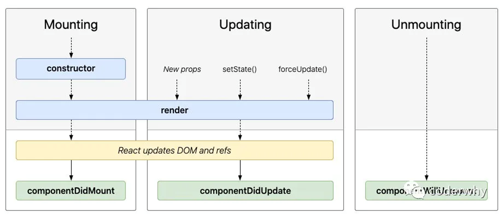
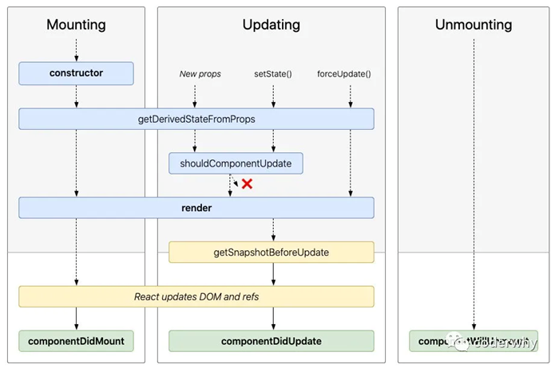
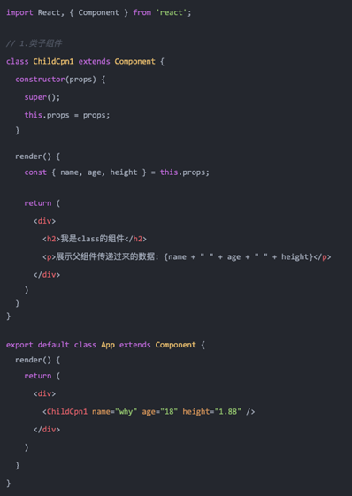
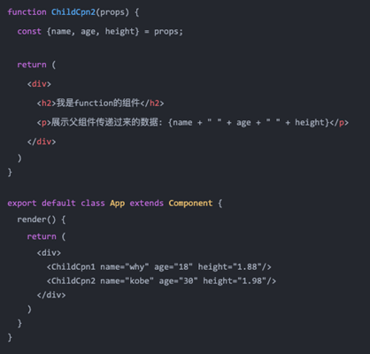
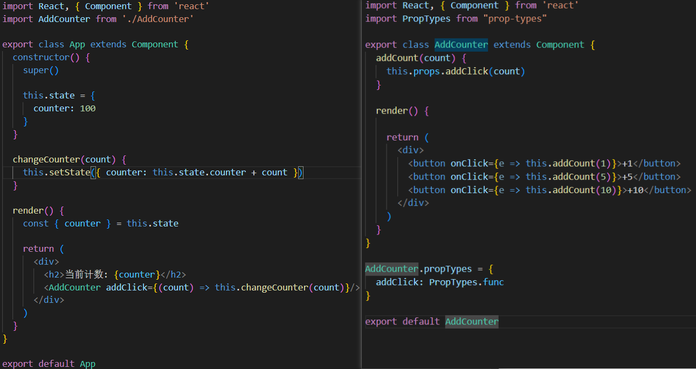
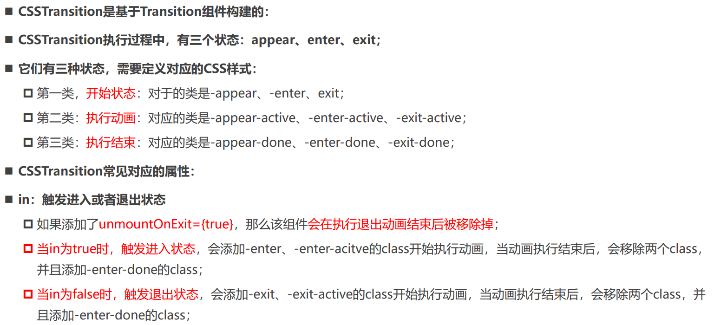
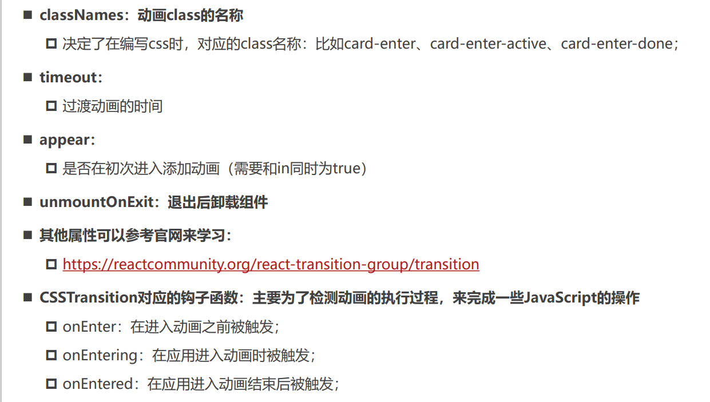
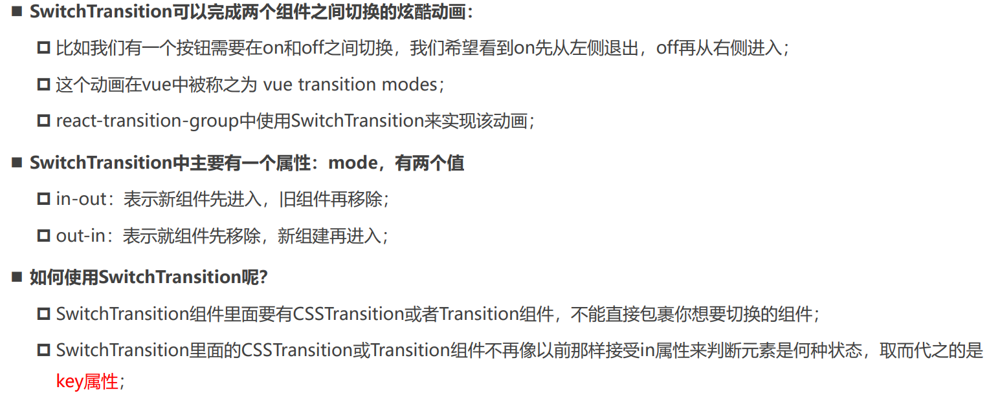

# React

## 一、React基础

### 1.React的开发依赖

> 开发React必须依赖三个库：
>
> * react：包含react所必须的核心代码 
> * react-dom：react渲染在不同平台所需要的核心代码 
> * babel：将jsx转换成React代码的工具
>
> 在React的0.14版本之前是没有react-dom这个概念的，所有功能都包含在react里；

**为什么要进行拆分呢？原因就是react-native**：react包中包含了**react web**和**react-native**所共同拥有的核心代码。react-dom针对web和native所完成的事情不同：

* web端：react-dom会将jsx最终渲染成真实的DOM，显示在浏览器中
* native端：react-dom会将jsx最终渲染成原生的控件（比如Android中的Button，iOS中的UIButton）。

**React的引入：**

* 1.直接CDN引入

```html
<script src="https://unpkg.com/react@18/umd/react.development.js" crossorigin></script>
<script src="https://unpkg.com/react-dom@18/umd/react-dom.development.js" crossorigin></script>
<script src="https://unpkg.com/babel-standalone@6/babel.min.js"></script>
```

* 2.下载后，添加本地依赖 
* 3.通过npm管理（后续脚手架再使用）


### 2.Hello World

* 这里的script标签必须添加 **type="text/babel"**，作用是可以让babel解析jsx的语法
* **ReactDOM. createRoot**函数：用于创建一个React根，之后渲染的内容会包含在这个根中
* **root.render**函数: 参数：要渲染的根组件
* 通过**{}**语法来引入外部的变量或者表达式

```html
<!DOCTYPE html>
<html lang="en">
  <head>
    <meta charset="UTF-8" />
    <meta http-equiv="X-UA-Compatible" content="IE=edge" />
    <meta name="viewport" content="width=device-width, initial-scale=1.0" />
    <title>Document</title>
  </head>
  <body>
    <div id="root"></div>

    <!-- 引入依赖包：本地 -->
    <script src="../lib/react.js"></script>
    <script src="../lib/react-dom.js"></script>
    <script src="../lib/babel.js"></script>

    <script type="text/babel">
      const root = ReactDOM.createRoot(document.querySelector("#root"));

      let message = "hello world";
      function btnClick() {
        message = "hello react";
        renderFun()
      }
      function renderFun() {
        root.render((
            <div>
            <h2>{message}</h2>
            <button onClick={btnClick}>修改文本</button>
          </div>
        ));
      }
      renderFun()
    </script>
  </body>
</html>

```


### 3.组件化开发

> 在React中，如何封装一个组件呢？这里暂时使用类的方式封装组件： 
>
> * 1.定义一个类（类名大写，组件的名称是必须大写的，小写会被认为是HTML元素），继承自React.Component 
> * 2.实现当前组件的render函数 ， render当中返回的jsx内容，就是之后React会帮助我们渲染的内容

* 数据定义在当前对象的state中，可以通过在构造函数中 this.state = {定义的数据} ，当我们的数据发生变化时，我们可以调用 this.setState 来更新数据，并且通知React进行update操作；在进行update操作时，就会重新调用render函数，并且使用最新的数据，来渲染界面

```html
<!DOCTYPE html>
<html lang="en">
  <head>
    <meta charset="UTF-8" />
    <meta http-equiv="X-UA-Compatible" content="IE=edge" />
    <meta name="viewport" content="width=device-width, initial-scale=1.0" />
    <title>Document</title>
  </head>
  <body>
    <div id="root"></div>

    <!-- 引入依赖包 -->
    <script src="../lib/react.js"></script>
    <script src="../lib/react-dom.js"></script>
    <script src="../lib/babel.js"></script>

    <script type="text/babel">
      const root = ReactDOM.createRoot(document.querySelector("#root"));

      class App extends React.Component {
        constructor() {
          super()
          this.state = {
            message: "Hello World"
          }
          // 对需要绑定的方法，提前绑定好this
          this.btnClick = this.btnClick.bind(this)
        }

        btnClick() {
          // 内部完成了两件事:1.将state中的值修改掉 2.自动重新执行render函数
          this.setState({
            message: "Hello React"
          })
        }
        
        render() {
          return (
            <div>
              <h2>{this.state.message}</h2>
              <button onClick={this.btnClick}>修改文本</button>  
            </div>
          )
        }
      }

      root.render(<App/>)
    </script>
  </body>
</html>
```


### 4.JSX基础语法

> JSX是一种JavaScript的语法扩展（eXtension），也在很多地方称之为JavaScript XML，因为看起就是一段XML语法；它用于描述我们的UI界面，并且其完成可以和JavaScript融合在一起使用；它不同于Vue中的模块语法，你不需要专门学习模块语法中的一些指令。

#### (1)JSX书写规范

* JSX的顶层只能有一个根元素，所以我们很多时候会在外层包裹一个div元素；
* 通常在jsx的外层包裹一个小括号()，这样可以方便阅读，并且jsx可以进行换行书写；
* JSX中的标签可以是单标签，也可以是双标签；如果是单标签，必须以/>结尾；

```html
<body>
  <!--  -->
  <div id="root"></div>
  
  <script src="../lib/react.js"></script>
  <script src="../lib/react-dom.js"></script>
  <script src="../lib/babel.js"></script>
  <script type="text/babel">
    // 1.定义App根组件
    class App extends React.Component {
      constructor() {
        super()
        this.state = {
          message: "Hello World"
        }
      }

      render() {
        // 1.state的解构, 获取到message
        const { message } = this.state

        // 书写规范
        // 1.jsx结构中只能有一个根元素
        // 2.jsx结构通常会包裹一个(), 将整个jsx当做一个整体, 实现换行
        // 3.jsx可以是单标签, 也可以双标签, 但是单标签必须以/>结尾
        return (
          <div>
            { /* JSX的注释写法 */ }
            <h2>{message}</h2>
          </div>
        )
      }
    }

    // 2.创建root并且渲染App组件
    const root = ReactDOM.createRoot(document.querySelector("#root"))
    root.render(<App/>)
  </script>
</body>
```

#### (2)JSX嵌入数据

**嵌入变量作为子元素：**

* 当变量是Number、String、Array类型时，可以直接显示
* 当变量是null、undefined、Boolean类型时，内容为空； ✓ 如果希望可以显示null、undefined、Boolean，那么需要转成字符串； ✓ 转换的方式有很多，比如toString方法、和空字符串拼接，String(变量)等方式；
* 当变量是Object对象时，该类型不能作为子元素（not valid as a React child），在html中不显示

**嵌入表达式：**

* 运算表达式 
* 三元运算符
* 执行一个函数

```html
<body>
  <div id="root"></div>

  <script src="../lib/react.js"></script>
  <script src="../lib/react-dom.js"></script>
  <script src="../lib/babel.js"></script>
  <script type="text/babel">
    // 1.定义App根组件
    class App extends React.Component {
      constructor() {
        super()
        this.state = {
          counter: 100,
          message: "Hello World",
          names: ["abc", "cba", "nba"],
          aaa: undefined,
          bbb: null,
          ccc: true,
          friend: { name: "kobe" },
          firstName: "kobe",
          lastName: "bryant",
          age: 20,
          movies: ["流浪地球", "星际穿越", "独行月球"]
        }
      }

      render() {
        // 1.插入标识符
        const { message, names, counter } = this.state
        const { aaa, bbb, ccc } = this.state
        const { friend } = this.state

        // 2.对内容进行运算后显示(插入表示)
        const { firstName, lastName } = this.state
        const fullName = firstName + " " + lastName
        const { age } = this.state
        const ageText = age >= 18 ? "成年人": "未成年人"
        const liEls = this.state.movies.map(movie => <li>{movie}</li>)

        // 3.返回jsx的内容
        return (
          <div>
            {/* 1.Number/String/Array直接显示出来 */}
            <h2>{counter}</h2>
            <h2>{message}</h2>
            <h2>{names}</h2>

            {/* 2.undefined/null/Boolean */}
            <h2>{String(aaa)}</h2>
            <h2>{bbb + ""}</h2>
            <h2>{ccc.toString()}</h2>

            {/* 3.Object类型不能作为子元素进行显示*/}
            <h2>{friend.name}</h2>
            <h2>{Object.keys(friend)[0]}</h2>

            {/* 4.可以插入对应的表达式*/}
            <h2>{10 + 20}</h2>
            <h2>{firstName + " " + lastName}</h2>
            <h2>{fullName}</h2>

            {/* 5.可以插入三元运算符*/}
            <h2>{ageText}</h2>
            <h2>{age >= 18 ? "成年人": "未成年人"}</h2>

            {/* 6.可以调用方法获取结果*/}
            <ul>{liEls}</ul>
            <ul>{this.state.movies.map(movie => <li>{movie}</li>)}</ul>
            <ul>{this.getMovieEls()}</ul>
          </div>
        )
      }

      getMovieEls() {
        const liEls = this.state.movies.map(movie => <li>{movie}</li>)
        return liEls
      }
    }

    // 2.创建root并且渲染App组件
    const root = ReactDOM.createRoot(document.querySelector("#root"))
    root.render(<App/>)
  </script>
</body>
```


#### (3)绑定属性

> 比如元素都会有title属性、img元素会有src属性、a元素会有href属性、元素可能需要绑定class、原生使用内联样式style。

```html
<body>
  <div id="root"></div>

  <script src="../lib/react.js"></script>
  <script src="../lib/react-dom.js"></script>
  <script src="../lib/babel.js"></script>
  <script type="text/babel">
    // 1.定义App根组件
    class App extends React.Component {
      constructor() {
        super()
        this.state = {
          title: "哈哈哈",
          imgURL: "https://ts1.cn.mm.bing.net/th/id/R-C.95bc299c3f1f0e69b9eb1d0772b14a98?rik=W5QLhXiERW4nLQ&riu=http%3a%2f%2f20178405.s21i.faiusr.com%2f2%2fABUIABACGAAgoeLO-wUo4I3o2gEw8Qs4uAg.jpg&ehk=N7Bxe9nqM08w4evC2kK6yyC%2bxIWTjdd6HgXsQYPbMj0%3d&risl=&pid=ImgRaw&r=0",
          href: "https://www.baidu.com",

          isActive: true,
          objStyle: {color: "red", fontSize: "30px"}
        }
      }

      render() {
        const { title, imgURL, href, isActive, objStyle } = this.state

        // 需求: isActive: true -> active
        // 1.class绑定的写法一: 字符串的拼接
        const className = `abc cba ${isActive ? 'active': ''}`
        // 2.class绑定的写法二: 将所有的class放到数组中
        const classList = ["abc", "cba"]
        if (isActive) classList.push("active")
        // 3.class绑定的写法三: 第三方库classnames -> npm install classnames

        return (
          <div>
            { /* 1.基本属性绑定 */ }
            <h2 title={title}>我是h2元素</h2>
            {/**/}
            <a href={href}>百度一下</a>

            
            { /* 2.绑定class属性: 最好使用className */ }
            <h2 className={className}>哈哈哈哈</h2>
            <h2 className={classList.join(" ")}>哈哈哈哈</h2>

            
            { /* 3.绑定style属性: 绑定对象类型 */ }
            <h2 style={{color: "red", fontSize: "30px"}}>呵呵呵呵</h2>
            <h2 style={objStyle}>呵呵呵呵</h2>
          </div>
        )
      }
    }

    const root = ReactDOM.createRoot(document.querySelector("#root"))
    root.render(<App/>)
  </script>
</body>
```


#### (4)绑定事件

> React 事件的命名采用小驼峰式（camelCase），而不是纯小写；需要通过{}传入一个事件处理函数，这个函数会在事件发生时被执行；

**this绑定问题：**

```html
<!DOCTYPE html>
<html lang="en">
<head>
  <meta charset="UTF-8">
  <meta http-equiv="X-UA-Compatible" content="IE=edge">
  <meta name="viewport" content="width=device-width, initial-scale=1.0">
  <title>计数器</title>
</head>
<body>
  <div id="root"></div>

  <script src="../lib/react.js"></script>
  <script src="../lib/react-dom.js"></script>
  <script src="../lib/babel.js"></script>
  <script type="text/babel">
    // 1.定义App根组件
    class App extends React.Component {
      constructor() {
        super()
        this.state = {
          message: "Hello World"
        }

        this.btn1Click = this.btn1Click.bind(this)
      }

      btnClick() {
        console.log(this); // undefined 原因是btnClick函数并不是我们主动调用的，而且当button发生改变时，React内部调用了btnClick函数；而它内部调用时，并不知道要如何绑定正确的this；
      }
      btn1Click() {
        console.log(this);
      }
      btn2Click = () => {
        console.log(this);
      }
      btn3Click() {
        console.log(this);
      }

// 如何解决this的问题呢？
//  方案一：bind给btnClick显示绑定this
//  方案二：使用 ES6 class fields 语法
//  方案三：事件监听时传入箭头函数（推荐）

      render() {
        const { message } = this.state

        return (
          <div>
            <button onClick={this.btn1Click}>按钮</button>

            {/* 1.this绑定方式一: bind绑定：在constructor中对方法进行显示绑定this */}
            <button onClick={this.btn1Click}>按钮1</button>

            {/* 2.this绑定方式二: ES6 class fields */}
            <button onClick={this.btn2Click}>按钮2</button>

            {/* 3.this绑定方式三: 直接传入一个箭头函数(重要) */}
            <button onClick={() => this.btn3Click()}>按钮3</button>
          </div>
        )
      }
    }

    // 2.创建root并且渲染App组件
    const root = ReactDOM.createRoot(document.querySelector("#root"))
    root.render(<App/>)
  </script>

</body>
</html>
```

**参数问题：**

```html
<!DOCTYPE html>
<html lang="en">
<head>
  <meta charset="UTF-8">
  <meta http-equiv="X-UA-Compatible" content="IE=edge">
  <meta name="viewport" content="width=device-width, initial-scale=1.0">
  <title>计数器</title>
</head>
<body>
  
  <div id="root"></div>

  <script src="../lib/react.js"></script>
  <script src="../lib/react-dom.js"></script>
  <script src="../lib/babel.js"></script>

  <script type="text/babel">
    // 1.定义App根组件
    class App extends React.Component {
      constructor() {
        super()
        this.state = {
          message: "Hello World"
        }
      }

      btnClick(event, name, age) {
        console.log("btnClick:", event, this)
        console.log("name, age:", name, age)
      }

      render() {
        const { message } = this.state

        return (
          <div>
            {/* 1.event参数的传递 */}
            <button onClick={this.btnClick.bind(this)}>按钮1</button>
            <button onClick={(event) => this.btnClick(event)}>按钮2</button>

            {/* 2.额外的参数传递 */}
            <button onClick={this.btnClick.bind(this, "kobe", 30)}>按钮3(不推荐)</button>
            <button onClick={(event) => this.btnClick(event, "why", 18)}>按钮4</button>
          </div>
        )
      }
    }

    // 2.创建root并且渲染App组件
    const root = ReactDOM.createRoot(document.querySelector("#root"))
    root.render(<App/>)
  </script>

</body>
</html>
```


#### (5)条件渲染

> 在React中，所有的条件判断都和普通的JavaScript代码一致；

```html
<!DOCTYPE html>
<html lang="en">
<head>
  <meta charset="UTF-8">
  <meta http-equiv="X-UA-Compatible" content="IE=edge">
  <meta name="viewport" content="width=device-width, initial-scale=1.0">
  <title>条件渲染</title>
</head>
<body>
  <div id="root"></div>

  <script src="../lib/react.js"></script>
  <script src="../lib/react-dom.js"></script>
  <script src="../lib/babel.js"></script>
  <script type="text/babel">
    // 1.定义App根组件
    class App extends React.Component {
      constructor() {
        super()
        this.state = {
          message: "Hello World",
          isReady: false,
          friend: undefined
        }
      }

      render() {
        const { isReady, friend } = this.state

        // 1.条件判断方式一: 使用if进行条件判断
        let showElement = null
        if (isReady) {
          showElement = <h2>准备开始比赛吧</h2>
        } else {
          showElement = <h1>请提前做好准备!</h1>
        }

        return (
          <div>
            {/* 1.方式一: 根据条件给变量赋值不同的内容 */}
            <div>{showElement}</div>

            {/* 2.方式二: 三元运算符 */}
            <div>{ isReady ? <button>开始战斗!</button>: <h3>赶紧准备</h3> }</div>

            {/* 3.方式三: &&逻辑与运算 */}
            {/* 场景: 当某一个值, 有可能为undefined时, 使用&&进行条件判断 */}
            <div>{ friend && <div>{friend.name + " " + friend.desc}</div> }</div>
          </div>
        )
      }
    }

    // 2.创建root并且渲染App组件
    const root = ReactDOM.createRoot(document.querySelector("#root"))
    root.render(<App/>)
  </script>

</body>
</html>
```


### 5.react脚手架

> React的脚手架：**create-react-app**
>
> 全局安装：**npm install create-react-app -g**
>
> 创建项目：**create-react-app 项目名称**

**目录结构：**

* README.md：readme说明文档
* package.json
* public
* * favicon.io：应用程序顶部的icon图标
  * index.html：应用的index.html入口文件
  * logo192.png：被在mainfest.json中使用
  * logo512.png：被在mainfest.json中使用
  * mainfest.json：和web app配置相关
  * robots.txt：指定搜索引擎可以或者无法爬取哪些文件
* src
* * App.css：App组件相关样式
  * App.js：App组件的代码文件
  * App.test.js：App组件的测试代码文件
  * index.css：全局的样式文件
  * index.js：整个应用程序的入口文件
  * logo.svg：启动项目所看到的react图标
  * serviceworker.js：默认帮助我们写好的注册PWA相关的代码
  * setupTests.js：测试初始化文件

**脚手架中的webpack：**react脚手架中webpack相关配置是隐藏的如果想要显示需要执行**eject脚本(npm run eject)**，注意是**不可逆**的。


### 6.组件化开发

> 根据组件的定义方式，可以分为：**函数组件(Functional Component )和类组件(Class Component)；**
>
> 根据组件内部是否有状态需要维护，可以分成：无状态组件(Stateless Component )和有状态组件(Stateful Component)；
>
> 根据组件的不同职责，可以分成：展示型组件(Presentational Component)和容器型组件(Container Component)；

#### (1)类组件

* 组件的名称是**大写字符开头**（无论类组件还是函数组件）

* 类组件需要继承自 **React.Component**

* 类组件必须实现**render**函数

* constructor是**可选**的，我们通常在constructor中初始化一些数据；

* **this.state**中维护的就是我们组件内部的数据；

* render() 方法是 class 组件中唯一**必须实现**的方法；

* 当render被调用时，它会检查 **this.props** **和** **this.state** **的变化并返回以下类型之一：**

* * **React** **元素**：通常通过 JSX 创建。例如，< div /> 会被 React 渲染为 DOM 节点，< MyComponent /> 会被 React 渲染为自定义组件；

    无论是 < div /> 还是 < MyComponent /> 均为 **React 元素**。

  * **数组或** **fragments**：使得 render 方法可以返回多个元素。

  * **Portals**：可以渲染子节点到不同的 DOM 子树中。

  * **字符串或数值类型**：它们在 DOM 中会被渲染为文本节点

  * **布尔类型或** **null**：什么都不渲染。

```jsx
import React from "react";

// 1.类组件
class App extends React.Component {
  constructor() {
    super()

    this.state = {
      message: "App Component"
    }
  }

  render() {
    // const { message } = this.state
    // 1.react元素: 通过jsx编写的代码就会被编译成React.createElement, 所以返回的就是一个React元素
    // return <h2>{message}</h2>

    // 2.组件或者fragments(后续学习)
    // return ["abc", "cba", "nba"]
    // return [
    //   <h1>h1元素</h1>,
    //   <h2>h2元素</h2>,
    //   <div>哈哈哈</div>
    // ]

    // 3.字符串/数字类型
    // return "Hello World"

    return true
  }
}

export default App;
```


#### (2)函数组件

> **函数组件是**使用**function**来进行定义的函数，只是这个函数会返回和类组件中render函数返回一样的内容。

* 没有生命周期，也会被更新并挂载，但是没有生命周期函数；
* this关键字不能指向组件实例（因为没有组件实例）；
* 没有内部状态（state）；

```jsx
function App(props) {
  // 返回值: 和类组件中render函数返回的是一致
  return <h1>App Functional Component</h1>
}

export default App
```


#### (3)生命周期

**基础常用的生命周期：**



* **Constructor**：如果不初始化 state 或不进行方法绑定，则不需要为 React 组件实现构造函数。constructor中通常只做两件事情：通过给 this.state 赋值对象来初始化内部的state；为事件绑定实例（this）；
* **componentDidMount**：会在组件挂载后（插入 DOM 树中）立即调用。通常进行的操作：依赖于DOM的操作可以在这里进行；在此处发送网络请求就最好的地方；（官方建议）可以在此处添加一些订阅（会在componentWillUnmount取消订阅）；
* **componentDidUpdate**：会在更新后会被立即调用，首次渲染不会执行此方法。当组件更新后，可以在此处对 DOM 进行操作；也可以选择在此处进行网络请求；（例如，当 props 未发生变化时，则不会执行网络请求）。
* **componentWillUnmount**：会在组件卸载及销毁之前直接调用。在此方法中执行必要的清理操作；例如，清除 timer，取消网络请求或清除在 componentDidMount() 中创建的订阅等；

**不常用生命周期：**



* getDerivedStateFromProps：state 的值在任何时候都依赖于 props时使用；该方法返回一个对象来更新state；
* getSnapshotBeforeUpdate：在React更新DOM之前回调的一个函数，可以获取DOM更新前的一些信息（比如说滚动位置）；
* shouldComponentUpdate：该生命周期函数很常用

**参考官网**：https://zh-hans.reactjs.org/docs/react-component.html

```jsx
import React from "react"

class HelloWorld extends React.Component {
  // 1.构造方法: constructor
  constructor() {
    console.log("HelloWorld constructor")
    super()

    this.state = {
      message: "Hello World"
    }
  }

  changeText() {
    this.setState({ message: "你好啊, 李银河" })
  }

  // 2.执行render函数
  render() {
    console.log("HelloWorld render")
    const { message } = this.state

    return (
      <div>
        <h2>{message}</h2>
        <p>{message}是程序员的第一个代码!</p>
        <button onClick={e => this.changeText()}>修改文本</button>
      </div>
    )
  }

  // 3.组件被渲染到DOM: 被挂载到DOM
  componentDidMount() {
    console.log("HelloWorld componentDidMount")
  }

  // 4.组件的DOM被更新完成： DOM发生更新
  componentDidUpdate(prevProps, prevState, snapshot) {
    console.log("HelloWorld componentDidUpdate:", prevProps, prevState, snapshot)
  }

  // 5.组件从DOM中卸载掉： 从DOM移除掉
  componentWillUnmount() {
    console.log("HelloWorld componentWillUnmount")
  }


  // 不常用的生命周期补充
  shouldComponentUpdate() {
    return true
  }

  getSnapshotBeforeUpdate() {
    console.log("getSnapshotBeforeUpdate")
    return {
      scrollPosition: 1000
    }
  }
}

export default HelloWorld
```


#### (4)组件间通讯

**父传子**：父组件通过 **属性=值** 的形式来传递给子组件数据；子组件通过 **props** 参数获取父组件传递过来的数据；





**父传子：**父组件给子组件传递一个回调函数，在子组件中调用这个函数。



**参数验证：**如果项目中默认继承了Flow或者TypeScript，那么直接就可以进行类型验证；也可以通过 **prop-types** 库来进行参数验证；从 React v15.5 开始，React.PropTypes 已移入另一个包中：prop-types 库。

参考官网：https://zh-hans.reactjs.org/docs/typechecking-with-proptypes.html


#### (5)非父子组件通讯

> **Context** 提供了一种在组件之间共享此类值的方式，而不必显式地通过组件树的逐层传递 props；
>
> Context 设计目的是为了共享那些对于一个组件树而言是“全局”的数据，例如当前认证的用户、主题或首选语言；

**相关API：**

* **React.createContext**：创建一个需要共享的Context对象：如果一个组件订阅了Context，那么这个组件会从离自身最近的那个匹配的 Provider 中读取到当前的context值；**defaultValue**是组件在顶层查找过程中没有找到对应的Provider，那么就使用默认值
* **Context.Provider**：每个 Context 对象都会返回一个 Provider React 组件，它允许消费组件订阅 context 的变化：Provider 接收一个 value 属性，传递给消费组件；一个 Provider 可以和多个消费组件有对应关系；多个 Provider 也可以嵌套使用，里层的会覆盖外层的数据；当 Provider 的 value 值发生变化时，它内部的所有消费组件都会重新渲染；
* **Class.contextType**：挂载在 class 上的 contextType 属性会被重赋值为一个由 React.createContext() 创建的 Context 对象：这能使用 this.context 来消费最近 Context 上的那个值；可以在任何生命周期中访问到它，包括 render 函数中；
* **Context.Consumer**：这里，React 组件也可以订阅到 context 变更。这能让你在 函数式组件 中完成订阅 context。这里需要 函数作为子元素（function as child）这种做法；这个函数接收当前的 context 值，返回一个 React 节点；

**步骤：**

* 1.创建一个Context

```javascript
import React from "react"
// 1.创建一个Context
const ThemeContext = React.createContext({ color: "blue", size: 10 })
export default ThemeContext
```

* 2.通过ThemeContext中Provider中value属性为后代提供数据

```jsx
import React, { Component } from 'react'
import Home from './Home'

import ThemeContext from "./context/theme-context"
import UserContext from './context/user-context'
import Profile from './Profile'

export class App extends Component {
  constructor() {
    super()

    this.state = {
      info: { name: "kobe", age: 30 }
    }
  }

  render() {
    const { info } = this.state

    return (
      <div>
        <h2>App</h2>
        {/* 第二步操作: 通过ThemeContext中Provider中value属性为后代提供数据 */}
        <UserContext.Provider value={{nickname: "kobe", age: 30}}>
          <ThemeContext.Provider value={{color: "red", size: "30"}}>
            <Home {...info}/>
          </ThemeContext.Provider>
        </UserContext.Provider>
        <Profile/>
      </div>
    )
  }
}

export default App
```

* 3.设置组件的contextType为某一个Context
* 4.获取数据, 并且使用数据

```jsx
import React, { Component } from 'react'
import ThemeContext from './context/theme-context'
import UserContext from './context/user-context'

export class HomeInfo extends Component {
  render() {
    // 4.第四步操作: 获取数据, 并且使用数据
    console.log(this.context)

    return (
      <div>
        <h2>HomeInfo: {this.context.color}</h2>
        <UserContext.Consumer>
          {
            value => {
              return <h2>Info User: {value.nickname}</h2>
            }
          }
        </UserContext.Consumer>
      </div>
    )
  }
}

// 3.第三步操作: 设置组件的contextType为某一个Context
HomeInfo.contextType = ThemeContext

export default HomeInfo
```

* 5.**函数式组件**中使用Context共享的数据

```jsx
import ThemeContext from "./context/theme-context"

function HomeBanner() {

  return <div>
    {/* 函数式组件中使用Context共享的数据 */}
    <ThemeContext.Consumer>
      {
        value => {
          return <h2> Banner theme:{value.color}</h2>
        }
      }
    </ThemeContext.Consumer>
  </div>
}

export default HomeBanner
```


#### (6)”插槽“

> react并没有插槽的概念，这里类比vue中的插槽。**有两种方案可以实现：**
>
> * 组件的children子元素；
>
> * props属性传递React元素；

**App.jsx：**

```jsx
import React, { Component } from 'react'
import NavBar from './nav-bar'
import NavBarTwo from './nav-bar-two'

export class App extends Component {
  render() {
    const btn = <button>按钮2</button>

    return (
      <div>
        {/* 1.使用children实现插槽 */}
        <NavBar>
          <button>按钮</button>
          <h2>哈哈哈</h2>
          <i>斜体文本</i>
        </NavBar>

        {/* 2.使用props实现插槽 */}
        <NavBarTwo 
          leftSlot={btn}
          centerSlot={<h2>呵呵呵</h2>}
          rightSlot={<i>斜体2</i>}
        />
      </div>
    )
  }
}

export default App
```

**NavBar.jsx：**

```jsx
import React, { Component } from 'react'
import PropTypes from "prop-types"
import "./style.css"

export class NavBar extends Component {
  render() {
    // 每个组件都可以获取到 props.children：它包含组件的开始标签和结束标签之间的内容。弊端：通过索引值获取传入的元素很容易出错，不能精准的获取传入的原生；
    const { children } = this.props
    console.log(children)
    return (
      <div className='nav-bar'>
        <div className="left">{children[0]}</div>
        <div className="center">{children[1]}</div>
        <div className="right">{children[2]}</div>
      </div>
    )
  }
}
NavBar.propTypes = {
  children: PropTypes.array
}
export default NavBar
```

**NavBarTwo.jsx：**

```jsx
import React, { Component } from 'react'

export class NavBarTwo extends Component {
  render() {
    // 通过具体的属性名，可以让我们在传入和获取时更加的精准；
    const { leftSlot, centerSlot, rightSlot } = this.props

    return (
      <div className='nav-bar'>
        <div className="left">{leftSlot}</div>
        <div className="center">{centerSlot}</div>
        <div className="right">{rightSlot}</div>
      </div>
    )
  }
}

export default NavBarTwo
```


#### (7)获取DOM

* ref获取dom

```jsx
import React, { PureComponent, createRef } from 'react'

export class App extends PureComponent {
  constructor() {
    super()

    this.state = {

    }

    this.titleRef = createRef()
    this.titleEl = null
  }

  getNativeDOM() {
    // 1.方式一: 在React元素上绑定一个ref字符串
    // console.log(this.refs.why)

    // 2.方式二: 提前创建好ref对象, createRef(), 将创建出来的对象绑定到元素
    // console.log(this.titleRef.current)

    // 3.方式三: 传入一个回调函数, 在对应的元素被渲染之后, 回调函数被执行, 并且将元素传入
    console.log(this.titleEl)
  }

  render() {
    return (
      <div>
        <h2 ref="why">Hello World</h2>
        <h2 ref={this.titleRef}>你好啊,李银河</h2>
        <h2 ref={el => this.titleEl = el}>你好啊, 师姐</h2>
        <button onClick={e => this.getNativeDOM()}>获取DOM</button>
      </div>
    )
  }
}

export default App
```

* ref获取组件类实例

```jsx
import React, { PureComponent, createRef } from 'react'

class HelloWorld extends PureComponent {
  test() {
    console.log("test------")
  }
  render() {
    return <h1>Hello World</h1>
  }
}

export class App extends PureComponent {
  constructor() {
    super()

    this.hwRef = createRef()
  }

  getComponent() {
    console.log(this.hwRef.current)
    this.hwRef.current.test()
  }

  render() {
    return (
      <div>
        <HelloWorld ref={this.hwRef}/>
        <button onClick={e => this.getComponent()}>获取组件实例</button>
      </div>
    )
  }
}

export default App
```

* ref获取函数组件的dom

```jsx
import React, { PureComponent, createRef, forwardRef } from 'react'

const HelloWorld = forwardRef(function(props, ref) {
  return (
    <div>
      <h1 ref={ref}>Hello World</h1>
      <p>哈哈哈</p>
    </div>
  )
})

export class App extends PureComponent {
  constructor() {
    super()
    this.hwRef = createRef()
  }
  getComponent() {
    console.log(this.hwRef.current)
  }
  render() {
    return (
      <div>
        <HelloWorld ref={this.hwRef}/>
        <button onClick={e => this.getComponent()}>获取组件实例</button>
      </div>
    )
  }
}

export default App
```


#### (8)受控组件和非受控组件

* 基本使用

```html
import React, { PureComponent } from 'react'

export class App extends PureComponent {
  constructor() {
    super()

    this.state = {
      username: "coderwhy"
    }
  }

  inputChange(event) {
    console.log("inputChange:", event.target.value)
    this.setState({ username: event.target.value })
  }

  render() {
    const { username } = this.state

    return (
      <div>
        {/* 受控组件 */}
        <input type="checkbox" value={username} onChange={e => this.inputChange(e)}/>

        {/* 非受控组件 */}
        <input type="text" />
        <h2>username: {username}</h2>
      </div>
    )
  }
}

export default App
```

* 自己提交form表单

```jsx
import React, { PureComponent } from 'react'

export class App extends PureComponent {

  constructor() {
    super()

    this.state = {
      username: ""
    }
  }

  handleSubmitClick(event) {
    // 1.阻止默认的行为
    event.preventDefault()

    // 2.获取到所有的表单数据, 对数据进行组件
    console.log("获取所有的输入内容")
    console.log(this.state.username)

    // 3.以网络请求的方式, 将数据传递给服务器(ajax/fetch/axios)
  }

  handleUsernameChange(event) {
    this.setState({ username: event.target.value })
  }

  render() {
    const { username } = this.state

    return (
      <div>
        <form onSubmit={e => this.handleSubmitClick(e)}>
          {/* 1.用户名和密码 */}
          <label htmlFor="username">
            用户: 
            <input 
              id='username' 
              type="text" 
              name='username' 
              value={username} 
              onChange={e => this.handleUsernameChange(e)}
            />
          </label>

          <button type='submit'>注册</button>
        </form>
      </div>
    )
  }
}

export default App
```

* 多个表单同一个函数

```jsx
import React, { PureComponent } from 'react'

export class App extends PureComponent {

  constructor() {
    super()

    this.state = {
      username: "",
      password: ""
    }
  }

  handleSubmitClick(event) {
    // 1.阻止默认的行为
    event.preventDefault()

    // 2.获取到所有的表单数据, 对数据进行组件
    console.log("获取所有的输入内容")
    console.log(this.state.username, this.state.password)

    // 3.以网络请求的方式, 将数据传递给服务器(ajax/fetch/axios)
  }

  // handleUsernameChange(event) {
  //   this.setState({ username: event.target.value })
  // }

  // handlePasswordChange(event) {
  //   this.setState({ password: event.target.value })
  // }

  handleInputChange(event) {
    this.setState({
      [event.target.name]: event.target.value
    })
  }

  render() {
    const { username, password } = this.state

    return (
      <div>
        <form onSubmit={e => this.handleSubmitClick(e)}>
          {/* 1.用户名和密码 */}
          <label htmlFor="username">
            用户: 
            <input 
              id='username' 
              type="text" 
              name='username' 
              value={username} 
              onChange={e => this.handleInputChange(e)}
            />
          </label>
          <label htmlFor="password">
            密码: 
            <input 
              id='password' 
              type="password" 
              name='password' 
              value={password} 
              onChange={e => this.handleInputChange(e)}
            />
          </label>

          <button type='submit'>注册</button>
        </form>
      </div>
    )
  }
}

export default App
```

* checkbox单选多选

```jsx
import React, { PureComponent } from 'react'

export class App extends PureComponent {

  constructor() {
    super()

    this.state = {
      username: "",
      password: "",
      isAgree: false,
      hobbies: [
        { value: "sing", text: "唱", isChecked: false },
        { value: "dance", text: "跳", isChecked: false },
        { value: "rap", text: "rap", isChecked: false }
      ],
      fruit: "orange"
    }
  }

  handleSubmitClick(event) {
    // 1.阻止默认的行为
    event.preventDefault()

    // 2.获取到所有的表单数据, 对数据进行组件
    console.log("获取所有的输入内容")
    console.log(this.state.username, this.state.password)
    const hobbies = this.state.hobbies.filter(item => item.isChecked).map(item => item.value)
    console.log("获取爱好: ", hobbies)

    // 3.以网络请求的方式, 将数据传递给服务器(ajax/fetch/axios)
  }

  handleInputChange(event) {
    this.setState({
      [event.target.name]: event.target.value
    })
  }

  handleAgreeChange(event) {
    this.setState({ isAgree: event.target.checked })
  }

  handleHobbiesChange(event, index) {
    const hobbies = [...this.state.hobbies]
    hobbies[index].isChecked = event.target.checked
    this.setState({ hobbies })
  }

  render() {
    const { username, password, isAgree, hobbies, fruit } = this.state

    return (
      <div>
        <form onSubmit={e => this.handleSubmitClick(e)}>
          {/* 1.用户名和密码 */}
          <div>
            <label htmlFor="username">
              用户: 
              <input 
                id='username' 
                type="text" 
                name='username' 
                value={username} 
                onChange={e => this.handleInputChange(e)}
              />
            </label>
            <label htmlFor="password">
              密码: 
              <input 
                id='password' 
                type="password" 
                name='password' 
                value={password} 
                onChange={e => this.handleInputChange(e)}
              />
            </label>
          </div>

          {/* 2.checkbox单选 */}
          <label htmlFor="agree">
            <input 
              id='agree' 
              type="checkbox" 
              checked={isAgree} 
              onChange={e => this.handleAgreeChange(e)}
            />
            同意协议
          </label>

          {/* 3.checkbox多选 */}
          <div>
            您的爱好:
            {
              hobbies.map((item, index) => {
                return (
                  <label htmlFor={item.value} key={item.value}>
                    <input 
                      type="checkbox"
                      id={item.value} 
                      checked={item.isChecked}
                      onChange={e => this.handleHobbiesChange(e, index)}
                    />
                    <span>{item.text}</span>
                  </label>
                )
              })
            }
          </div>

          {/* 4.select */}
          <select>
            <option value="apple">苹果</option>
            <option value="orange">橘子</option>
            <option value="banana">香蕉</option>
          </select>

          <div>
            <button type='submit'>注册</button>
          </div>
        </form>
      </div>
    )
  }
}

export default App
```

* select的单选多选

```jsx
import React, { PureComponent } from 'react'

export class App extends PureComponent {

  constructor() {
    super()

    this.state = {
      username: "",
      password: "",
      isAgree: false,
      hobbies: [
        { value: "sing", text: "唱", isChecked: false },
        { value: "dance", text: "跳", isChecked: false },
        { value: "rap", text: "rap", isChecked: false }
      ],
      fruit: ["orange"]
    }
  }

  handleSubmitClick(event) {
    // 1.阻止默认的行为
    event.preventDefault()

    // 2.获取到所有的表单数据, 对数据进行组件
    console.log("获取所有的输入内容")
    console.log(this.state.username, this.state.password)
    const hobbies = this.state.hobbies.filter(item => item.isChecked).map(item => item.value)
    console.log("获取爱好: ", hobbies)

    // 3.以网络请求的方式, 将数据传递给服务器(ajax/fetch/axios)
  }

  handleInputChange(event) {
    this.setState({
      [event.target.name]: event.target.value
    })
  }

  handleAgreeChange(event) {
    this.setState({ isAgree: event.target.checked })
  }

  handleHobbiesChange(event, index) {
    const hobbies = [...this.state.hobbies]
    hobbies[index].isChecked = event.target.checked
    this.setState({ hobbies })
  }

  handleFruitChange(event) {
    const options = Array.from(event.target.selectedOptions)
    const values = options.map(item => item.value)
    this.setState({ fruit: values })

    // 额外补充: Array.from(可迭代对象)
    // Array.from(arguments)
    const values2 = Array.from(event.target.selectedOptions, item => item.value)
    console.log(values2)
  }

  render() {
    const { username, password, isAgree, hobbies, fruit } = this.state

    return (
      <div>
        <form onSubmit={e => this.handleSubmitClick(e)}>
          {/* 1.用户名和密码 */}
          <div>
            <label htmlFor="username">
              用户: 
              <input 
                id='username' 
                type="text" 
                name='username' 
                value={username} 
                onChange={e => this.handleInputChange(e)}
              />
            </label>
            <label htmlFor="password">
              密码: 
              <input 
                id='password' 
                type="password" 
                name='password' 
                value={password} 
                onChange={e => this.handleInputChange(e)}
              />
            </label>
          </div>

          {/* 2.checkbox单选 */}
          <label htmlFor="agree">
            <input 
              id='agree' 
              type="checkbox" 
              checked={isAgree} 
              onChange={e => this.handleAgreeChange(e)}
            />
            同意协议
          </label>

          {/* 3.checkbox多选 */}
          <div>
            您的爱好:
            {
              hobbies.map((item, index) => {
                return (
                  <label htmlFor={item.value} key={item.value}>
                    <input 
                      type="checkbox"
                      id={item.value} 
                      checked={item.isChecked}
                      onChange={e => this.handleHobbiesChange(e, index)}
                    />
                    <span>{item.text}</span>
                  </label>
                )
              })
            }
          </div>

          {/* 4.select */}
          <select value={fruit} onChange={e => this.handleFruitChange(e)} multiple>
            <option value="apple">苹果</option>
            <option value="orange">橘子</option>
            <option value="banana">香蕉</option>
          </select>

          <div>
            <button type='submit'>注册</button>
          </div>
        </form>
      </div>
    )
  }
}

export default App
```


#### (9)高阶组件

> 高阶组件 本身不是一个组件，而是一个函数；其次，这个函数的参数是一个组件，返回值也是一个组件；

* 定义

```jsx
import React, { PureComponent } from 'react'

// 定义一个高阶组件
function hoc(Cpn) {
  // 1.定义类组件
  class NewCpn extends PureComponent {
    render() {
      return <Cpn name="why"/>
    }
  }
  return NewCpn

  // 定义函数组件
  // function NewCpn2(props) {

  // }
  // return NewCpn2
}

class HelloWorld extends PureComponent {
  render() {
    return <h1>Hello World</h1>
  }
}

const HelloWorldHOC = hoc(HelloWorld)

export class App extends PureComponent {
  render() {
    return (
      <div>
        <HelloWorldHOC/>
      </div>
    )
  }
}

export default App
```

* props增强

```jsx
import React, { PureComponent } from 'react'
import enhancedUserInfo from './hoc/enhanced_props'
import About from './pages/About'


const Home = enhancedUserInfo(function(props) {
  return <h1>Home: {props.name}-{props.level}-{props.banners}</h1>
})

const Profile = enhancedUserInfo(function(props) {
  return <h1>Profile: {props.name}-{props.level}</h1>
})

const HelloFriend = enhancedUserInfo(function(props) {
  return <h1>HelloFriend: {props.name}-{props.level}</h1>
})

export class App extends PureComponent {
  render() {
    return (
      <div>
        <Home banners={["轮播1", "轮播2"]}/>
        <Profile/>
        <HelloFriend/>

        <About/>
      </div>
    )
  }
}

export default App
```


#### (10)react动画

> React社区为我们提供了**react-transition-group**用来完成过渡动画。
>
> **npm install react-transition-group --save**

**主要组件：**

* Transition：该组件是一个和平台无关的组件（不一定要结合CSS）； 在前端开发中，一般是结合CSS来完成样式，所以比较常用的是CSSTransition；
* CSSTransition：在前端开发中，通常使用CSSTransition来完成过渡动画效果





```jsx
import React, { createRef, PureComponent } from 'react'
import { CSSTransition } from "react-transition-group"
import "./style.css"

export class App extends PureComponent {
  constructor(props) {
    super(props)

    this.state = {
      isShow: true
    }

    this.sectionRef = createRef()
  }

  render() {
    const { isShow } = this.state

    return (
      <div>
        <button onClick={e => this.setState({isShow: !isShow})}>切换</button>
        {/* { isShow && <h2>哈哈哈</h2> } */}

        <CSSTransition 
          nodeRef={this.sectionRef}
          in={isShow} 
          unmountOnExit={true} 
          classNames="why" 
          timeout={2000}
          appear
          onEnter={e => console.log("开始进入动画")}
          onEntering={e => console.log("执行进入动画")}
          onEntered={e => console.log("执行进入结束")}
          onExit={e => console.log("开始离开动画")}
          onExiting={e => console.log("执行离开动画")}
          onExited={e => console.log("执行离开结束")}
        >
          <div className='section' ref={this.sectionRef}>
            <h2>哈哈哈</h2>
            <p>我是内容, 哈哈哈</p>
          </div>
        </CSSTransition>
      </div>
    )
  }
}

export default App
```

```css
/* 进入动画 */
/* .why-appear {
  transform: translateX(-150px);
}

.why-appear-active {
  transform: translateX(0);
  transition: transform 2s ease;
} */

.why-appear, .why-enter {
  opacity: 0;
}

.why-appear-active, .why-enter-active {
  opacity: 1;
  transition: opacity 2s ease;
}

/* 离开动画 */
.why-exit {
  opacity: 1;
}

.why-exit-active {
  opacity: 0;
  transition: opacity 2s ease;
}

```

* SwitchTransition：两个组件显示和隐藏切换时，使用该组件



```jsx
import React, { PureComponent } from 'react'
import { SwitchTransition, CSSTransition } from 'react-transition-group'
import "./style.css"

export class App extends PureComponent {
  constructor() {
    super() 

    this.state = {
      isLogin: true
    }
  }

  render() {
    const { isLogin } = this.state

    return (
      <div>
        <SwitchTransition mode='out-in'>
          <CSSTransition
            key={isLogin ? "exit": "login"}
            classNames="login"
            timeout={1000}
          >
            <button onClick={e => this.setState({ isLogin: !isLogin })}>
              { isLogin ? "退出": "登录" }
            </button>
          </CSSTransition>
        </SwitchTransition>
      </div>
    )
  }
}

export default App
```

```css
.login-enter {
  transform: translateX(100px);
  opacity: 0;
}

.login-enter-active {
  transform: translateX(0);
  opacity: 1;
  transition: all 1s ease;
}

.login-exit {
  transform: translateX(0);
  opacity: 1;
}

.login-exit-active {
  transform: translateX(-100px);
  opacity: 0;
  transition: all 1s ease;
}

```

* TransitionGroup：将多个动画组件包裹在其中，一般用于列表中元素的动画；

```jsx
import React, { PureComponent } from 'react'
import { TransitionGroup, CSSTransition } from "react-transition-group"
import "./style.css"

export class App extends PureComponent {
  constructor() {
    super()

    this.state = {
      books: [
        { id: 111, name: "你不知道JS", price: 99 },
        { id: 222, name: "JS高级程序设计", price: 88 },
        { id: 333, name: "Vuejs高级设计", price: 77 },
      ]
    }
  }

  addNewBook() {
    const books = [...this.state.books]
    books.push({ id: new Date().getTime(), name: "React高级程序设计", price: 99 })
    this.setState({ books })
  }

  removeBook(index) {
    const books = [...this.state.books]
    books.splice(index, 1)
    this.setState({ books })
  }

  render() {
    const { books } = this.state

    return (
      <div>
        <h2>书籍列表:</h2>
        <TransitionGroup component="ul">
          {
            books.map((item, index) => {
              return (
                <CSSTransition key={item.id} classNames="book" timeout={1000}>
                  <li>
                    <span>{item.name}-{item.price}</span>
                    <button onClick={e => this.removeBook(index)}>删除</button>
                  </li>
                </CSSTransition>
              )
            })
          }
        </TransitionGroup>
        <button onClick={e => this.addNewBook()}>添加新书籍</button>
      </div>
    )
  }
}

export default App
```

```css
.book-enter {
  transform: translateX(150px);
  opacity: 0;
}

.book-enter-active {
  transform: translateX(0);
  opacity: 1;
  transition: all 1s ease;
}

.book-exit {
  transform: translateX(0);
  opacity: 1;
}

.book-exit-active {
  transform: translateX(150px);
  opacity: 0;
  transition: all 1s ease;
}
```


### 7.reactCSS

#### (1)内联样式

```jsx
import React, { PureComponent } from 'react'

export class App extends PureComponent {
  constructor() {
    super()

    this.state = {
      titleSize: 30
    }
  }

  addTitleSize() {
    this.setState({ titleSize: this.state.titleSize + 2 })
  }

  render() {
    const { titleSize } = this.state

    return (
      <div>
        <button onClick={e => this.addTitleSize()}>增加titleSize</button>
        <h2 style={{color: "red", fontSize: `${titleSize}px`}}>我是标题</h2>
        <p style={{color: "blue", fontSize: "20px"}}>我是内容, 哈哈哈</p>
      </div>
    )
  }
}

export default App
```

#### (2)普通样式

> 普通的css我们通常会编写到一个单独的文件，之后再进行引入。 这样的编写方式和普通的网页开发中编写方式是一致的：如果按照普通的网页标准去编写，那么也不会有太大的问题； 但是组件化开发中总是希望组件是一个独立的模块，即便是样式也只是在自己内部生效，不会相互影响； 但是普通的css都属于全局的css，样式之间会相互影响； 这种编写方式最大的问题是样式之间会相互层叠掉；

#### (3)css modules

> React的脚手架已经内置了css modules的配置： **.css/.less/.scss** 等样式文件都需要修改成 **.module.css/.module.less/.module.scss** 等； 之后就可以引用并且进行使用了；

#### (4)CSS in JS

> CSS-in-JS通过JavaScript来为CSS赋予一些能力，包括类似于CSS预处理器一样的样式嵌套、函数定义、逻辑复用、动态修 改状态等等； 虽然CSS预处理器也具备某些能力，但是获取动态状态依然是一个不好处理的点；所以，目前可以说CSS-in-JS是React编写CSS最为受欢迎的一种解决方案；**styled-components**是社区最流行的CSS-in-JS库
>
> **npm install styled-components**

**style.js:**

```javascript
import styled from "styled-components"
import {
  primaryColor,
  largeSize
} from "./style/variables"

// 1.基本使用
export const AppWrapper = styled.div`
  .footer {
    border: 1px solid orange;
  }
`

// const obj = {
//   name: (props) => props.name || "why"
// }


// 2.子元素单独抽取到一个样式组件
// 3.可以接受外部传入的props
// 4.可以通过attrs给标签模板字符串中提供的属性
// 5.从一个单独的文件中引入变量
export const SectionWrapper = styled.div.attrs(props => ({
  tColor: props.color || "blue"
}))`
  border: 1px solid red;

  .title {
    font-size: ${props => props.size}px;
    color: ${props => props.tColor};

    &:hover {
      background-color: purple;
    }
  }

  .content {
    font-size: ${largeSize}px;
    color: ${primaryColor};
  }
`
```

**App.jsx:**

```jsx
import React, { PureComponent } from 'react'
import Home from './home'
import { AppWrapper, SectionWrapper } from "./style"

export class App extends PureComponent {

  constructor() {
    super()

    this.state = {
      size: 30,
      color: "yellow"
    }
  }

  render() {
    const { size } = this.state

    return (
      <AppWrapper>
        <SectionWrapper size={size}>
          <h2 className='title'>我是标题</h2>
          <p className='content'>我是内容, 哈哈哈</p>
          <button onClick={e => this.setState({color: "skyblue"})}>修改颜色</button>
        </SectionWrapper>

        <Home/>

        <div className='footer'>
          <p>免责声明</p>
          <p>版权声明</p>
        </div>
      </AppWrapper>
    )
  }
}

export default App
```


## 二、Reducx

> Redux就是一个帮助我们管理State的容器：Redux是JavaScript的状态容器，提供了可预测的状态管理； Redux除了和React一起使用之外，它也可以和其他界面库一起来使用（比如Vue），并且它非常小（包括依赖在内，只有2kb）

### 1.Redux核心理念

#### (1)Store

#### (2)action

> Redux要求我们通过action来更新数据： 所有数据的变化，必须通过派发（dispatch）action来更新；  action是一个普通的JavaScript对象，用来描述这次更新的type和content；

#### (3)reducer

> reducer是一个纯函数； reducer做的事情就是将传入的state和action结合起来生成一个新的state；

