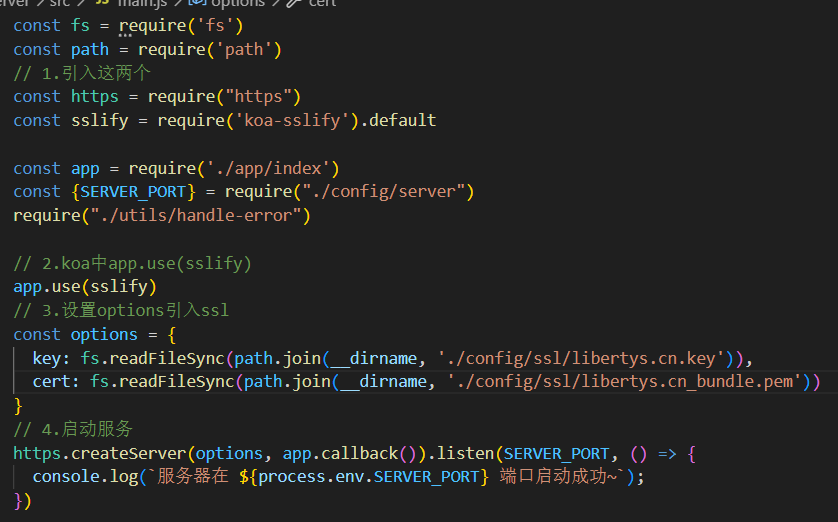

# koa2搭建https服务

> 由于申请了ssl证书网站变成了https网站，并且https网页访问的资源也必须为https的，才不久将图片资源由http变成了https，这次又遇到了相同的问题。在部署koa2写的服务端代码时，部署好了之后前端页面又不能进行请求了，原因就是之前一样https网页也必须访问https资源，所以有**必须得将服务端接口弄成https的**。

​	在有了ssl证书（之前域名的ssl证书）之后将原本http的服务搭建成https的服务其实很简单，在koa2中只需要一个**koa-sslify**库以及node的**https模块**。

* 1.引入**koa-sslify**和**https**
* 2.koa中**app.use(sslify)**
* 3.设置**options**引入**ssl**
* 4.启动服务

**注：const app = require('./app/index')**我只是将koa在另一个文件中导出（封装）

