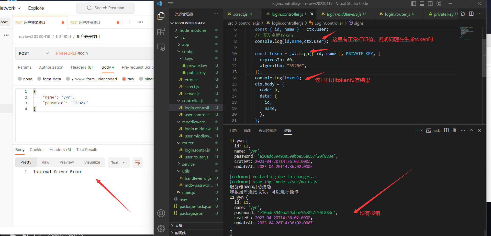
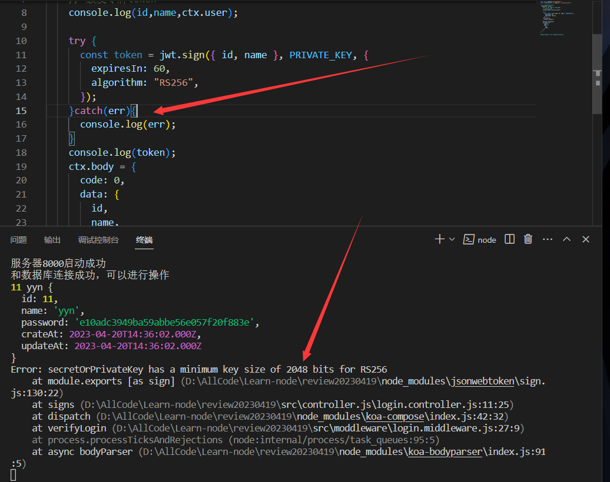
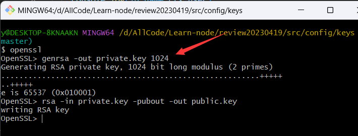
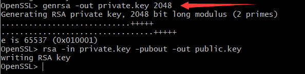
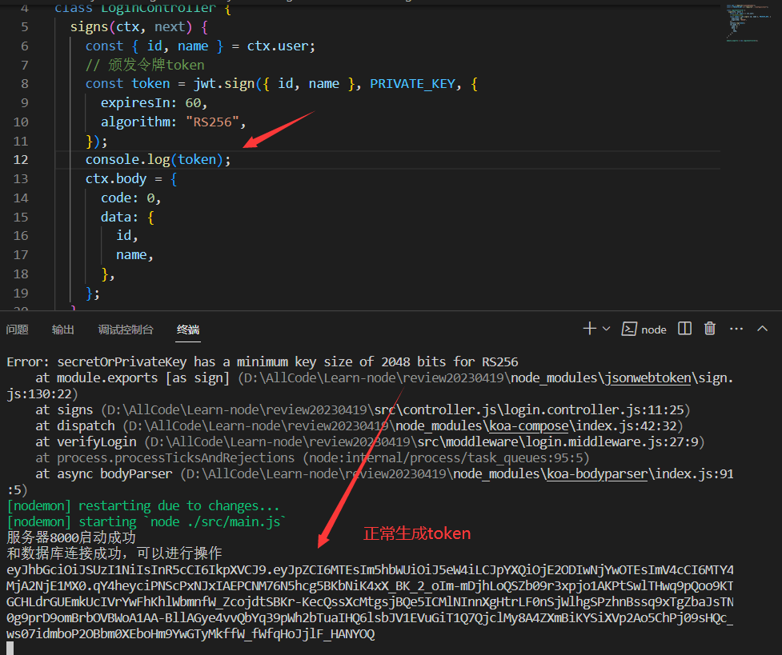

# 关于jwt.sign没有返回值的问题

## 问题

> 在写登录接口时，想生成token用于登录验证，但是在使用jwt生成**token(jwt.sign())**时却没有返回值，服务端没有报错但是使用postman验证接口时却没有得到正确的请求结果。

## 原因

> 在各个平台没有找到相关问题的解决办法，我已明确的是肯定是jwt.sign这里出了问题，只是终端没有打印错误，于是想到使用**try catch**将异常抛出，查看问题是什么。

这里报错**Error: secretOrPrivateKey has a minimum key size of 2048 bits for RS256**才想起生成私钥时是**1024**的（学习视频中也生成的是1024确实正常的，不知道为啥我这里报错了）：

## 解决

> 所以尝试生成大小为2048时就可以正常生成token了

