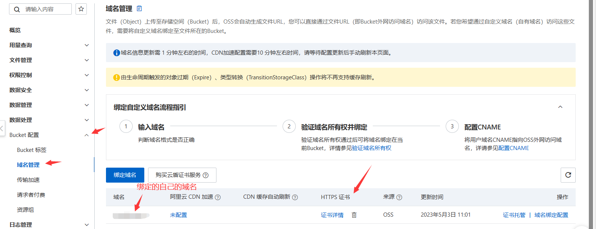

# 阿里云对象存储OSS使用 HTTPS

> ​		在部署项目的时候遇到了一个问题，就是https页面访问http资源报错的问题。

我写了一个前端项目在云服务器部署，我的域名申请了ssl证书并在云服务器nginx部署，所以**页面是https页面**，但是该项目中使用的图片资源是阿里云OSS的**http资源**(阿里云OSS资源本可以通过https访问，但是这样访问的域名并不是我想要，于是我**对OSS存储绑定了自己的域名的子域名**，所以我可以通过我的域名的**子域名**访问OSS资源，但是因为绑定了我的域名的子域名**所以只能通过http的方式访问资源**)，所以就出现了我的https页面加载http资源无法加载的问题。

​		尝试了很多网上的方法都没有解决，所以想办法**通过https的方式且使用我自己绑定的域名**访问OSS资源：**可以给阿里云Bucekt绑定的域名 托管 该域名的ssl证书，然后就可以使用自己绑定的域名通过https的方式访问OSS的资源。**

* 1.我使用的是阿里云OSS存储，但是域名是腾讯云的，所以得先去腾讯云为我的域名的**子域名再申请一个ssl证书**（腾讯云好像可以申请几个免费的ssl证书[SSL 证书 关于免费证书权益升级通知-产品公告-文档中心-腾讯云 (tencent.com)](https://cloud.tencent.com/document/product/400/88702)）：

* 2.将申请的**子域名的ssl证书**托管到阿里云**Bucket绑定的域名**那里：

* 3.然后就可以使用自己的子域名然后通过https的方式访问OSS中存储的图片资源了