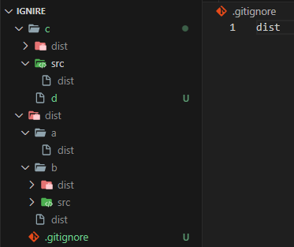

### 1.直接一个名称

> 会忽略目录下的所有该名称文件和文件夹，无论嵌套多深。

### 2.斜杠 /

* 1.斜杠在开头(**/dist**)：忽略和.gitignore同目录下的dist，无论是文件夹还是文件都忽略。（单层级）

* 2.斜杠在中间(**c/dist**)：忽略和.gitignore同目录下的c文件夹中的dist（单层级）

* 3.斜杠在末尾(**dist/**)：忽略和.gitignore同目录及其子目录下的所有dist文件夹，不包括dist文件（多层级）

### 3.符号 *

* 1.**c/*.jpg**：忽略c目录下的以.jpg结尾文件，不包括子目录（单层级）

### 4.问号 ？

* 一个问号表示一个字符

### 5.感叹号 ！

* 表示排除某一个文件或文件夹不忽略

### 6.gitkeep

* .gitkeep表示某个文件夹需要跟踪(仅文件夹不包括文件)

